# System Architecture & Component Topology

## 1. Architectural Philosophy & Layer Boundaries

The system is built on **Domain-Driven Design (DDD)** and **Dependency Inversion (DIP)** principles. Unidirectional dependencies ensure that mathematical business logic remains entirely decoupled from web frameworks, persistence drivers, and database engines.

$$\text{Domain Layer} \longleftarrow \text{Infrastructure Layer} \longleftarrow \text{Application Services} \longleftarrow \text{Presentation (API)}$$

```mermaid
graph TD
    subgraph Presentation Layer [Presentation Layer: FastAPI / ASGI]
        API1[api.v1.endpoints.events]
        API2[api.v1.endpoints.genotypes]
        API3[api.v1.endpoints.market_data]
        API4[api.v1.endpoints.auth]
        DEP[api.dependencies]
        MID[api.middleware]
    end

    subgraph Application Layer [Application Services Layer: Orchestration]
        S1[services.event_service<br>Decay Kernel & Causal Graph]
        S2[services.genotype_service<br>NSGA-II & Pareto Ranking]
        S3[services.market_data_service<br>Validation & Volatility Estimation]
    end

    subgraph Domain Layer [Domain Layer: Pure Math & Models]
        M1[domain.models.PriceBar]
        M2[domain.models.MarketDataBatch]
        M3[domain.models.NewsEvent]
        M4[domain.models.Genotype]
        I1[domain.interfaces.IMarketDataRepository]
        I2[domain.interfaces.IEventRepository]
        I3[domain.interfaces.IGenotypeRepository]
        I4[domain.interfaces.IAssetRepository]
    end

    subgraph Infrastructure Layer [Infrastructure Layer: Hybrid Storage]
        DB1[(DuckDB Columnar Store<br>market_data.duckdb)]
        DB2[(Relational ACID Store<br>quant.db / PostgreSQL)]
        R1[infrastructure.repositories.duckdb_market_data_repo]
        R2[infrastructure.repositories.event_repository]
        R3[infrastructure.repositories.genotype_repository]
        R4[infrastructure.repositories.asset_repository]
    end

    API1 --> S1
    API2 --> S2
    API3 --> S3
    S1 --> I2
    S1 --> I4
    S2 --> I3
    S3 --> I1
    S3 --> I4
    R1 -.->|Implements| I1
    R2 -.->|Implements| I2
    R3 -.->|Implements| I3
    R4 -.->|Implements| I4
    R1 --> DB1
    R2 --> DB2
    R3 --> DB2
    R4 --> DB2
```



---

## 2. Hybrid Storage Architecture (ADR-001)

To achieve institutional-grade throughput while preserving relational integrity, persistence is strictly split into two specialized engines:

```
+-------------------------------------------------------------------------------+
|                       QUANTITATIVE PREDICTION ENGINE                          |
+---------------------------------------+---------------------------------------+
|  TRANSACTIONAL METADATA STORE (ACID)  |  ANALYTICAL TIME-SERIES STORE (OLAP)  |
|  Engine: SQLAlchemy + PostgreSQL/SQLite|  Engine: DuckDB + PyArrow (Embedded) |
+---------------------------------------+---------------------------------------+
| * Asset Master & Universe Metadata    | * Raw OHLCV Price Bars (PriceBar)     |
| * News Events & Causal Graph Edges    | * High-Frequency Trade & Quote Ticks  |
| * Genotype Chromosomes & Audit History| * Microstructural Depth Snapshots     |
| * User Authentication & RBAC Roles    | * Contiguous Columnar Output (Batch)  |
+---------------------------------------+---------------------------------------+
```

### 2.1 The Analytical Columnar Engine (DuckDB + PyArrow)
* **Zero Python Object Tax**: Traditional ORMs allocate independent Python objects per row, causing severe memory bloat when loading millions of bars. DuckDB loads data directly into contiguous C++ memory buffers.
* **Direct Vectorization**: DuckDB's `.fetchnumpy()` and PyArrow table exports output contiguous NumPy 1D arrays (`np.ascontiguousarray`), matching the exact memory layout required by downstream linear algebra libraries (BLAS/LAPACK).
* **Threadpool Offloading**: To prevent C++ query routines from blocking FastAPI's asynchronous event loop, all DuckDB calls are dispatched to worker threads via `asyncio.to_thread` protected by a thread mutex lock (`DuckDBManager.run_sync`).

---

## 3. Module Inventory & Structural Map

| Module Path | Primary Class / Component | Architectural Responsibility |
| :--- | :--- | :--- |
| `src/quant/domain/models.py` | `PriceBar`, `MarketDataBatch`, `NewsEvent`, `Genotype` | Pure, immutable domain value objects enforcing boundary invariants. |
| `src/quant/domain/interfaces.py` | `IMarketDataRepository`, `IEventRepository`, `IGenotypeRepository` | Abstract contracts isolating domain logic from storage mechanics. |
| `src/quant/infrastructure/database/duckdb_session.py` | `DuckDBManager` | Thread-safe connection management and table/index schema provisioning for DuckDB. |
| `src/quant/infrastructure/repositories/duckdb_market_data_repository.py` | `DuckDBMarketDataRepository` | Bulk PyArrow insertion and range/latest bar retrieval. |
| `src/quant/services/market_data_service.py` | `MarketDataService` | Bar validation, gap detection, and rolling realized volatility ($\sigma_t$). |
| `src/quant/analytics/fractional_diff.py` | `FractionalDifferentiator`, `StreamingFracDiffBuffer` | Fixed-Width Window Fractional Differentiation ($d^*$), zero-sum correction, and streaming inference. |
| `src/quant/analytics/labeling.py` | `DynamicTripleBarrierLabeler` | Path-dependent Triple-Barrier labeling with Parkinson range volatility, gap-fill, and pessimistic collision rules. |
| `src/quant/analytics/cross_validation.py` | `CombinatorialPurgedCV`, `CPCVConfig`, `PurgedSplit` | Combinatorial Purged Cross-Validation with interval purging, post-test embargoing, and continuous path reconstruction. |
| `src/quant/analytics/meta_labeling.py` | `TwoStageMetaLabeler`, `ContinuousKellySizer`, `ProbabilityCalibrator` | Continuous-Payoff Kelly Meta-Labeling with duration discounting and concurrency throttling. |
| `src/quant/analytics/deflated_sharpe.py` | `DeflatedSharpeEngine`, `DSRConfig`, `DSRResult` | Robust Spectral Deflated Sharpe Ratio, Extreme Value Theory hurdles, piecewise MinBTL, and FDR cohort screening. |
| `src/quant/analytics/regimes.py` | `CausalBayesianRegimeFilter`, `CUSUMJumpDetector`, `OASCovarianceEstimator` | Online causal Bayesian regime filter, CUSUM jump detection with dwell hysteresis, and OAS covariance conditioning. |
| `src/quant/analytics/market_impact.py` | `MultiAssetMarketImpactEngine`, `GeneralizedPseudoHuber`, `HubermanStanzlCrossImpact` | Huberman-Stanzl cross-impact tensor, 3/2-power Square-Root Law potential, and Bayesian panic gate. |
| `src/quant/analytics/payoff_matrix.py` | `DiscreteHyperbolicPropagator`, `StackelbergPayoffEngine`, `InstitutionalBenchmarkUniverse` | Multi-bar hyperbolic trajectory scheduling, Stackelberg continuous payoff with predatory quote shading, and friction parity benchmarks. |
| `src/quant/analytics/minimax_regret.py` | `EntropicBoltzmannPotential`, `LatentSoftmaxTransform`, `VectorizedNewtonSolver` | Closed-form Boltzmann dual potential, bounded latent softmax mapping, and sub-millisecond vectorized Newton solver with KKT projection. |
| `src/quant/analytics/chromosomes.py` | `GENE_REGISTRY`, `StrategyChromosome`, `ChromosomeVectorCodec` | Scale-free unit hypercube encoding, declarative gene registry, invariants by construction, and typed analytics adapters. |
| `src/quant/analytics/pareto_sorting.py` | `BoundaryAnchoredRVEARanker`, `SVDSubspaceOrthogonalArchive`, `AdaptiveReferenceLattice`, `DependentNonDominatedSorter` | Boundary-Anchored Adaptive RVEA, SVD subspace orthogonal novelty ($1 - R^2$), Memmel–Ledoit–Wolf dependent dominance, and ENS-SS front sorting. |
| `src/quant/analytics/hypergamic_selection.py` | `HypergamicSelectionEngine`, `ParetoCohortStratifier`, `ResidualOrthogonalityGate`, `HypergamicPartnerMatcher`, `AsymmetricLatentCrossover` | Front-preserving Pareto cohort stratification, bidirectional residual orthogonality gating, adaptive deadlock-free partner matching, and asymmetric latent-hypercube crossover. |
| `src/quant/analytics/evolutionary_lifecycle.py` | `GenerationalLifecycleEngine`, `AdaptiveVolatilityMutator`, `StagnationDetector`, `MutationConfig`, `GenerationalState` | Adaptive Cauchy volatility mutation with mirror reflection, Rechenberg APD progress adaptation, dual-space stagnation monitoring, and $(\mu + \lambda)$ closed-loop generational lifecycle. |
| `src/quant/analytics/ensemble.py` | `RegimeConditionedDMAEngine`, `VolatilityAdaptiveForgetting`, `AsymmetricDownsideLossScorer`, `TikhonovCorrelationEstimator`, `OrthogonalityRegularizedSolver` | Regime-Conditioned Dynamic Model Averaging (RD-DMA) with volatility-adaptive forgetting, predictive forward-Markov regime transitions, asymmetric downside loss, Tikhonov correlation regularization, Entropic Mirror Descent on the simplex, thermodynamic ambiguity shrinkage, and total variance risk decomposition. |
| `src/quant/services/event_service.py` | `EventService` | Dual-decay temporal kernel evaluation and multimodal feature projection. |
| `src/quant/services/genotype_service.py` | `GenotypeService` | Multi-objective fitness calculation, NSGA-II sorting, and crowding distance. |
| `src/quant/api/v1/endpoints/market_data.py` | `router` (`/api/v1/market-data`) | High-throughput batch ingestion and historical range queries. |
| `src/quant/api/dependencies.py` | `get_market_data_service`, `get_db` | Factory dependency injection for repositories, services, and security roles. |
| `src/quant/main.py` | `create_application` | FastAPI ASGI factory mounting routers, middleware, and `/healthz` probe. |

---

## 4. End-to-End Data Flow Pipelines

### 4.1 Ingestion Pipeline (Market Bars)
1. **Client / Feed Request**: External market feed dispatches `POST /api/v1/market-data/bars/batch` with `X-API-Key`.
2. **Gateway Validation**: Dependency `require_api_key` verifies constant-time HMAC signature.
3. **Domain Invariant Enforcement**: `MarketDataService` parses JSON dictionaries into immutable `PriceBar` value objects; `__post_init__` verifies $High \ge \max(Open, Close)$, $Low \le \min(Open, Close)$, $Prices > 0$, $Volume \ge 0$.
4. **Columnar Ingestion**: `DuckDBMarketDataRepository` transforms the batch into a typed `pa.Table` and issues an in-memory `INSERT OR REPLACE INTO market_bars`.

### 4.2 Analytical Feature Extraction Pipeline
1. **Consumer Request**: Downstream econometric engine calls `get_historical_bars(asset_id, start_time, end_time)`.
2. **Columnar Query**: DuckDB executes indexed binary search over `(asset_id, resolution, timestamp)` and fetches arrays via `.fetchnumpy()`.
3. **Zero-Copy Batch Creation**: Wraps contiguous arrays into `MarketDataBatch`.
4. **Econometric Calculation**: Computes instantaneous rolling volatility $\sigma_t$ over closing prices.

### 4.3 Fractional Differentiation Feature Pipeline
1. **Offline Fitting / Calibration**: `FractionalDifferentiator.fit(train_prices)` evaluates optimal $d^*$ using bisection search with Augmented Dickey-Fuller stationarity tests ($p \le 0.01$), enforcing sample lookback caps $l^* \le 0.20 \cdot T$ and zero-sum weight correction.
2. **Batch Feature Transformation**: `FractionalDifferentiator.transform(test_prices)` convolves series via $O(T \log l^*)$ 1D FFT (`scipy.signal.fftconvolve`) without lookahead leakage.
3. **Online Real-Time Streaming**: `StreamingFracDiffBuffer` hydrates historical window from DuckDB (`hydrate_from_repository`) and computes sub-millisecond single-bar updates (`update(P_t)`).
4. **Price Reconstruction**: When trading orders require nominal price targets from model forecasts, `inverse_transform` analytically reconstructs $P_t$ from differenced predictions.

### 4.4 Dynamic Volatility Triple-Barrier Labeling Pipeline
1. **Causal Volatility Estimation**: Pre-computes Parkinson range volatility $\sigma_t$ strictly lagged to $t-1$ over high and low prices.
2. **Execution Latency Offset**: Enforces entry at $t + \text{delay}$ to eliminate intra-signal lookahead.
3. **Log-Space Barrier Geometry**: Scales horizontal barriers via $\ln(P_{\text{entry}}) \pm c \cdot \sigma$, adjusting for position side (Long vs. Short).
4. **Path Evaluation & Collision Priority**: Scans intra-bar wicks and opening gaps, enforcing pessimistic stop-loss priority on dual-barrier candle collisions.
5. **Net Payoff Generation**: Outputs `BarrierLabel` containing discrete classification $\{+1, -1, 0\}$, holding duration $[t_{\text{entry}}, t_{\text{exit}}]$, and net return deducting spread and fee friction.

### 4.5 Combinatorial Purged Cross-Validation (CPCV) Pipeline
1. **Group Block Partitioning**: Divides $T$ observations into $N$ balanced contiguous chronological blocks $G_0, \dots, G_{N-1}$.
2. **Combinatorial Fold Generation**: Enumerates $\binom{N}{k}$ combinations (or forward-chained splits) with budget bounding cap `max_splits`.
3. **Interval Purging**: Drops any training observation whose trade lifespan $[t_{\text{entry}}, t_{\text{exit}}]$ intersects any test block interval $[T_{\text{test, start}}, T_{\text{test, end}}]$.
4. **Autoregressive Embargoing**: Excludes training observations occurring within post-test window $h_{\text{embargo}}$ to neutralize serial correlation leakage.
5. **Continuous Path Reconstruction**: Assembles test predictions into $\phi = \binom{N-1}{k-1}$ continuous out-of-sample backtest paths.
6. **Sharpe Variance Evaluation**: Calculates empirical Sharpe ratio distribution $\{SR_p\}$ and variance $V[\{SR_p\}]$ for Deflated Sharpe Ratio (Step 6).

### 4.6 Two-Stage Continuous-Payoff Kelly Meta-Labeling Pipeline
1. **Primary Signal Ingestion**: Ingests Stage 1 directional indicators $\hat{y}_t \in \{-1, +1\}$.
2. **Payoff Alignment & Odds Computation**: Generates ground-truth meta-labels ($z_t = 1 \iff \pi_t > 0$) aligning net return from `BarrierLabel` with proposed trade direction, calculating odds $b_t$.
3. **Probability Calibration**: Maps decision function margins to smooth probabilities $p_t$ via regularized Platt logistic regression, validating calibration improvement via Brier score.
4. **Time-Decayed Fractional Kelly Sizing**: Calculates raw Kelly fraction $f^* = \frac{p \cdot b - (1-p)}{b}$ scaled by conservative multiplier $\lambda = 0.50$ (Half-Kelly). Zero allocation when expected edge is non-positive.
5. **Duration Discounting & Concurrency Throttling**: Discounts size by $\sqrt{\tau_t / \tau_{\text{ref}}}$ and normalizes by simultaneous open trade count $c_t$, enforcing aggregate leverage bound $\le L_{\text{max}} = 1.0$.

### 4.7 Deflated Sharpe Ratio (DSR) & Statistical Significance Pipeline
1. **Robust Moment Extraction**: Applies two-sided winsorization to raw trade return series to dampen outlier wicks; calculates sample mean, standard deviation, skewness $\hat{\gamma}_3$, and Pearson kurtosis $\hat{\gamma}_4$ with Pearson bound clamping $\hat{\gamma}_4 \ge 1 + \hat{\gamma}_3^2$.
2. **Non-Normality Adjustment (PSR)**: Computes Probabilistic Sharpe Ratio using the Mertens/Lo standard error under non-Gaussian higher moments.
3. **Effective Independent Trials ($K_{\text{eff}}$)**: Constructs correlation matrix $\mathbf{C}$ across tested strategy configurations and calculates $K_{\text{eff}} = K^2 / \sum C_{ij}^2$ via Frobenius participation ratio, eliminating the independence fallacy.
4. **Extreme Value Selection Hurdle**: Evaluates Expected Maximum Sharpe ratio $E[\max_K \{SR\}]$ across $K_{\text{eff}}$ trials with cross-path variance $V[\{SR\}]$ derived from Step 4 CPCV paths.
5. **Sample Duration Requirement (MinBTL)**: Evaluates piecewise analytical Minimum Backtest Length, requiring $+\infty$ for losing strategies.
6. **Dual Institutional Gate**: Certifies strategies for Phase 4 evolution only when simultaneously clearing $\text{DSR} \ge 0.95$ AND $T \ge \text{MinBTL}$.
7. **Population Cohort Screening**: Applies Benjamini-Hochberg (BH) or Benjamini-Yekutieli (BY) False Discovery Rate controls across multi-model genetic populations.

### 4.8 Causal Bayesian Jump-Regime Estimation Pipeline
1. **Innovation Normalization**: Computes standardized cross-sectional return innovations $z_t = \bar{r}_t / \sigma_t$ strictly lagged to eliminate lookahead bias.
2. **Two-Sided CUSUM Tracking**: Accumulates directional deviations $S_t^+, S_t^-$ with drift $k$; triggers jump alarm only when cumulative deviation crosses threshold $h$ and minimum dwell time ($\tau_{\text{dwell}} \ge 3\text{ bars}$) is cleared, suppressing whipsaws.
3. **Emergency Panic Prior Injection**: On severe negative shocks ($S_t^- \ge h$), injects an instantaneous panic prior into the transition probability matrix, snapping the regime classification to defensive posture within a single bar.
4. **OAS Covariance Regularization**: Evaluates Oracle Approximating Shrinkage on rolling asset return windows, projecting eigenvalues to $\lambda_{\min} \ge 10^{-5}$ to guarantee strict positive definiteness.
5. **Thermodynamic Ambiguity Calibration**: Calibrates temperature $\beta_t = \text{clip}\left(\kappa \bar{\sigma}_t \sqrt{\ln(1/\alpha) / N_{\text{eff}}}, \beta_{\min}, \beta_{\max}\right)$, smoothly expanding the ambiguity set during turbulence.

### 4.9 Multi-Asset Cross-Impact Propagator Pipeline
1. **Dimensional Participation Conversion**: Transforms dimensionless portfolio weights $\Delta \mathbf{a}$ into nominal dollars and scales by expected bar dollar volume ($\nu_i = W_0 \Delta a_i / (\text{ADV\_Dol}_i \tau_{\text{bar}})$).
2. **Huberman-Stanzl Cross-Impact**: Evaluates symmetric sandwich matrix $\mathbf{\Lambda}_{\text{cross}} = \lambda_{\text{fee}} \mathbf{I} + \theta \mathbf{Z}_t^{1/2} (\mathbf{D}^{-1/2} \mathbf{\Sigma}^{1/2} \mathbf{D}^{-1/2}) \mathbf{Z}_t^{1/2} \succ 0$, guaranteeing strict positive-definiteness and eliminating price manipulation arbitrage.
3. **3/2-Power Generalized Pseudo-Huber Evaluation**: Applies $\psi_{3/2}(u) = (u^2 + \delta^2)^{3/4} - \delta^{1.5}$, accurately modeling the universal Square-Root Law of price impact with guaranteed strict convexity everywhere ($\psi''_{3/2} > 0$).
4. **Smooth Panic Asymmetry Multiplier**: Multiplies base potential by $(1 + \kappa_{\text{panic}} \pi_{\text{panic}} \sigma_{\text{asym}}(\nu))$, ensuring an identically zero gradient at rest ($\nabla \mathcal{C}(\mathbf{0}) = \mathbf{0}$) with zero artificial buying/selling drift.
5. **State-Space Bounded Depletion Tracking**: Updates order book depletion state via saturating hyperbolic tangent filter $\mathbf{B}_t = \rho \mathbf{B}_{t-1} + (1-\rho) B_{\max} \tanh(|\boldsymbol{\nu}| / B_{\max})$, preventing infinite cost blowouts across consecutive trades.

### 4.10 Stackelberg Leader-Follower Trajectory & Payoff Tensor Pipeline
1. **Discrete Hyperbolic Scheduling**: Computes multi-bar execution slices using the exact exponential formulation $\alpha_k = (1 - e^{-\kappa}) [e^{-\kappa(k-1)} + e^{-\kappa(2H-k)}] / (1 - e^{-2\kappa H})$, guaranteeing an exact partition of unity ($\sum \alpha_k = 1.0$), monotonic decay, and sub-millisecond evaluation.
2. **Stackelberg Payoff Functional**: Evaluates continuous quadratic net utility $U(\mathbf{a}, \mathbf{s}_j) = \mathbf{a}^T \hat{\boldsymbol{\mu}}_j + a_{\text{cash}} r_f - \frac{\gamma + 2\theta_{\text{pred}}}{2} \mathbf{a}^T \mathbf{\Sigma}_j \mathbf{a} - \mathcal{C}(\mathbf{a} - \mathbf{a}_0)$, penalizing high-variance flow vulnerable to predatory quote shading.
3. **Exact Analytical Derivative Evaluation**: Computes analytical gradient $\nabla_{\mathbf{a}} U$ and certifies strictly negative-definite Hessian $\mathbf{H}_{\mathbf{a}} U \prec 0$ (global concavity everywhere).
4. **Institutional Benchmark Evaluation (Friction Parity)**: Generates constrained benchmarks (Equal Weight, Risk Parity, Inverse Volatility, Cash) under single-asset caps ($b_i \le w_{\max}$) and evaluates utility ceilings $U_{\text{bench}}^*(\mathbf{s}_j) = \max_{\mathbf{b} \in \mathcal{B}} U(\mathbf{b}, \mathbf{s}_j)$ deducting identical rebalancing market friction from $\mathbf{a}_0$.
5. **Regret Matrix Construction**: Computes non-negative regret tensor $R_{i, j} = \max(0, U_{\text{bench}}^*(\mathbf{s}_j) - U_{i, j}) \ge 0$ across candidates and regimes, directly supplying Step 4's closed-form Boltzmann dual solver.

### 4.11 Closed-Form Boltzmann Dual & Entropic Minimax Regret Solver Pipeline
1. **Max-Shifted Log-Sum-Exp Dual Potential**: Evaluates $\Psi(\mathbf{a}) = \beta_t [ m + \ln( \sum \pi_j e^{(R_j/\beta_t) - m} ) ]$ with $m = \max_j (R_j/\beta_t)$, guaranteeing zero numerical overflow across all temperature ranges $\beta_t \in [\beta_{\min}, \beta_{\max}]$ and producing worst-case tilted distributions $\mathbf{q}^* \in \Delta^M$.
2. **Latent Softmax Coordinate Transformation**: Maps box constraints $[0, w_{\max}]^N$ bijectively to unconstrained coordinates $\mathbf{w} \in \mathbb{R}^N$ via $a_i(w_i) = w_{\max} / (1 + e^{-w_i})$ with diagonal Jacobian $\mathbf{J}_{\mathbf{w}} = \text{diag}(a_i (1 - a_i / w_{\max}))$, eliminating interior-point barrier complexity.
3. **Simultaneous Single-Pass Utility/Gradient Extraction**: Calculates both utility $U(\mathbf{a}, \mathbf{s}_j)$ and analytical gradient $\nabla_{\mathbf{a}} U$ in a single market impact evaluation, halving computation time per regime scenario.
4. **Strictly Positive-Definite Fisher Information Hessian**: Formulates $\mathbf{H}_{\mathbf{a}} \Psi = -\sum q_j^* \mathbf{H}_j U + \frac{1}{\beta_t} \text{Cov}_{\mathbf{q}^*}[\mathbf{g}, \mathbf{g}] \succ 0$, guaranteeing strict convexity and quadratic local convergence.
5. **Levenberg-Marquardt Regularization & Armijo Line Search**: Computes damped Newton step $\mathbf{d}_{\mathbf{w}} = -(\mathbf{H}_{\mathbf{w}} + \mu \mathbf{I})^{-1} \mathbf{g}_{\mathbf{w}}$ with Armijo backtracking and quadratic leverage penalty $\frac{\rho_{\text{lev}}}{2} (\max(0, \sum a_i - L_{\max}))^2$.
6. **KKT Projected Gradient Termination**: Certifies first-order optimality on bounded box $[0, w_{\max}]$ via projected gradient $\mathbf{g}^{\text{proj}}$, ensuring termination even when optimal allocations bind to boundaries ($a_i^* \to 0$ or $a_i^* \to w_{\max}$).
7. **Cross-Impact Tensor Caching & Trajectory Output**: Caches symmetric cross-impact matrices $\mathbf{\Lambda}_{\text{cross}}$ across scenarios, achieving sub-millisecond execution ($< 400\mu\text{s}$) and emitting certified worst-case regret $\Psi(\mathbf{a}^*)$ and multi-bar discrete hyperbolic trajectory slices $\mathbf{A} \in \mathbb{R}^{H \times N}$ directly feeding Phase 4 Genetic Algorithm chromosome fitness.

### 4.12 Evolutionary Chromosome & Vector Codec Pipeline
1. **Declarative Parameter Registry**: Declares 20 strategy hyperparameters in `GENE_REGISTRY` across Representation ($\tau_{\text{slow}}, r_\tau, \alpha, d$), Game Theory ($\tau, \gamma, \theta_{\text{pred}}, \mathbf{z}$), Inference ($H, \kappa, k_{\text{pt}}, k_{\text{sl}}, T_{\text{hold}}, p_{\text{thresh}}$), and Risk ($\sigma_{\text{target}}, w_{\max}, \text{MDD}_{\max}, \Delta_{\max}$).
2. **Scale-Invariant Unit Hypercube Codec**: Implements hybrid logarithmic-linear mapping $\mathbf{g} \longleftrightarrow \mathbf{u} \in [0, 1]^{20}$, equalizing mutation sensitivity across orders of magnitude.
3. **Invariance by Construction**: Unconditionally satisfies timescale ordering ($\tau_{\text{fast}} = r_\tau \tau_{\text{slow}} < \tau_{\text{slow}}$) and regime simplex ($\mathbf{p} = \text{softmax}(\mathbf{z}) \in \Delta^3$) without artificial penalty functions or clipping clumping.
4. **Midpoint Quantization Stability**: Centers discrete genes at bucket midpoints $u(k) = (k + 0.5) / K$, insulating round-trip decoding against floating-point drift with a $\pm 2.5\%$ noise tolerance.
5. **Decoded Phenotype Distance**: Evaluates behavioral novelty distance on normalized decoded parameters and actual regime probabilities $\mathbf{p} \in \Delta^3$, preventing artificial diversity from logit gauge shifts or sub-threshold discrete variations.
6. **Typed Pipeline Adapters & Serialization**: Generates typed configurations for Phases 1-3 analytics engines (`to_stackelberg_config`, `to_regime_config`, `to_minimax_config`, `to_triple_barrier_config`, `to_meta_label_config`) and serializes to native Python dicts for zero-crash database persistence.

### 4.13 Boundary-Anchored Adaptive RVEA & SVD Subspace Pareto Sorting Pipeline
1. **Viability Gate & Orthogonal Residual Extraction**: Filters out unviable strategies ($\text{DSR} < 0.50$ or infeasible); extracts standardized prediction residual vectors $\tilde{\mathbf{e}} \in \mathbb{R}^T$ with zero mean and unit norm.
2. **SVD Subspace Orthogonal Archive**: Projects candidate residuals onto historical elite basis $\mathbf{V}_K$ derived from thin SVD; evaluates orthogonal novelty as the unexplained variance ratio $\rho_{\text{ortho}} = 1 - R^2 = 1 - \|\mathbf{V}_K^T \tilde{\mathbf{e}}\|_2^2$, mathematically eliminating multi-collinear clones ($e_A = 0.6 e_1 + 0.8 e_2$).
3. **Memmel–Ledoit–Wolf Dependent Dominance**: Calculates the exact asymptotic standard error of DSR differences between strategy pairs conditioned on empirical return correlation $\rho$:
   $$\sigma^2(\Delta \widehat{\text{DSR}}_{A, B} \mid \rho_{A, B}) = \frac{1}{T} \left( 2(1 - \rho_{A, B}) + \frac{1}{2}\left(\widehat{\text{DSR}}_A^2 + \widehat{\text{DSR}}_B^2 - 2 \rho_{A, B}^2 \widehat{\text{DSR}}_A \widehat{\text{DSR}}_B\right)\right)$$
   eliminating the 300% variance inflation of the independence fallacy.
4. **Deb's Feasibility Rule & ENS-SS Front Sorting**: Applies Deb's constraint handling (feasible strictly dominates infeasible) and executes Efficient Non-dominated Sorting with Sequential Search (ENS-SS) in $O(M N^2)$ time to partition the population into non-dominated Pareto fronts.
5. **Adaptive Reference Vector Guided Selection (APD)**: Generates Das-Dennis lattice with immutable coordinate basis anchors $[1,0,0], [0,1,0], [0,0,1]$ (`INV-PAR-004`), dynamically migrating interior rays toward dense front clusters with minimum angular separation ($\theta \ge 0.10\text{ rad}$). Ranks candidates along rays via Angle-Penalized Distance (APD) with progressive generational escalation $P(\theta) = M \cdot (t / t_{\max})^\alpha \cdot (\theta / \gamma)$.
6. **Front-1 Auto-Admission**: Automatically admits viable Front-1 non-dominated strategies into the historical elite SVD archive, continuously enriching the subspace basis across evolutionary generations.

### 4.14 Hypergamic Assortative Selection & Residual Orthogonality Gating Pipeline
1. **Front-Preserving Pareto Cohort Stratification**: Partitions candidates into elite Alphas $\mathcal{A}$ ($|\mathcal{A}| \ge N_\alpha$) and exploratory Aspirants $\mathcal{X}$. Guarantees full Front 1 retention without truncation, padding from Front 2 (ordered by APD) only if $|\mathcal{F}_1| < N_\alpha$, while strictly excluding infeasible candidates (`INV-HYP-004`).
2. **Monotonic Elitism Preservation**: Directly clones top $N_{\text{elite}}$ Front-1 champions bitwise identical into the offspring pool without crossover (`INV-HYP-003`), guaranteeing monotonic preservation of the Pareto frontier.
3. **Bidirectional Residual Orthogonality Gating**: Evaluates $1 - |\rho(e_A, e_B)| \ge \delta_{\text{current}}$ between Alpha $A$ and Aspirant $B$, strictly eliminating both direct clones and inverse clones ($\rho = -0.95$) with zero-variance residual protection.
4. **Adaptive Threshold Relaxation & Deadlock Fallback**: If diversity cannot be met, relaxes threshold $\delta_{\text{current}} = \delta_{\text{ortho}} \cdot \gamma_{\text{relax}}^k$. If unmet after $2 \times K_{\max}$ retries, selects Aspirant with maximum Euclidean distance in unit hypercube space $\|\mathbf{u}_A - \mathbf{u}_B\|_2$, guaranteeing $O(1)$ bounded execution with zero deadlocks (`INV-HYP-005`).
5. **Asymmetric Latent Unit-Hypercube Crossover (SBX)**: Recombines genes in continuous scale-free latent space $\mathbf{u} \in [0, 1]^{20}$ with distribution index $\eta_c = 15.0$. Implements gene-family role-biased inheritance ($P_\alpha = 0.75$ for risk/game blocks; $P_{\text{asp}} = 0.65$ for repr/infer blocks).
6. **Invariance by Construction**: Offspring are decoded via `ChromosomeVectorCodec`, guaranteeing timescale ordering ($\tau_{\text{fast}} < \tau_{\text{slow}}$) and simplex normalization ($\sum p_j \equiv 1.0$) by construction (`INV-HYP-002`) and emitting exact target population size $N_{\text{offspring}} == N_{\text{target}}$ (`INV-HYP-001`).

### 4.15 Adaptive Volatility Mutation & Generational Lifecycle Pipeline
1. **Self-Adaptive Truncated Cauchy Perturbation**: For each selected non-elite offspring gene $i$, applies a heavy-tailed Cauchy increment $\Delta u_i = \sigma_{\text{mut}} \cdot \kappa_{\text{block}} \cdot \tan\left(\pi \left(\xi_i - \frac{1}{2}\right)\right)$ clipped to $[-c \sigma_{\text{mut}}, +c \sigma_{\text{mut}}]$ with $c = 2.0$, generating exploratory leap jumps that escape local epistatic traps.
2. **Mirror Boundary Reflection**: When mutated coordinates escape $[0.0, 1.0]$, folds them back into the valid hypercube ($u_{\text{refl}} = -u$ if $u < 0$; $2 - u$ if $u > 1$), preserving ergodic boundary exploration without sticky edge clumping.
3. **Differential Gene-Family Sensitivity Scaling**: Modulates mutation volatility by gene functional block ($\kappa_{\text{risk}} = 0.50$ for capital preservation; $\kappa_{\text{game}} = 0.75$ for strategic stability; $\kappa_{\text{search}} = 1.00$ for aggressive discovery), honoring differing domain sensitivities.
4. **Continuous APD-Progress Rechenberg Volatility Adaptation**: Evaluates generation success ratio $r_t = \frac{1}{N_{\text{off}}} \sum_{i=1}^{N_{\text{off}}} \mathbf{1}_{[\min_j d_{\text{APD}}(O_i, R_j) < \min_j d_{\text{APD}}(P_i, R_j)]}$ comparing offspring against parents on the adaptive reference lattice; smooths via $\bar{r}_t = (1 - \alpha) \bar{r}_{t-1} + \alpha r_t$ and scales mutation volatility $\sigma_{\text{mut}} \leftarrow \text{clip}\left(\sigma_{\text{mut}} \cdot e^{\frac{\bar{r}_t - r^*}{1 - r^*}}, \sigma_{\min}, \sigma_{\max}\right)$.
5. **Dual-Space Stagnation Monitoring & Cataclysmic Trigger**: Evaluates population genotypic dispersion $\bar{D}_{\text{param}}$ in the unit hypercube via `scipy.spatial.distance.pdist` and phenotypic collinearity $\bar{\rho}_{\text{pop}}$ across residual error series. If both drop below critical thresholds for $K_{\text{stagnant}} \ge 5$ consecutive generations, fires cataclysmic hyper-mutation with elevated volatility $\sigma_{\text{cataclysm}} = 0.20$, violently shattering stagnation while preserving Front-1 champions bitwise identical (`INV-LIFE-004`).
6. **Closed-Loop $(\mu + \lambda)$ Environmental Selection & Ranking Caching**: Evaluates candidate fitnesses on offspring chromosomes, pools $P_t \cup Q_t$ ($2N = 200$), and ranks via Boundary-Anchored Adaptive RVEA. Truncates strictly to the top $N$ survivors (`INV-LIFE-001`), caches survivor ranking order to eliminate redundant parent re-evaluations, and strictly guarantees monotonic Pareto frontier improvement (`INV-LIFE-002`) and sub-35ms benchmark SLA (`INV-LIFE-006`).

### 4.16 Regime-Conditioned Dynamic Model Averaging (RD-DMA) Subsystem & Pipeline

```mermaid
graph TD
    subgraph Inputs [Online Bar Inputs]
        Y[Realized Return y_t]
        SIG[Realized Volatility sigma_t]
        PRED[Model Forecasts y_hat_k]
        VAR[Model Variances sigma_k^2]
        REG[Regime Posteriors p_t]
        TRANS[Transition Matrix P_trans]
        BETA[Ambiguity Temp beta_t]
    end

    subgraph Dynamics [Online Dynamic Filtering]
        VAF[Volatility-Adaptive Forgetting<br>alpha_t in 0.85, 0.99]
        FMR[Forward-Markov Projection<br>p_{t+1|t} = P_trans^T p_t]
        ADL[Asymmetric Downside Loss<br>l_{t,k} = y - y_tilde^2 + gamma max 0, -y y_tilde]
        SEM[Downside Semi-Variance<br>sigma^2_{k, down}]
        TIK[Tikhonov Ridge Correlation<br>C_t = 1-delta C_hat + delta I]
    end

    subgraph Optimizer [Simplex Convex Optimization]
        SCORE[Composite Prior & Loss Score<br>s_t = l_{t-1} - ln bar_pi_{t|t-1}]
        EMD[Entropic Mirror Descent<br>min w^T s + lambda/2 w^T C w - tau H w]
        LAP[Laplace Floor Smoothing<br>w_k >= eps_floor = 0.001 / K]
    end

    subgraph Regularization [Robust Risk & Execution Shaping]
        AMB[Thermodynamic Ambiguity Shrinkage<br>w^shrunk = 1-lambda_beta w* + lambda_beta w_uniform]
        DAMP[Convex L1 Turnover Damping<br>w^final = 1-lambda_churn w^shrunk + lambda_churn w_{t-1}]
        DECOMP[Law of Total Variance Decomposition<br>sigma^2_total = sigma^2_aleatoric + sigma^2_epistemic]
        POST[Regime Posterior Update<br>Pi_{t, j} proportional to Pi_{t-1, j}^alpha exp -p_{t,j} l_t]
    end

    SIG --> VAF
    REG --> FMR
    TRANS --> FMR
    Y --> ADL
    PRED --> ADL
    PRED --> TIK
    VAF --> SCORE
    FMR --> SCORE
    ADL --> SCORE
    TIK --> EMD
    SCORE --> EMD
    EMD --> LAP
    LAP --> AMB
    BETA --> AMB
    AMB --> DAMP
    DAMP --> DECOMP
    SEM --> DECOMP
    DECOMP --> POST
```

1. **Volatility-Adaptive Memory Depth Adjustment**: Evaluates market realized volatility deviation $\Delta \sigma_t = (\sigma_t - \bar{\sigma}) / \bar{\sigma}$ and updates rolling EMA baseline $\bar{\sigma}$. Adapts forgetting factor $\alpha_t = \text{clip}(\alpha_0 - \kappa_\alpha \Delta \sigma_t, \alpha_{\min}, \alpha_{\max})$, compressing memory depth in volatile sell-offs ($\alpha_t \to \alpha_{\min} = 0.85$) to track regime breaks within 1–2 bars while expanding memory in calm regimes ($\alpha_t \to \alpha_{\max} = 0.99$) to filter transient noise (`INV-ENS-003`).
2. **Predictive Forward-Markov Transition Projection**: Ingests current regime posterior distribution $\mathbf{p}_t \in \Delta^3$ and Phase 3 Markov transition matrix $\mathbf{P}_{\text{trans}} \in \mathbb{R}^{3 \times 3}$. Projects predictive forward regime probabilities:
   $$\mathbf{p}_{t+1|t} = \mathbf{P}_{\text{trans}}^T \mathbf{p}_t$$
3. **Tempered Posterior Aggregation & Composite Prior Synthesis**: For each regime $j \in \{0, 1, 2\}$, tempers prior posteriors $\boldsymbol{\pi}_{j}^{\text{tempered}} \propto (\boldsymbol{\Pi}_{t-1, j})^{\alpha_t}$ via log-sum-exp normalization, and synthesizes forward composite model prior:
   $$\bar{\boldsymbol{\pi}}_{t+1|t} = \sum_{j=0}^2 p_{t+1|t, j} \boldsymbol{\pi}_{j}^{\text{tempered}}$$
4. **Asymmetric Downside Loss Scoring**: Measures model forecast errors against realized market return $y_t$:
   $$\ell_{t, k} = (y_t - \tilde{y}_{t, k})^2 + \gamma_{\text{down}} \max(0, -y_t \tilde{y}_{t, k})$$
   where $\gamma_{\text{down}} = 2.50$ and $\tilde{y}_{t, k} = \hat{y}_{t, k} / \sqrt{H_k}$, heavily penalizing false-positive directional signals that induce portfolio drawdowns, and computes empirical downside semi-variance $\sigma^2_{k, \text{down}}$.
5. **Tikhonov Ridge-Regularized Correlation Estimation**: Evaluates strategy prediction correlation matrix $\widehat{\mathbf{C}}_t$ with standard deviation floor $\sigma_{\min} = 10^{-8}$, and regularizes via Tikhonov ridge shrinkage:
   $$\mathbf{C}_t = (1 - \delta_{\text{ridge}}) \widehat{\mathbf{C}}_t + \delta_{\text{ridge}} \mathbf{I}_K, \quad \delta_{\text{ridge}} = 0.05$$
   guaranteeing strict positive definiteness ($\mathbf{C}_t \succ 0, \lambda_{\min} \ge 0.05$) and eliminating $0/0$ division by zero on flatline strategies.
6. **Entropic Mirror Descent Optimization on Simplex**: Optimizes model weights over the unit simplex $\Delta^K$:
   $$\mathbf{w}_t^* = \arg\min_{\mathbf{w} \in \Delta^K} \left\{ \mathbf{w}^T \mathbf{s}_t + \frac{\lambda_{\text{ortho}}}{2} \mathbf{w}^T \mathbf{C}_t \mathbf{w} - \tau \mathcal{H}(\mathbf{w}) \right\}$$
   where $\mathbf{s}_t = \boldsymbol{\ell}_{t-1} - \ln \bar{\boldsymbol{\pi}}_{t|t-1}$ and $\mathcal{H}(\mathbf{w}) = -\sum w_k \ln w_k$. Solves via vectorized Entropic Mirror Descent starting from prior weights $\mathbf{w}_{t-1}$ within 10 iterations ($< 0.15\text{ms}$), followed by Laplace floor injection:
   $$w_{t, k}^* \leftarrow (1 - K \epsilon_{\text{floor}}) w_{t, k}^* + \epsilon_{\text{floor}}, \quad \epsilon_{\text{floor}} = \frac{0.001}{K}$$
   strictly preserving unit simplex conservation and model survivability (`INV-ENS-001`).
7. **Thermodynamic Ambiguity Shrinkage**: When Phase 3 thermodynamic ambiguity temperature $\beta_t$ rises, shrinks weights toward the entropy-maximizing uniform distribution:
   $$\lambda_\beta = \text{clip}\left(\frac{\beta_t - \beta_{\min}}{\beta_{\max} - \beta_{\min}}, 0.0, 1.0\right) \cdot \kappa_{\text{shrink}}, \quad \mathbf{w}_t^{\text{shrunk}} = (1 - \lambda_\beta) \mathbf{w}_t^* + \lambda_\beta \mathbf{w}_{\text{uniform}}$$
   defensively dampening overconfidence during macroeconomic turbulence ($\kappa_{\text{shrink}} = 0.50$).
8. **Convex L1 Turnover Damping**: Protects against excessive transaction fee erosion via convex blending with the previous bar's executed weights:
   $$\mathbf{w}_t^{\text{final}} = (1 - \lambda_{\text{churn}}) \mathbf{w}_t^{\text{shrunk}} + \lambda_{\text{churn}} \mathbf{w}_{t-1}, \quad \lambda_{\text{churn}} = 0.15$$
   guaranteeing bounded weight turnover $\|\mathbf{w}_t - \mathbf{w}_{t-1}\|_1 \le 2(1 - \lambda_{\text{churn}})$ (`INV-ENS-005`).
9. **Total Variance Risk Decomposition & Posterior Update**: Decomposes total prediction variance via the Law of Total Variance into process aleatoric uncertainty and model epistemic disagreement:
   $$\hat{\mu}_t = \sum_{k=1}^K w_k^{\text{final}} \tilde{y}_{t, k}, \quad \sigma^2_{\text{aleatoric}} = \sum_{k=1}^K w_k^{\text{final}} \sigma^2_{k, \text{down}}, \quad \sigma^2_{\text{epistemic}} = \sum_{k=1}^K w_k^{\text{final}} (\tilde{y}_{t, k} - \hat{\mu}_t)^2$$
   $$\sigma^2_{\text{total}} = \sigma^2_{\text{aleatoric}} + \sigma^2_{\text{epistemic}}, \quad K_{\text{eff}} = \frac{1}{\sum (w_k^{\text{final}})^2}$$
   satisfying strict variance additivity (`INV-ENS-002`). Updates regime-conditional posteriors $\boldsymbol{\Pi}_{t, j} \propto \boldsymbol{\Pi}_{t-1, j}^{\text{tempered}} \odot \exp(-p_{t, j} \boldsymbol{\ell}_t)$ and advances state monotonically (`INV-ENS-004`), completing the full lifecycle within $\approx 0.18\text{ms} \le 2.0\text{ms}$ (`INV-ENS-006`).


