# System Architecture & Component Topology

## 1. Architectural Philosophy & Layer Boundaries

The system is built on **Domain-Driven Design (DDD)** and **Dependency Inversion (DIP)** principles. Unidirectional dependencies ensure that mathematical business logic remains entirely decoupled from web frameworks, persistence drivers, and database engines.

$$\text{Domain Layer} \longleftarrow \text{Infrastructure Layer} \longleftarrow \text{Application Services} \longleftarrow \text{Presentation (API)}$$

```mermaid
graph TD
    subgraph Presentation Layer [Presentation Layer: FastAPI / ASGI]
        API1[api.v1.endpoints.events]
        API2[api.v1.endpoints.genotypes]
        API3[api.v1.endpoints.market_data]
        API4[api.v1.endpoints.auth]
        DEP[api.dependencies]
        MID[api.middleware]
    end

    subgraph Application Layer [Application Services Layer: Orchestration]
        S1[services.event_service<br>Decay Kernel & Causal Graph]
        S2[services.genotype_service<br>NSGA-II & Pareto Ranking]
        S3[services.market_data_service<br>Validation & Volatility Estimation]
    end

    subgraph Domain Layer [Domain Layer: Pure Math & Models]
        M1[domain.models.PriceBar]
        M2[domain.models.MarketDataBatch]
        M3[domain.models.NewsEvent]
        M4[domain.models.Genotype]
        I1[domain.interfaces.IMarketDataRepository]
        I2[domain.interfaces.IEventRepository]
        I3[domain.interfaces.IGenotypeRepository]
        I4[domain.interfaces.IAssetRepository]
    end

    subgraph Infrastructure Layer [Infrastructure Layer: Hybrid Storage]
        DB1[(DuckDB Columnar Store<br>market_data.duckdb)]
        DB2[(Relational ACID Store<br>quant.db / PostgreSQL)]
        R1[infrastructure.repositories.duckdb_market_data_repo]
        R2[infrastructure.repositories.event_repository]
        R3[infrastructure.repositories.genotype_repository]
        R4[infrastructure.repositories.asset_repository]
    end

    API1 --> S1
    API2 --> S2
    API3 --> S3
    S1 --> I2
    S1 --> I4
    S2 --> I3
    S3 --> I1
    S3 --> I4
    R1 -.->|Implements| I1
    R2 -.->|Implements| I2
    R3 -.->|Implements| I3
    R4 -.->|Implements| I4
    R1 --> DB1
    R2 --> DB2
    R3 --> DB2
    R4 --> DB2
```



---

## 2. Hybrid Storage Architecture (ADR-001)

To achieve institutional-grade throughput while preserving relational integrity, persistence is strictly split into two specialized engines:

```
+-------------------------------------------------------------------------------+
|                       QUANTITATIVE PREDICTION ENGINE                          |
+---------------------------------------+---------------------------------------+
|  TRANSACTIONAL METADATA STORE (ACID)  |  ANALYTICAL TIME-SERIES STORE (OLAP)  |
|  Engine: SQLAlchemy + PostgreSQL/SQLite|  Engine: DuckDB + PyArrow (Embedded) |
+---------------------------------------+---------------------------------------+
| * Asset Master & Universe Metadata    | * Raw OHLCV Price Bars (PriceBar)     |
| * News Events & Causal Graph Edges    | * High-Frequency Trade & Quote Ticks  |
| * Genotype Chromosomes & Audit History| * Microstructural Depth Snapshots     |
| * User Authentication & RBAC Roles    | * Contiguous Columnar Output (Batch)  |
+---------------------------------------+---------------------------------------+
```

### 2.1 The Analytical Columnar Engine (DuckDB + PyArrow)
* **Zero Python Object Tax**: Traditional ORMs allocate independent Python objects per row, causing severe memory bloat when loading millions of bars. DuckDB loads data directly into contiguous C++ memory buffers.
* **Direct Vectorization**: DuckDB's `.fetchnumpy()` and PyArrow table exports output contiguous NumPy 1D arrays (`np.ascontiguousarray`), matching the exact memory layout required by downstream linear algebra libraries (BLAS/LAPACK).
* **Threadpool Offloading**: To prevent C++ query routines from blocking FastAPI's asynchronous event loop, all DuckDB calls are dispatched to worker threads via `asyncio.to_thread` protected by a thread mutex lock (`DuckDBManager.run_sync`).

---

## 3. Module Inventory & Structural Map

| Module Path | Primary Class / Component | Architectural Responsibility |
| :--- | :--- | :--- |
| `src/quant/domain/models.py` | `PriceBar`, `MarketDataBatch`, `NewsEvent`, `Genotype` | Pure, immutable domain value objects enforcing boundary invariants. |
| `src/quant/domain/interfaces.py` | `IMarketDataRepository`, `IEventRepository`, `IGenotypeRepository` | Abstract contracts isolating domain logic from storage mechanics. |
| `src/quant/infrastructure/database/duckdb_session.py` | `DuckDBManager` | Thread-safe connection management and table/index schema provisioning for DuckDB. |
| `src/quant/infrastructure/repositories/duckdb_market_data_repository.py` | `DuckDBMarketDataRepository` | Bulk PyArrow insertion and range/latest bar retrieval. |
| `src/quant/services/market_data_service.py` | `MarketDataService` | Bar validation, gap detection, and rolling realized volatility ($\sigma_t$). |
| `src/quant/services/event_service.py` | `EventService` | Dual-decay temporal kernel evaluation and multimodal feature projection. |
| `src/quant/services/genotype_service.py` | `GenotypeService` | Multi-objective fitness calculation, NSGA-II sorting, and crowding distance. |
| `src/quant/api/v1/endpoints/market_data.py` | `router` (`/api/v1/market-data`) | High-throughput batch ingestion and historical range queries. |
| `src/quant/api/dependencies.py` | `get_market_data_service`, `get_db` | Factory dependency injection for repositories, services, and security roles. |
| `src/quant/main.py` | `create_application` | FastAPI ASGI factory mounting routers, middleware, and `/healthz` probe. |

---

## 4. End-to-End Data Flow Pipelines

### 4.1 Ingestion Pipeline (Market Bars)
1. **Client / Feed Request**: External market feed dispatches `POST /api/v1/market-data/bars/batch` with `X-API-Key`.
2. **Gateway Validation**: Dependency `require_api_key` verifies constant-time HMAC signature.
3. **Domain Invariant Enforcement**: `MarketDataService` parses JSON dictionaries into immutable `PriceBar` value objects; `__post_init__` verifies $High \ge \max(Open, Close)$, $Low \le \min(Open, Close)$, $Prices > 0$, $Volume \ge 0$.
4. **Columnar Ingestion**: `DuckDBMarketDataRepository` transforms the batch into a typed `pa.Table` and issues an in-memory `INSERT OR REPLACE INTO market_bars`.

### 4.2 Analytical Feature Extraction Pipeline
1. **Consumer Request**: Downstream econometric engine calls `get_historical_bars(asset_id, start_time, end_time)`.
2. **Columnar Query**: DuckDB executes indexed binary search over `(asset_id, resolution, timestamp)` and fetches arrays via `.fetchnumpy()`.
3. **Zero-Copy Batch Creation**: Wraps contiguous arrays into `MarketDataBatch`.
4. **Econometric Calculation**: Computes instantaneous rolling volatility $\sigma_t$ over closing prices.
