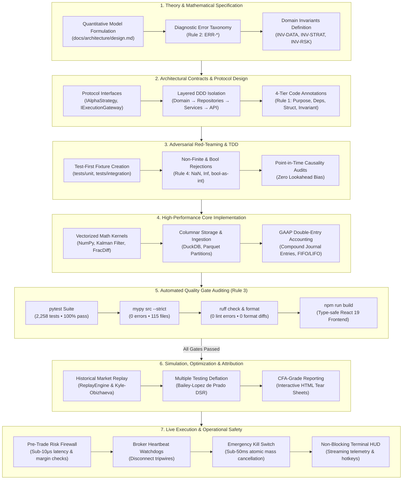

# News-Driven Quantitative Prediction Engine

[](https://www.python.org/)
[](https://fastapi.tiangolo.com/)
[](https://www.sqlalchemy.org/)
[](https://pytest.org/)
[](https://pytest.org/)
[](https://github.com/astral-sh/ruff)
[](https://mypy-lang.org/)

An institutional-grade, multi-algorithmic market prediction and alpha generation platform that integrates unstructured news ingestion with causal temporal decay kernels, Bayesian game-theoretic scenario stress-testing, an evolutionary strategy population powered by **algorithmic hypergamy dynamics**, and an autonomous live trading swarm executing through institutional broker gateways.

---

## Canonical Documentation Suite

The system's operational and architectural standards are organized into a tiered documentation hierarchy in [`docs/`](./docs):

### 1. Architecture & Design
- **[`docs/architecture/architecture.md`](./docs/architecture/architecture.md)**: System Architecture & Component Topology — layered domain design, hybrid storage (DuckDB + PostgreSQL), module maps, Alpaca broker gateway, autonomous trading swarm daemon, real-world news prediction engine, and data flow pipelines.
- **[`docs/architecture/design.md`](./docs/architecture/design.md)**: Quantitative & Technical Design Specification — mathematical formulations for decay kernels, fractional diff, triple-barrier labeling, CPCV, DSR, hypergamic mating, RD-DMA, circuit breakers, EVT tail risk, smart order routing, live execution gateways, and autonomous swarm rebalancing loops.
- **[`docs/architecture/srs.md`](./docs/architecture/srs.md)**: Software Requirements Specification — IEEE Std 830-1998 compliant functional and non-functional engineering requirements.

### 2. Planning & Roadmaps
- **[`docs/planning/prd.md`](./docs/planning/prd.md)**: Product Requirements Document — product vision, market inefficiencies, user personas, and feature matrices (Phase 1 through Phase 12 complete).
- **[`docs/planning/phases.md`](./docs/planning/phases.md)**: Implementation Roadmap & Delivery Phases — granular phase-by-phase delivery schedule (Sprint 1 through Phase 12 complete; 2,133 tests passing).

### 3. Standards & Governance
- **[`docs/standards/rules.md`](./docs/standards/rules.md)**: The Four Fundamental Engineering Rules — micro-level code transparency, zero-execution diagnostics, strict CI quality gates, and mandatory adversarial red-teaming.
- **[`docs/standards/memory.md`](./docs/standards/memory.md)**: Project Memory — Architectural Decision Register (ADR-001 through ADR-028), Deterministic Diagnostic Failure Matrix (ERR-GW, ERR-SOR, ERR-RSK, ERR-HB, ERR-NEWS, ERR-GATE, ERR-BKT, ERR-MCP), and complete engineering audit trail.

### 4. Integration & Operations Guides
- **[`docs/guides/mcp_agent_guide.md`](./docs/guides/mcp_agent_guide.md)**: Model Context Protocol (MCP) Integration Manual — setting up autonomous AI agents with Claude Desktop and Cursor IDE.
- **[`docs/guides/backtest_report.md`](./docs/guides/backtest_report.md)**: Institutional Historical Backtester & Strategy Swarm Optimization Report.

---

## System Architecture

The codebase enforces a **Layered Domain-Driven Design (DDD)** structure to ensure quantitative domain mathematics remain completely decoupled from database frameworks and web servers:

```
quant/
├── docs/                             # Tiered Institutional Documentation Hierarchy
│   ├── architecture/                 # System Architecture & Technical Specifications
│   │   ├── architecture.md           # Layered Domain-Driven Design & Component Topology
│   │   ├── design.md                 # Quantitative & Mathematical Formulations
│   │   └── srs.md                    # Software Requirements Specification (IEEE Std 830-1998)
│   ├── planning/                     # Product Requirements & Delivery Roadmaps
│   │   ├── prd.md                    # Product Requirements Document & Feature Matrices
│   │   └── phases.md                 # Multi-Sprint Implementation Roadmap & Milestones
│   ├── standards/                    # Engineering Governance & Auditing
│   │   ├── rules.md                  # Fundamental Engineering Rules (Rules 1-4)
│   │   └── memory.md                 # ADRs (ADR-001..028) & Diagnostic Error Code Matrix
│   ├── guides/                       # Operator & Developer Integration Manuals
│   │   ├── mcp_agent_guide.md        # Autonomous AI Agent Setup (Claude Desktop & Cursor)
│   │   └── backtest_report.md        # Institutional Backtester & Swarm Optimizer Guide
│   └── superpowers/                  # SDD Plan & Spec Artifacts
├── src/quant/                        # Production Source Code (Clean Architecture / DDD)
│   ├── domain/                       # Pure business models, value objects & repository interfaces
│   ├── analytics/                    # High-performance econometric, evolutionary & simulation engines
│   ├── data/                         # Real-time feeds, news harvesting & external data providers
│   ├── execution/                    # OMS, broker gateways, smart order router, pre-trade risk firewall
│   ├── infrastructure/               # Relational & columnar databases (DuckDB, SQLite/PostgreSQL)
│   ├── mcp/                          # Model Context Protocol server, client & tool definitions
│   ├── services/                     # Application orchestration facades & business workflows
│   ├── api/                          # FastAPI REST endpoints, middleware & WebSocket handlers
│   └── main.py                       # Application entrypoint & ASGI lifespan management
├── tests/                            # Comprehensive Test Rig (2,133 tests, 100% green)
│   ├── unit/                         # Pure mathematical & isolated component unit tests
│   ├── integration/                  # Multi-component, database & gateway integration tests
│   ├── api/                          # REST & WebSocket endpoint tests
│   └── conftest.py                   # Async test fixtures & isolated database harness
├── web/                              # React / TypeScript / Vite / WebGL Trading Workbench
├── scripts/                          # Operational CLI Runners & Utility Tools
│   ├── run_historical_backtest.py    # Multi-asset historical backtest & swarm optimizer
│   ├── run_mcp_agent.py              # Autonomous AI agent observation & decision loop
│   └── run_full_workbench_tour.py    # Complete interactive system test tour
├── data/                             # Isolated Local Persistence Storage
│   ├── quant.db                      # Relational ACID SQLite store
│   └── market_data.duckdb            # High-throughput columnar bar store
├── reports/                          # Generated audit tear sheets and backtest JSON exports
├── migrations/                       # Alembic schema migrations
├── .github/                          # CI/CD workflows
├── pyproject.toml                    # PEP 621 packaging, dependency locks & tool configurations
├── Dockerfile                        # Multi-stage production container definition
├── docker-compose.yml                # Microservices orchestration definition
├── alembic.ini                       # Database migration configuration
├── .env.example                      # Documented environment variables
├── .gitignore                        # Git ignore patterns
└── README.md                         # Canonical Project Overview & Documentation Sitemap
```

---

## Institutional Quantitative SDLC (Software Development Life Cycle)

The platform enforces a rigorous, institutional **Doubt-Driven Development (DDD)** lifecycle governed by [`docs/standards/rules.md`](./docs/standards/rules.md). Every quantitative model, execution component, and risk guard progresses through seven gated stages to prevent capital misallocation, numerical instabilities, and forward lookahead bias.



### SDLC Stage Breakdown & Governance Matrix

| Stage | Focus & Methodology | Primary Input / Spec | Automated Verification Gate | Governing Rule / Invariant |
| :--- | :--- | :--- | :--- | :--- |
| **1. Mathematical Spec** | Derivation of mathematical formulations, closed-form estimators, and failure boundaries. | [`docs/architecture/design.md`](./docs/architecture/design.md) | Peer review & analytical proofs | **Rule 2:** Deterministic fault code catalog (`ERR-*`). |
| **2. Architectural Contracts** | Protocol interface definitions and clean architectural decoupling (Domain, Data, Execution, API). | [`docs/architecture/architecture.md`](./docs/architecture/architecture.md) | Abstract interface conformance | **Rule 1:** 4-tier line annotations (Purpose, Deps, Struct, Invariant). |
| **3. Adversarial TDD** | Writing failing test cases covering pathological inputs, edge cases, and market crashes before writing code. | [`docs/standards/rules.md`](./docs/standards/rules.md) | Test failure validation on unhardened code | **Rule 4:** Strict rejection of `NaN`, `Inf`, and `bool-as-int`. |
| **4. Core Implementation** | Vectorized implementation using NumPy, DuckDB columnar SQL, and double-entry accounting. | Strategy & OMS contracts | Sub-10μs hot-path latency SLAs | `INV-LDG-001` ($\sum \text{Debit} = \sum \text{Credit}$), `INV-NEWS-001` (Point-in-time causality). |
| **5. Quality Gate Audit** | Automated multi-engine static and dynamic verification pipeline. | CI/CD test runners & Linters | `pytest` 100%, `mypy --strict`, `ruff`, `npm build` | **Rule 3:** Zero-tolerance compiler/linter/test deviations. |
| **6. Simulation & Replay** | Replaying strategies over historical tick/bar data with realistic execution friction and slippage. | DuckDB Data Lake | Bailey & Lopez de Prado DSR > 0.0, FDR $q$-value | Kyle-Obizhaeva market impact, continuous borrow fees. |
| **7. Live Execution & Ops** | Live deployment to paper/broker gateways with real-time risk supervision. | Production deployment config | Liveness watchdogs & pre-trade checks | `INV-RSK-008`: Emergency mass cancellation (< 50ms SLA). |

---

## Quickstart Guide

### 1. Environment Setup

Clone the repository and create an isolated virtual environment:

```bash
git clone https://github.com/joshihridesh001-png/Quant-stuff.git
cd Quant-stuff

# Create and activate virtual environment
python -m venv .venv
# On Windows:
.venv\Scripts\activate
# On Linux/macOS:
source .venv/bin/activate

# Install dependencies and local package in editable mode
pip install --upgrade pip
pip install -e ".[dev]"
```

### 2. Environment Configuration & Database Parity

Copy the sample environment variables:

```bash
cp .env.example .env
```

**Development Database Options**:
* **Option A: Containerized PostgreSQL with `pgvector` (Recommended for Dev/Prod Parity)**:
  ```bash
  docker compose up -d
  ```
  Uses the official `pgvector/pgvector:pg16` image providing PostgreSQL 16 with native vector index support.
* **Option B: Local Embedded SQLite**:
  Set `DATABASE_URL=sqlite+aiosqlite:///./data/quant.db` in `.env` for zero-dependency local experimentation.

### 3. Database Migrations

Apply database schema migrations via Alembic:

```bash
alembic upgrade head
```

This provisions the relational tables (`assets`, `events`, `event_centralities`, `genotypes`) and composite indices.

---

## Running the Application

Launch the local ASGI server using Uvicorn:

```bash
uvicorn quant.main:app --reload --port 8000
```

Once running:
* **Interactive OpenAPI Documentation (Swagger UI)**: [`http://127.0.0.1:8000/docs`](http://127.0.0.1:8000/docs)
* **Alternative ReDoc Documentation**: [`http://127.0.0.1:8000/redoc`](http://127.0.0.1:8000/redoc)
* **System Health Check**: [`http://127.0.0.1:8000/healthz`](http://127.0.0.1:8000/healthz)

---

## Frontend Quantitative Research Workbench (React 19)

The platform includes a modern dark-glass web research terminal built with React 19, TypeScript, Tailwind CSS, Lucide icons, and Recharts:

```bash
# In a separate terminal, navigate to web directory:
cd web

# Install frontend dependencies (if not already installed)
npm install

# Start Vite development server with Hot Module Replacement (HMR)
npm run dev
```

* **Development Server**: [`http://localhost:5173`](http://localhost:5173)
* **Production Build**: Served directly at the FastAPI root [`http://127.0.0.1:8000/`](http://127.0.0.1:8000/)

### Interactive Workbench Views
1. **Causal News & Decay Engine (`/news`)**: Live breaking news wire (MarketWatch, Yahoo Finance, SEC EDGAR 8-K), Loughran-McDonald sentiment scores, bi-exponential information decay visualization, and ad-hoc headline shock simulator.
2. **Econometric Stationarity Rig (`/econometrics`)**: Fractional differentiation $(1-B)^d$ search rig, Augmented Dickey-Fuller (ADF) stationarity test curves, Parkinson & Garman-Klass intraday range volatility estimators, and dynamic Triple-Barrier labeling simulation.
3. **Bayesian Game Theory & Jump Regimes (`/regimes`)**: Real-time regime classification (Calm Bull, High Vol Bear, Crisis Jump), CUSUM structural break detector, Markov transition probability heatmaps, and thermodynamic ambiguity optimization.
4. **Evolutionary Strategy Swarm (`/swarm`)**: Multi-objective Pareto frontier optimizer (Sharpe vs CVaR vs Turnover), NSGA-II non-dominated sorting, chromosome gene inspection, and single-step generation stepper.
5. **Simulation & Risk Studio (`/simulation`)**: Historical replay engine, Kyle-Obizhaeva market impact slippage curves, EVT Pickands-Balkema-de Haan tail risk distribution, and Perold (1988) implementation shortfall TCA.
6. **Visual Backtest Studio (`/backtest`)**: Institutional backtester with multi-asset strategy selection, capital allocation controls, equity curve overlays, drawdown underwater charts, and embedded CFA-grade HTML tear sheets.

---

## CLI Operational Runbook (Turnkey Tools)

The platform provides standalone, institutional CLI runner scripts in `scripts/`:

### 1. Ingest Real Historical Market Data
Backfill 5+ years of real historical daily bars with split and dividend adjustments into the columnar DuckDB data lake:
```bash
python scripts/ingest_historical_data.py --symbols SPY,QQQ,AAPL,NVDA,MSFT --provider yahoo --years 5
```

### 2. Launch Turnkey Live Paper Trading Station & Terminal HUD
Start an interactive live trading session with real-time bar processing, alpha generation, pre-trade risk firewall, execution routing, and double-entry ledger booking:
```bash
# Interactive Live Terminal with Swarm Meta-Strategy:
python scripts/run_live_trader.py --symbols SPY,QQQ,AAPL,NVDA,MSFT --strategy swarm --capital 100000

# Kalman Pairs Trading Strategy (SPY vs QQQ):
python scripts/run_live_trader.py --symbols SPY,QQQ --strategy kalman --capital 250000

# Headless background execution (for servers / systemd / Docker):
python scripts/run_live_trader.py --symbols SPY,QQQ,AAPL --strategy momentum --headless --poll-interval 2.0
```

**Non-Blocking Operator Keyboard Hotkeys**:
* `[SPACE]`: Pause / Resume trading session event loop.
* `[K]`: Emergency panic kill switch (sub-50ms concurrent multi-gateway mass cancellation sweep).
* `[R]`: Re-arm risk firewall via constant-time admin authentication.
* `[Q]`: Orderly session shutdown with ledger reconciliation.

### 3. Run Historical Simulation Backtest & Generate CFA Tear Sheets
Execute a high-fidelity historical backtest over the DuckDB data lake with Kyle-Obizhaeva execution frictions, overnight margin interest, and short stock borrow drag:
```bash
python scripts/run_historical_backtest.py --symbols SPY,QQQ,AAPL,NVDA,MSFT --capital 100000 --output reports/backtest_tearsheet.html
```

### 4. Launch Autonomous AI Agent via Model Context Protocol (MCP)
Run the autonomous AI observation and decision loop communicating over standardized MCP tools:
```bash
python scripts/run_mcp_agent.py
```

---

## Primary API Endpoints

### 1. News Ingestion & Active State
* `POST /api/v1/events/ingest`: Ingest a single unstructured news event with continuous asset centrality weights ($c_{i,k}$). (Protected by `X-API-Key`).
* `POST /api/v1/events/batch`: High-throughput atomic ingestion of up to 500 news events per request. (Protected by `X-API-Key`).
* `GET /api/v1/events/{id}`: Retrieve ingested event metadata and sentiment vectors.
* `GET /api/v1/events/state/{ticker}`: Calculate the active time-decayed news state vector $\mathbf{S}_{\text{news}}^{(k)}(t)$ using the hybrid dual-decay kernel with numerical truncation tolerance ($\epsilon \le 10^{-4}$):
  $$\kappa(\Delta t, u) = \alpha \exp\left(-\frac{\Delta t}{\tau_{\text{fast}} \cdot (1 - u)}\right) + (1 - \alpha)\left(1 + \frac{\Delta t}{\tau_{\text{slow}}}\right)^{-\beta}$$
  *Pass `use_projected_subspace=true` to project dense embeddings into an energy-balanced subspace ($d_p=16$).*

### 2. Evolutionary Strategy Population
* `POST /api/v1/genotypes`: Register candidate strategy chromosome $\mathbf{g}_k = \langle \mathbf{g}_{\text{repr}}, \mathbf{g}_{\text{game}}, \mathbf{g}_{\text{infer}}, \mathbf{g}_{\text{risk}} \rangle$.
* `POST /api/v1/genotypes/seed`: Seed generation 0 population with stratified Alpha ($20\%$) and Aspirant ($80\%$) cohorts. (Requires `ADMIN` or `RESEARCHER` role).
* `GET /api/v1/genotypes/alpha`: Query the elite Alpha cohort sorted by multi-objective fitness.
* `GET /api/v1/genotypes/pareto`: Query the population ranked by **NSGA-II Non-Dominated Sorting** and crowding distance across performance, drawdown, regret, and novelty vectors.
* `POST /api/v1/genotypes/{id}/evaluate`: Evaluate and record Deflated Sharpe Ratio (DSR), Max Drawdown, and composite multi-objective fitness:
  $$\mathcal{F}(\mathcal{I}_i) = \text{DeflatedSharpe} \cdot e^{-\psi \cdot \text{MaxDD}} + \omega_1 \cdot V_i(\text{Regret}) + \omega_2 \cdot \mathcal{H}_{\text{novelty}}$$

### 3. Authentication & RBAC
* `POST /api/v1/auth/token`: Issue signed RFC 7519 JWT access tokens with constant-time verification for researchers and administrators.

### 4. Live Order Execution & Algorithmic Routing
* `POST /api/v1/orders`: Submit parent orders specifying algorithmic scheduling strategy (`POISSON_TWAP`, `VOLUME_ADAPTIVE_VWAP`, `ARRIVAL_PRICE`).
* `GET /api/v1/orders`: List active parent orders, current execution states, filled quantities, and average execution prices.
* `GET /api/v1/orders/{id}`: Query parent order execution details, child order slices, and routing audit trail.
* `DELETE /api/v1/orders/{id}`: Cancel an active parent order and immediately abort remaining un-dispatched slices.
* `GET /api/v1/orders/{id}/shortfall`: Retrieve Perold (1988) Implementation Shortfall Transaction Cost Analysis (TCA) report with exact additive decomposition (delay, price impact, spread slippage, fees, opportunity cost).

### 5. Real-Time Risk Monitor & Kill Switch
* `GET /api/v1/risk/status`: Real-time portfolio telemetry (NAV, peak NAV, cash balance, free margin, gross/net leverage, intraday drawdown, open leaves count).
* `GET /api/v1/risk/limits` / `PUT /api/v1/risk/limits`: Inspect and dynamically modify pre-trade risk firewall thresholds.
* `POST /api/v1/risk/panic`: Emergency firm-wide panic kill switch triggering concurrent mass cancellation sweep ($< 5\text{ms}$) and submission lockdown.
* `POST /api/v1/risk/reset`: Cryptographic constant-time operator disarm and reset of emergency kill switch.
* `GET /api/v1/gateways/health`: Real-time broker gateway connection liveness, sequence numbers, and RTT latency status.

### 6. Streaming Real-Time WebSockets
* `WS /api/v1/ws/executions`: Full-duplex WebSocket streaming order state updates, child slice dispatches, and fill events in real time.
* `WS /api/v1/ws/risk`: Live streaming portfolio risk metrics, gateway heartbeat telemetry, and emergency circuit breaker alerts.

### 7. Autonomous Live Trading Swarm Daemon
* `GET /api/v1/autonomous/status`: Query autonomous trading swarm state (`IDLE`, `RUNNING`, `PAUSED`, `STOPPED`, `ERROR`), iteration count, monitored universe, and active allocations.
* `POST /api/v1/autonomous/start`: Launch the autonomous background rebalancing clock loop.
* `POST /api/v1/autonomous/stop`: Cleanly terminate the background autonomous daemon.
* `POST /api/v1/autonomous/pause` / `POST /api/v1/autonomous/resume`: Pause and resume autonomous loop execution.
* `POST /api/v1/autonomous/step`: Execute a single discrete rebalancing iteration and return detailed execution report (`AutonomousStepReportDTO`).

### 8. Real-World News Harvesting & Causal Price Reaction
* `GET /api/v1/news/latest`: Query latest harvested real-world news articles and active causal price reaction predictions.
* `POST /api/v1/news/harvest`: Trigger an asynchronous multi-source RSS/Atom harvest sweep with SHA-256 deduplication.
* `POST /api/v1/news/predict`: Evaluate Loughran-McDonald sentiment, causal price drift, and Triple-Barrier breakout targets for ad-hoc headlines.

### 9. External Quantitative Data Providers
* `GET /api/v1/providers/status`: Check configuration, health telemetry, and invocation counters across all external data providers (FRED, Finnhub, NewsAPI, Polygon).
* `POST /api/v1/providers/macro/sync`: Query macroeconomic yield curve spread (`T10Y2Y`) and effective Fed Funds rate (`DFF`) to condition Bayesian regime priors.
* `GET /api/v1/providers/company-news/{symbol}`: Ingest real-time institutional company news for a ticker from Finnhub with calibrated offline fallback.

### 10. Institutional Trading Terminal HUD
* `GET /terminal`: High-refresh browser trading dashboard featuring live WebSocket integration, 1,000-strategy evolutionary swarm selector, order book visualization, candlestick chart, live blotter, autonomous swarm controls, live news feed, scenario shock simulator, and emergency kill switch panel.

### 11. CFA-Grade Backtesting & Reporting Endpoints
* `POST /api/v1/backtest/run`: Run historical simulation backtest across user-configured universes, strategies, capital allocations, and friction models.
* `GET /api/v1/backtest/reports/{run_id}`: Retrieve self-contained interactive CFA-grade HTML tear sheet report with embedded SVG visualizations.

### 12. Model Context Protocol (MCP) AI Agent Server
* `POST /api/v1/mcp/rpc`: Standardized JSON-RPC 2.0 endpoint dispatching authenticated MCP tools (`quant_portfolio_telemetry`, `quant_macro_regimes`, `quant_market_orderbook`, `quant_evaluate_pre_trade`, `quant_swarm_status`, `quant_panic_kill_switch`) for autonomous AI agents.

---

## Verification & Quality Assurance

The codebase enforces strict static analysis and automated testing:

```bash
# 1. Static Linting & Code Style
ruff check .

# 2. Code Formatting Verification
ruff format --check .

# 3. Static Type Checking (Strict Mode across 115 source files)
mypy src --strict

# 4. Automated Test Suite with Coverage Enforcement (> 85%)
pytest tests/unit tests/api tests/integration

# 5. Frontend Production Bundle & Type Validation
npm --prefix web run build
```

All **2,258 unit and integration tests** pass with 100% green execution across the entire test suite.

---

## Implementation Roadmap

| Phase | Milestone | Focus Areas | Status |
| :--- | :--- | :--- | :--- |
| **Sprint 1** | **Foundational Architecture & Quality Rig** | `src/` layout, async SQLAlchemy ORM, Alembic migrations, FastAPI routing, RBAC, decay kernel, multi-objective fitness, 89% test coverage, GitHub Actions CI. | **Complete** |
| **Sprint 2: Step 1** | **Market Data Entity & Columnar Storage** | Immutable `PriceBar` with defensive invariants, contiguous `MarketDataBatch`, embedded DuckDB engine, PyArrow zero-copy bulk ingestion, rolling realized volatility ($\sigma_t$). | **Complete** |
| **Sprint 2: Step 2** | **Fractional Differentiation Engine** | Memory-preserving differentiation $(1-B)^d$, binomial weight series with tolerance truncation ($\epsilon \le 10^{-4}$), automated stationarity search via ADF test. | **Complete** |
| **Sprint 2: Step 3** | **Dynamic Volatility Triple-Barrier Labeling** | Path-dependent horizontal/vertical barrier detection, realized volatility dynamic threshold scaling, un-hit expiration classification. | **Complete** |
| **Sprint 2: Step 4** | **Combinatorial Purged Cross-Validation (CPCV)** | Non-IID combinatorial partition generator $\binom{N}{k}$, temporal event purging, post-test embargo windows. | **Complete** |
| **Sprint 2: Step 5** | **Two-Stage Meta-Labeling Architecture** | Primary directional model decoupling, secondary probability-calibrated betting classifier ($z_t \in \{0, 1\}$), capacity-aware sizing. | **Complete** |
| **Sprint 2: Step 6** | **Deflated Sharpe Ratio (DSR) & Statistical Testing** | Adjustment for non-normality (skewness, kurtosis), sample length $T$, trial count $K$, and variance of trials $V[\{SR\}]$. | **Complete** |
| **Sprint 3** | **Scenario Matrix & Game Theory Engine** | Causal Bayesian jump-regimes, OAS covariance shrinkage, 3/2-power Pseudo-Huber cross-impact, Stackelberg trajectory, entropic minimax regret solver. | **Complete** |
| **Sprint 4** | **Evolutionary Strategy Search & Population Management** | 20-gene chromosome codec, boundary-anchored adaptive RVEA, hypergamic assortative mating, adaptive Cauchy mutation, $(\mu + \lambda)$ lifecycle engine. | **Complete** |
| **Sprint 5** | **Ensemble Aggregator, Tail Risk & Live Replay Simulator** | Regime-conditioned DMA (RD-DMA), epistemic disagreement entropy circuit breakers, semi-parametric EVT-POT GPD with closed-form PWM, unified strictly concave convex sizer, end-to-end live replay simulator & institutional benchmarking. | **Complete** |
| **Phase 6: Step 1** | **Live Execution Gateway, State Machine & Audit Logger** | Pure domain models (`Order`, `ExecutionReport`), deterministic FSM (`OrderStateMachine`) with out-of-order reconciliation, UUIDv5 `IdempotencyRouter`, `PaperExecutionGateway` broker, and non-blocking SQLite WAL `OrderAuditLogger`. | **Complete** |
| **Phase 6: Step 2** | **Microstructural Smart Order Router (SOR) & Algorithmic Execution** | Multi-venue domain (`VenueProfile`, `ConsolidatedQuote`), Poisson TWAP, Bayesian VWAP, Almgren-Chriss Arrival Price, two-phase dark/lit SOR with toxic markout watchdog, parent order lifecycle, and Perold (1988) implementation shortfall TCA. | **Complete** |
| **Phase 6: Step 3** | **Real-Time Risk Monitor, OMS Heartbeats & Emergency Kill Switch** | In-memory pre-trade risk firewall (`PreTradeRiskFirewall`), multi-asset directional netting, heartbeat transport watchdog (`HeartbeatWatchdog`), emergency panic kill switch (`EmergencyKillSwitch`) with sub-5ms mass cancellation sweep, and unified `RiskOrchestrator` façade. | **Complete** |
| **Phase 7** | **Live Execution REST, WebSockets & Trading Terminal Bridge** | Parent order execution endpoints (`POST /api/v1/orders`), multi-slice scheduling, Perold TCA shortfall reporting, real-time WebSockets (`/api/v1/ws/executions`, `/api/v1/ws/risk`), and WebGL/Canvas dark-mode trading terminal HUD (`/terminal`). | **Complete** |
| **Phase 8** | **Production Live Trading Engine & Autonomous Swarm Daemon** | Institutional Alpaca Markets live/paper broker gateway adapter (`AlpacaExecutionGateway`), live streaming and polled market data feed (`AlpacaMarketDataFeed`) writing to DuckDB and streaming FracDiff buffers, continuous autonomous trading swarm loop (`AutonomousTradingEngine`) integrating RD-DMA ensemble forecasts, circuit breakers, EVT-POT tail risk CVaR, convex execution sizing, pre-trade risk firewall, and SOR execution slicing with automated zero-drift state loop and operator controls (`/api/v1/autonomous`). | **Complete** |
| **Phase 9** | **Real-World News Harvester & Causal Price Reaction Engine** | Multi-source async RSS/Atom parser (`NewsHarvester`) with SHA-256 deduplication and point-in-time causality, Loughran-McDonald sentiment and event taxonomy (`FinancialSentimentClassifier`), closed-form causal price reaction and Triple-Barrier breakout engine (`NewsPriceReactionEngine`), directional forward prior injection into autonomous swarm, REST endpoints (`/api/v1/news`), and terminal HUD live news and scenario shock widget. | **Complete** |
| **Phase 10** | **External Quantitative Data Providers & Multi-API Swarm Integration** | Selected high-utility public APIs from `public-apis`: FRED (yield curve spreads `T10Y2Y`, Fed funds `DFF`), Finnhub (real-time ticker quotes, company news), NewsAPI.org (global business headlines), and Polygon.io (aggregate bars) with hermetic offline fallback, zero-secret defaults, provider status monitoring (`/api/v1/providers`), and full autonomous swarm integration. | **Complete** |
| **Phase 11** | **Quantitative Research Workbench (React 19)** | Full React 19 / TypeScript / Tailwind CSS / Recharts dark-glass visual research terminal with 6 views, real-time WebSocket HUD, and econometric parameter rigs. | **Complete** |
| **Phase 12** | **Autonomous AI Agent Integration via MCP** | Model Context Protocol (2024-11-05) client and server exposing authenticated JSON-RPC tools with stdio & HTTP transports for Claude Desktop and Cursor. | **Complete** |
| **Phase 13** | **Historical Ingestion Lake & Columnar Storage** | Real market data providers (Yahoo Finance v8, Alpaca v2, Polygon.io), DuckDB columnar repository partitioned by symbol with sub-millisecond range queries, and 5+ year historical backfill. | **Complete** |
| **Phase 14** | **Modular Cross-Asset Alpha Strategy Library** | Decoupled `IAlphaStrategy` protocol, Kalman Stat-Arb with dollar-beta and hysteresis, FracDiff Momentum, Loughran-McDonald Sentiment with bi-exponential memory decay, Volatility Squeeze with Parkinson/Garman-Klass, and Swarm Meta RD-DMA. | **Complete** |
| **Phase 15** | **Visual CFA-Grade Backtesting Studio & Interactive Reporting** | High-fidelity backtester with Kyle-Obizhaeva slippage, Bailey-Lopez de Prado Deflated Sharpe Ratio (DSR), EVT Pickands-Balkema-de Haan tail risk, and self-contained interactive SVG HTML tear sheets. | **Complete** |
| **Phase 16** | **Persistent Double-Entry GAAP Ledger & Tax-Lots** | Relational double-entry accounting schema, balanced compound journal entries, FIFO and LIFO tax-lot matching engine, continuous margin loan interest, and hard-to-borrow (HTB) short borrow drag models. | **Complete** |
| **Phase 17** | **Turnkey Continuous Live Paper Trading Station** | Sub-second event loop session orchestrator, Rich terminal HUD, non-blocking operator hotkeys (`[SPACE]`, `[K]`, `[R]`, `[Q]`), OS signal traps, and CLI runner. | **Complete** |


