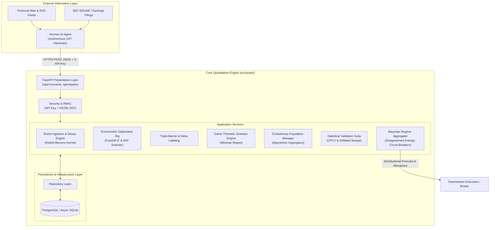

# Software Requirements Specification (SRS)
## News-Driven Quantitative Prediction Engine & Alpha Platform

**Document Identifier:** SRS-QUANT-2026-V1  
**Version:** 1.0.0  
**Status:** Approved / Baseline  
**Standards Compliance:** IEEE Std 830-1998 / ISO/IEC/IEEE 29148:2018  
**System Classification:** Institutional Algorithmic Prediction & Research Engine  

---

## 1. Introduction

### 1.1 Purpose
This Software Requirements Specification (SRS) establishes the complete functional, econometric, architectural, and non-functional requirements for the **News-Driven Quantitative Prediction Engine**. This document serves as the canonical technical contract for quantitative researchers, software engineers, and automated intelligence agents operating within the system ecosystem.

### 1.2 Scope
The system is an institutional-grade, multi-algorithmic quantitative prediction and alpha generation platform. The engine:
1. Ingests unstructured financial news streams asynchronously via internal services and external autonomous agents (**Hermes AI Agent**).
2. Maps events to target assets using continuous centrality weights and calculates active time-decayed state vectors via a hybrid dual-decay memory kernel ($\tau_{\text{fast}}, \tau_{\text{slow}}$).
3. Enforces econometric stationarity through memory-preserving **Fractional Differentiation** ($d^*$).
4. Evaluates strategy candidates against non-cooperative market regimes using **Bayesian Game-Theoretic Payoff Matrices** and **Minimax Regret**.
5. Evolves strategy chromosomes through a genetic algorithm governed by **Algorithmic Hypergamy Dynamics** gated by residual error orthogonality.
6. Validates all statistical alpha using **Combinatorial Purged Cross-Validation (CPCV)** and the **Deflated Sharpe Ratio (DSR)**.
7. Aggregates elite model predictions into risk-budgeted execution mandates with automated disagreement entropy circuit breakers.

### 1.3 Definitions, Acronyms, and Abbreviations
* **ADF**: Augmented Dickey-Fuller unit-root test for time series stationarity.
* **Alpha Cohort**: The top $\rho = 20\%$ tier of strategy genotypes ranked by multi-objective fitness.
* **Aspirant Cohort**: The remaining $80\%$ tier of candidate genotypes seeking crossover with Alpha models.
* **CPCV**: Combinatorial Purged Cross-Validation.
* **CUSUM**: Cumulative Sum control chart used for detecting alpha degradation.
* **DAG**: Directed Acyclic Graph representing causal event relationships.
* **DSR**: Deflated Sharpe Ratio (adjusts for skewness, kurtosis, sample length, and multiple testing trials).
* **FracDiff**: Fractional Differentiation operator $(1-B)^d$ preserving long-term memory while achieving stationarity.
* **Hermes Agent**: Autonomous external 24/7 background AI agent (Nous Research) handling web crawling, news ingestion, and structured entity extraction.
* **HRP**: Hierarchical Risk Parity portfolio allocation.
* **Meta-Labeling**: Machine learning architecture decoupling directional trade forecasting from position conviction and sizing.
* **Minimax Regret**: Game-theoretic optimization minimizing the worst-case opportunity loss across adversarial scenarios.
* **OBI**: Order Book Imbalance across price tiers.
* **Orthogonality Gate**: Mathematical condition requiring residual error correlation between two models to fall below $\delta_{\text{ortho}}$ before genetic crossover is permitted.
* **RBAC**: Role-Based Access Control.
* **RMT**: Random Matrix Theory for covariance matrix eigenvalue denoising.
* **Triple-Barrier Method**: Labeling method path-evaluating upper profit, lower stop-loss, and vertical horizon exit barriers.
* **VPIN**: Volume-Synchronized Probability of Toxicity.

### 1.4 References
1. *System Architecture Blueprint*: [`system_architecture_plan.md`](./system_architecture_plan.md)
2. *Institutional Research Framework*: [`institutional_quant_framework.md`](./institutional_quant_framework.md)
3. *Technical Audit Log*: [`CHANGELOG_DEV.md`](./CHANGELOG_DEV.md)
4. López de Prado, M. (2018). *Advances in Financial Machine Learning*. John Wiley & Sons.
5. Bailey, D. H., & López de Prado, M. (2014). *The Deflated Sharpe Ratio: Correcting for Selection Bias, Backtest Overfitting and Non-Normality*. Journal of Portfolio Management.
6. RFC 7807: *Problem Details for HTTP APIs*.
7. RFC 7519: *JSON Web Token (JWT)*.

---

## 2. Overall Description

### 2.1 Product Perspective & Context
The engine operates as a decoupled, layered service. It does not perform high-frequency colocation order routing itself; rather, it generates point-in-time distributional alpha forecasts, regime alerts, and risk-sized portfolio weights routed to downstream brokers or execution algorithms.

### 2.2 Product Functions (High-Level Summary)
* **F-1 Ingestion**: Ingestion and persistent storage of multi-asset unstructured news events with composite feature vectorization.
* **F-2 Decay Chaining**: Continuous temporal decay evaluation combining fast exponential dissipation with slow power-law structural memory.
* **F-3 Stationarity**: Transformation of non-stationary market series into stationary series using minimal fractional differencing $d^*$.
* **F-4 Labeling**: Path-dependent volatility-adjusted trade exit labeling and secondary conviction meta-labeling.
* **F-5 Scenario Testing**: Evaluation of strategy action vectors against non-cooperative market profiles (Immediate Reversal, Momentum Cascade, Liquidity Squeeze).
* **F-6 Natural Selection**: Population stratification into Alpha and Aspirant cohorts with hypergamic mating gated by error orthogonality.
* **F-7 Validation**: Leakage-free combinatorial cross-validation with temporal purging and embargoing; calculation of Deflated Sharpe Ratios.
* **F-8 Safeguards**: Predictive disagreement entropy monitoring with automated de-leveraging and CUSUM performance kill switches.

### 2.3 User Classes and Roles
1. **Machine Ingestion Client (`INGESTION_SERVICE`)**: Autonomous external scrapers (e.g., Hermes AI Agent) authenticated via scoped `X-API-Key` headers. Permitted solely to ingest events.
2. **Quantitative Researcher (`RESEARCHER`)**: Human or agent researchers authenticated via Bearer JWT. Permitted to query active states, seed populations, trigger backtests, and inspect Alpha cohorts.
3. **System Administrator (`ADMIN`)**: Administrative operators managing risk limits, database migrations, and system configuration.

### 2.4 Design and Implementation Constraints
* **CON-1 Language Runtime**: Core engine implemented in **Python 3.13+** adhering to strict PEP 621 packaging.
* **CON-2 Architecture**: Strict **Layered Domain-Driven Design (DDD)**. Domain entities and mathematical algorithms must remain pure functions with zero framework dependencies on FastAPI or SQLAlchemy.
* **CON-3 Zero Data Leakage**: Backtest splitting algorithms must mathematically guarantee zero temporal overlap between training feature horizons and test labels.
* **CON-4 Decoupled LLM Boundary**: No Large Language Model or autonomous agent shall execute inside the deterministic mathematical engine. All LLM operations remain out-of-process external clients communicating via REST.

---

## 3. External Interface Requirements

### 3.1 Software Interfaces

#### 3.1.1 Database Management System
* **Engine**: PostgreSQL 15+ (Production) / SQLite via `aiosqlite` (Local Development & Testing).
* **Connection Management**: Asynchronous connection pooling via SQLAlchemy 2.0 (`AsyncSession`).
* **Schema Evolution**: Version-controlled migrations managed via Alembic.

#### 3.1.2 External Ingestion Agent (Hermes AI Agent)
* **Protocol**: HTTPS / REST.
* **Payload Format**: JSON adhering strictly to RFC 8259.
* **Authentication**: Static or rotated cryptographic API key delivered in the `X-API-Key` HTTP header.

### 3.2 Communication Protocols & Security
* **Network Protocol**: TLS 1.3 encrypted HTTPS.
* **Token Standard**: RFC 7519 JSON Web Token (JWT) signed via HMAC-SHA256 (`HS256`).
* **Password Hashing**: NIST SP 800-132 compliant PBKDF2-HMAC-SHA256 with 600,000 iterations and 16-byte random salts.
* **Error Representation**: RFC 7807 Problem Details for all HTTP $4\times\times$ and $5\times\times$ responses.

---

## 4. System Features & Functional Requirements

### 4.1 Subsystem 1: News Ingestion & Temporal Causal Chaining

#### 4.1.1 Description
Captures unstructured market intelligence, transforms text into dense and axial representations, and maintains active state vectors per asset.

#### 4.1.2 Detailed Requirements
* **FR-1.1 Composite Vector Generation**: For every incoming event, the system shall construct feature vector $\mathbf{e}_i \in \mathbb{R}^D$:
  $$\mathbf{e}_i = \Big[ \mathbf{v}_{\text{dense}} \;\|\; \mathbf{s}_{\text{sentiment}} \;\|\; \mathbf{u}_{\text{urgency}} \;\|\; \mathbf{c}_{\text{centrality}} \Big]$$
  where $\mathbf{v}_{\text{dense}} \in \mathbb{R}^{d_e}$ is a dense Transformer embedding, $\mathbf{s}_{\text{sentiment}} \in [-1, 1]^3$ (polarity, subjectivity, novelty), $\mathbf{u}_{\text{urgency}} \in [0, 1]$, and $\mathbf{c}_{\text{centrality}} \in [0, 1]^K$.
* **FR-1.2 Centrality Linkage**: Events shall support multi-asset mapping where relevance weight $c_{i,k} \in [0, 1]$ represents continuous sensitivity for asset $k$.
* **FR-1.3 Hybrid Memory Kernel**: The active state $\mathbf{S}_{\text{news}}^{(k)}(t)$ for asset $k$ at time $t$ shall be evaluated as:
  $$\mathbf{S}_{\text{news}}^{(k)}(t) = \sum_{i \in \mathcal{V}_t} c_{i,k} \cdot \mathbf{e}_i \cdot \kappa(t - t_i, \mathbf{u}_i)$$
  $$\kappa(\Delta t, u) = \alpha \exp\left(-\frac{\Delta t}{\tau_{\text{fast}} \cdot (1 - u)}\right) + (1 - \alpha)\left(1 + \frac{\Delta t}{\tau_{\text{slow}}}\right)^{-\beta}$$
  with $\tau_{\text{fast}}$ governing fast sentiment dissipation and $\tau_{\text{slow}}$ governing long-term structural trends.
* **FR-1.4 Boundary Safety**: $\Delta t < 0$ shall yield $\kappa = 0.0$. In the fast decay denominator, $u \ge 1.0$ shall be clamped to $0.999$ to prevent division by zero.

---

### 4.2 Subsystem 2: Econometric Stationarity & Feature Engineering

#### 4.2.1 Description
Ensures financial time series achieve stationarity required for valid inferential estimation while preserving maximum long-memory structure.

#### 4.2.2 Detailed Requirements
* **FR-2.1 Binomial Series Expansion**: The system shall compute weights $w_k$ for the fractional differentiation operator $(1-B)^d$:
  $$w_0 = 1, \quad w_k = -w_{k-1} \frac{d - k + 1}{k}, \quad \forall k \ge 1$$
* **FR-2.2 Memory Cutoff Threshold**: Weights shall be truncated once $|w_k| < \epsilon$ (default $\epsilon = 1 \times 10^{-4}$) to prevent memory bloat and enforce finite memory windows.
* **FR-2.3 Stationary Series Generation**: The differentiated series shall evaluate via expanding window dot-product convolution:
  $$\tilde{X}_t = \sum_{k=0}^{\min(t, K)} w_k X_{t-k}$$
* **FR-2.4 Automated $d^*$ Search**: The system shall scan $d \in [0.0, 1.0]$ in discrete steps ($\Delta d \le 0.05$), executing the Augmented Dickey-Fuller (ADF) test at each step. It shall select the minimal differencing parameter $d^*$ satisfying:
  $$p_{\text{ADF}}(d^*) < 0.05 \quad \text{and} \quad d^* = \arg\min_{d} \{ \text{p-value}(d) < 0.05 \}$$
  while reporting correlation with original series $P_t$.

---

### 4.3 Subsystem 3: Dynamic Labeling & Meta-Labeling

#### 4.3.1 Description
Implements path-dependent, volatility-adjusted exit labeling replacing arbitrary fixed-horizon return prediction.

#### 4.3.2 Detailed Requirements
* **FR-3.1 Instantaneous Volatility**: The system shall estimate dynamic volatility $\sigma_t$ as an exponentially weighted moving standard deviation of log returns across span $N_{\text{vol}}$ (default $N_{\text{vol}} = 100$).
* **FR-3.2 Triple-Barrier Exit Evaluation**: For each trading decision timestamp $t_0$, three barriers shall be established:
  1. Upper Barrier: $U_t = P_{t_0} \cdot (1 + \text{pt} \cdot \sigma_{t_0})$
  2. Lower Barrier: $L_t = P_{t_0} \cdot (1 - \text{sl} \cdot \sigma_{t_0})$
  3. Vertical Barrier: $T_{\text{max}} = t_0 + \Delta t_{\text{horizon}}$
* **FR-3.3 First-Touch Labeling**: The sample shall be assigned label $y_{t_0} \in \{-1, 0, 1\}$ corresponding to whichever barrier is intersected first:
  $$y_{t_0} = \begin{cases} +1 & \text{if price touches } U_t \text{ first (profit)} \\ -1 & \text{if price touches } L_t \text{ first (stop loss)} \\ 0 & \text{if price reaches } T_{\text{max}} \text{ without touching } U_t \text{ or } L_t \end{cases}$$
* **FR-3.4 Meta-Labeling Classification**: Decouple directional prediction from bet conviction. Given primary directional signal $\hat{y}_t \in \{-1, 1\}$, generate binary target $z_t \in \{0, 1\}$:
  $$z_t = \begin{cases} 1 & \text{if primary model prediction matches sign of realized barrier exit return} \\ 0 & \text{otherwise} \end{cases}$$
  The secondary classifier outputs calibrated probability $p(z_t = 1)$ to parameterize bet sizing.

---

### 4.4 Subsystem 4: Adversarial Game-Theoretic Scenario Generator

#### 4.4.1 Description
Stress-tests candidate algorithms within non-cooperative, imperfect-information market games.

#### 4.4.2 Detailed Requirements
* **FR-4.1 Scenario Formulation**: The system shall model candidate algorithms as Player 1 selecting action $\mathbf{a}_1 \in [-1, 1]^K$ against Nature/Market scenarios $\mathbf{s}_j \in \mathcal{S}$:
  1. $\mathbf{s}_1$ (**Immediate Reversal**): Market-maker inventory mean reversion.
  2. $\mathbf{s}_2$ (**Momentum Cascade**): Flow clustering, herd stops, trend continuation.
  3. $\mathbf{s}_3$ (**Liquidity Trap / Squeeze**): Adversarial absorption by institutional liquidity providers.
* **FR-4.2 Payoff Utility**: Payoff $U(\mathbf{a}_1, \mathbf{s}_j)$ shall incorporate risk aversion, transaction friction, and non-linear crowding penalties:
  $$U(\mathbf{a}_1, \mathbf{s}_j) = \mathbf{a}_1^T \mathbb{E}[\mathbf{r} \mid \mathbf{s}_j] - \lambda \cdot \mathbf{a}_1^T \mathbf{\Sigma}(\mathbf{s}_j) \mathbf{a}_1 - \mathcal{C}(\mathbf{a}_1, \mathbf{a}_1^{\text{prior}}) - \Omega_{\text{crowding}}(\mathbf{a}_1, \mathbf{s}_j)$$
* **FR-4.3 Minimax Regret Metric**: Strategy robustness $V_i$ shall evaluate as the negative maximum regret across all scenarios:
  $$V_i = -\max_{\mathbf{s}_j \in \mathcal{S}} \left( \max_{\mathbf{a}^*} U(\mathbf{a}^*, \mathbf{s}_j) - U(\mathbf{a}_i, \mathbf{s}_j) \right)$$

---

### 4.5 Subsystem 5: Evolutionary Engine & Algorithmic Hypergamy

#### 4.5.1 Description
Optimizes model hyperparameters while preventing genetic homogenization and regime-specific overfitting.

#### 4.5.2 Detailed Requirements
* **FR-5.1 Chromosome Structure**: Genotypes $\mathbf{g}_k$ shall encode four modular sub-chromosomes:
  $$\mathbf{g}_k = \langle \mathbf{g}_{\text{repr}}, \mathbf{g}_{\text{game}}, \mathbf{g}_{\text{infer}}, \mathbf{g}_{\text{risk}} \rangle$$
  encoding decay rates ($\tau_{\text{fast}}, \tau_{\text{slow}}, \alpha$), game priors ($\mathbf{p}_{\text{belief}}, \lambda$), inference parameters, and volatility/drawdown limits.
* **FR-5.2 Population Stratification**: The population of $N$ individuals shall be partitioned into:
  * **Alpha Cohort**: Top $\rho = 20\%$ by multi-objective fitness.
  * **Aspirant Cohort**: Remaining $(1 - \rho) = 80\%$.
* **FR-5.3 Hypergamic Orthogonality Gate**: When an Aspirant seeks crossover with an Alpha individual, crossover shall be rejected unless historical prediction residuals demonstrate orthogonality:
  $$\text{Corr}(\mathbf{e}_{\text{Alpha}}, \mathbf{e}_{\text{Aspirant}}) < \delta_{\text{ortho}}$$
  If rejected, the Aspirant shall fall back to exploratory breeding within the Aspirant tier.
* **FR-5.4 Multi-Objective Fitness Function**:
  $$\mathcal{F}(\mathcal{I}_i) = \text{DeflatedSharpe}(\mathcal{I}_i) \cdot \exp\left( -\psi \cdot \text{MaxDD}(\mathcal{I}_i) \right) + \omega_1 \cdot V_i(\text{Regret}) + \omega_2 \cdot \mathcal{H}_{\text{novelty}}(\mathcal{I}_i)$$
* **FR-5.5 Adaptive Volatility Mutation**: Mutation probability $\mu(t)$ shall dynamically scale with realized volatility:
  $$\mu(t) = \mu_0 \cdot \left(1 + \tanh\left(\beta \cdot \frac{\sigma_{\text{realized}}(t)}{\bar{\sigma}_{\text{baseline}}} - 1\right)\right)$$

---

### 4.6 Subsystem 6: Statistical Validation & Multiple Testing Control

#### 4.6.1 Description
Enforces strict out-of-sample integrity, prevents backtest overfitting, and penalizes data mining bias.

#### 4.6.2 Detailed Requirements
* **FR-6.1 Purged Cross-Validation (PCV)**: For every training fold, the system shall purge all training observations whose label evaluation horizon $[t_{i,\text{start}}, t_{i,\text{end}}]$ overlaps with the test fold window.
* **FR-6.2 Embargo Period**: The system shall exclude training observations immediately following a test fold for duration $h_{\text{embargo}} \ge \text{max\_half\_life}$ to eliminate autoregressive serial correlation leakage.
* **FR-6.3 Combinatorial Purged K-Fold (CPCV)**: The system shall partition $T$ observations into $N$ chronological blocks, generate $\binom{N}{k}$ combinatorial testing paths, and yield independent out-of-sample backtest distributions.
* **FR-6.4 Deflated Sharpe Ratio (DSR)**: Observed Sharpe ratios shall be deflated conditional on sample length $T$, return skewness $\hat{\gamma}_3$, kurtosis $\hat{\gamma}_4$, and number of independent trials $K$:
  $$DSR = \Phi\left( \frac{(\widehat{SR} - E[\max_K \{SR_k\}]) \sqrt{T-1}}{\sqrt{1 - \hat{\gamma}_3 \widehat{SR} + \frac{\hat{\gamma}_4 - 1}{4} \widehat{SR}^2}} \right)$$
  $$E\left[\max_K \{SR_k\}\right] \approx (1-\gamma) Z^{-1}\left(1 - \frac{1}{K}\right) + \gamma Z^{-1}\left(1 - \frac{1}{K e}\right)$$
  The system shall reject any strategy where $DSR < 0.95$.
* **FR-6.5 Multiple Testing Corrections**: Implement Holm-Bonferroni (Family-Wise Error Rate) and Benjamini-Hochberg (False Discovery Rate) p-value adjustments.

---

### 4.7 Subsystem 7: Ensemble Aggregation & Risk Circuit Breakers

#### 4.7.1 Description
Combines predictions from elite Alpha models conditional on market regime and enforces autonomous risk shutdown controls.

#### 4.7.2 Detailed Requirements
* **FR-7.1 Bayesian Model Weighting**: The ensemble directional forecast shall weight elite Alpha models by regime compatibility:
  $$w_i(t) = \frac{\mathbb{P}(R_t \mid \mathcal{I}_i) \cdot \mathcal{F}(\mathcal{I}_i)^\gamma}{\sum_{j \in \mathcal{T}_{\text{Alpha}}} \mathbb{P}(R_t \mid \mathcal{I}_j) \cdot \mathcal{F}(\mathcal{I}_j)^\gamma}$$
* **FR-7.2 Disagreement Entropy Circuit Breaker**: The system shall compute Shannon entropy over elite predictions $\mathcal{H}(t) = -\sum_k p_k \log p_k$. If $\mathcal{H}(t) > \theta_{\text{entropy}}$, the engine shall automatically:
  1. Reduce gross exposure and leverage by a minimum of $50\%$.
  2. Increase evolutionary mutation rate $\mu(t)$ to accelerate exploration of new regimes.
* **FR-7.3 CUSUM Performance Degradation Kill Switch**: The system shall track out-of-sample returns using two-sided CUSUM charts ($S_t^+, S_t^-$). If $S_t^-$ breaches threshold $h$, capital de-allocation for that strategy shall execute automatically.

---

## 5. Non-Functional Requirements (NFR)

### 5.1 Performance & Latency Requirements
* **NFR-1.1 Vectorized Computation**: All matrix multiplications, fractional differentiations, and decay kernel calculations shall execute via vectorized NumPy/SciPy operations without raw Python loops.
* **NFR-1.2 API Response Time**: Ingestion endpoints (`POST /api/v1/events/ingest`) shall process, validate, and persist events in under **100 milliseconds** at the 99th percentile ($p99$).
* **NFR-1.3 Query Latency**: Active state vector lookups (`GET /api/v1/events/state/{ticker}`) over a 7-day lookback window shall complete in under **50 milliseconds**.

### 5.2 Data Integrity & Security Requirements
* **NFR-2.1 Zero Lookahead Leakage**: No calculation of feature state $\mathbf{S}_{\text{news}}^{(k)}(t)$ shall incorporate information whose public availability timestamp $t_i > t$.
* **NFR-2.2 Secrets Zero-Leakage**: API keys, JWT secret keys, and database credentials shall never be checked into version control. They must be parsed via environment variables (`.env`).
* **NFR-2.3 Constant-Time Comparison**: All API key and signature validations shall execute via constant-time equality comparisons (`hmac.compare_digest`) to prevent timing side-channel attacks.

### 5.3 Reliability, Availability & Fault Tolerance
* **NFR-3.1 Liveness Probe**: The system shall provide a `/healthz` endpoint returning HTTP 200 and verifying database connectivity within $20\text{ ms}$.
* **NFR-3.2 Transactional Integrity**: All event centralities and strategy evaluations shall execute within atomic database transactions with automatic rollback on error.
* **NFR-3.3 RFC 7807 Compliance**: Unhandled server errors shall return standardized JSON problem details with correlation IDs (`X-Request-ID`), preventing internal stack traces from leaking to clients.

### 5.4 Software Quality & Maintainability
* **NFR-4.1 Test Coverage**: The automated test suite must maintain an absolute minimum of **85% line and branch test coverage** enforced in CI.
* **NFR-4.2 Static Typing**: The entire codebase must pass **Mypy in strict mode** (`disallow_untyped_defs = true`, `strict = true`) without warnings.
* **NFR-4.3 Code Style**: The codebase must adhere to **Ruff** linting and formatting rules with zero warnings.

---

## 6. Verification & Acceptance Criteria

| Requirement ID | Verification Method | Acceptance Criteria |
| :--- | :--- | :--- |
| **FR-1.3** (Decay Kernel) | Automated Unit Test | At $\Delta t = 0$, $\kappa(0, u) = 1.0 \pm 10^{-6}$. Monotonically decreasing for $\Delta t > 0$. |
| **FR-2.4** (FracDiff $d^*$) | Automated Unit Test | Transformed random walk series passes ADF test ($p < 0.05$) while correlation with raw series $\ge 0.85$. |
| **FR-3.3** (Triple Barrier) | Automated Unit Test | Verified path exits on simulated price ramps: ramp up $\rightarrow +1$, ramp down $\rightarrow -1$, flat $\rightarrow 0$. |
| **FR-4.3** (Minimax Regret) | Automated Unit Test | Regret value $V_i \le 0.0$. Payoff correctly penalizes variance and crowding. |
| **FR-5.3** (Hypergamic Gate) | Automated Unit Test | Aspirant crossover rejected if $\text{Corr}(\mathbf{e}_{\text{Alpha}}, \mathbf{e}_{\text{Aspirant}}) \ge \delta_{\text{ortho}}$. |
| **FR-6.3** (CPCV Splitting) | Automated Unit Test | $\binom{N}{k}$ combinations generated. Zero overlapping indices between purged train and test sets. |
| **FR-6.4** (Deflated Sharpe) | Automated Unit Test | Increasing trial count $K$ strictly reduces $DSR$. Skewness and kurtosis penalties validated against analytical values. |
| **FR-7.2** (Entropy Breaker) | Automated Unit Test | Disagreement entropy $> \theta$ automatically halves exposure and flags regime shift alert. |
| **NFR-4.1** (Test Coverage) | Automated CI Pipeline | Pytest coverage runs in GitHub Actions and fails build if coverage $< 85\%$. |

---

## 7. Sign-off & Revision History

| Version | Date | Author / Role | Description of Changes |
| :---: | :---: | :--- | :--- |
| **1.0.0** | 2026-09-08 | Technical Lead & Quant Architect | Initial baseline SRS incorporating Sprint 1 foundation, Sprint 2 econometrics, evolutionary hypergamy, and Hermes AI Agent ingestion interface. |
