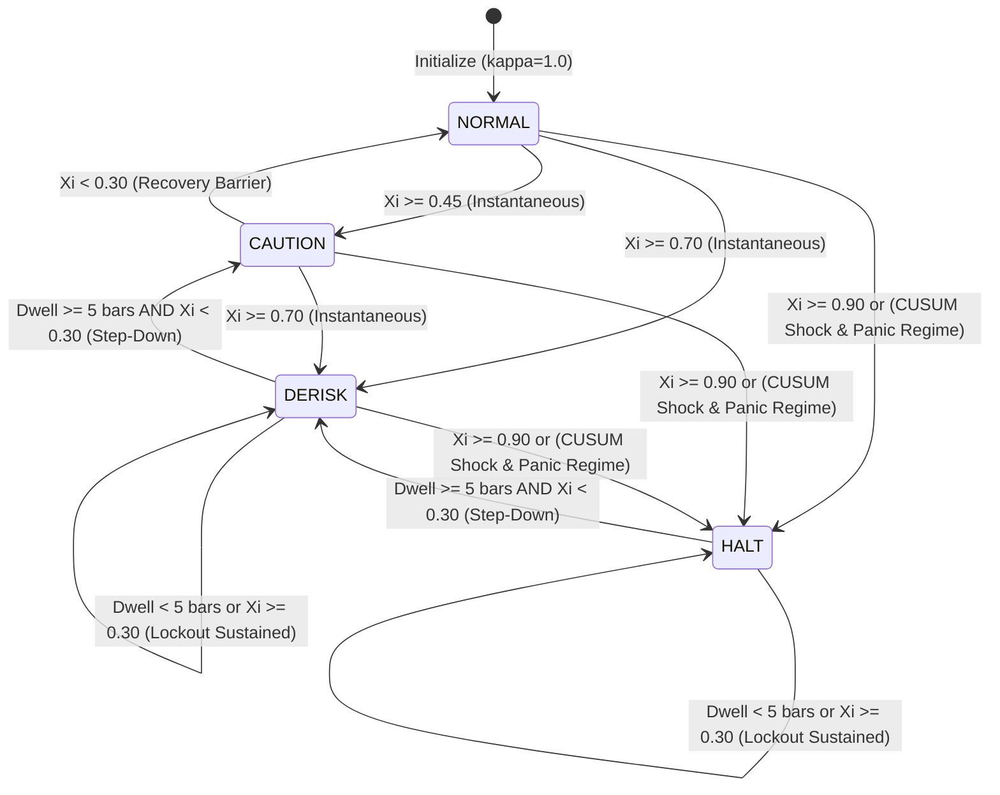

# System Architecture & Component Topology

## 1. Architectural Philosophy & Layer Boundaries

The system is built on **Domain-Driven Design (DDD)** and **Dependency Inversion (DIP)** principles. Unidirectional dependencies ensure that mathematical business logic remains entirely decoupled from web frameworks, persistence drivers, and database engines.

$$\text{Domain Layer} \longleftarrow \text{Infrastructure Layer} \longleftarrow \text{Application Services} \longleftarrow \text{Presentation (API)}$$

```mermaid
graph TD
    subgraph Presentation Layer [Presentation Layer: FastAPI / ASGI]
        API1[api.v1.endpoints.events]
        API2[api.v1.endpoints.genotypes]
        API3[api.v1.endpoints.market_data]
        API4[api.v1.endpoints.auth]
        DEP[api.dependencies]
        MID[api.middleware]
    end

    subgraph Application Layer [Application Services Layer: Orchestration]
        S1[services.event_service<br>Decay Kernel & Causal Graph]
        S2[services.genotype_service<br>NSGA-II & Pareto Ranking]
        S3[services.market_data_service<br>Validation & Volatility Estimation]
    end

    subgraph Domain Layer [Domain Layer: Pure Math & Models]
        M1[domain.models.PriceBar]
        M2[domain.models.MarketDataBatch]
        M3[domain.models.NewsEvent]
        M4[domain.models.Genotype]
        I1[domain.interfaces.IMarketDataRepository]
        I2[domain.interfaces.IEventRepository]
        I3[domain.interfaces.IGenotypeRepository]
        I4[domain.interfaces.IAssetRepository]
    end

    subgraph Infrastructure Layer [Infrastructure Layer: Hybrid Storage]
        DB1[(DuckDB Columnar Store<br>market_data.duckdb)]
        DB2[(Relational ACID Store<br>quant.db / PostgreSQL)]
        R1[infrastructure.repositories.duckdb_market_data_repo]
        R2[infrastructure.repositories.event_repository]
        R3[infrastructure.repositories.genotype_repository]
        R4[infrastructure.repositories.asset_repository]
    end

    API1 --> S1
    API2 --> S2
    API3 --> S3
    S1 --> I2
    S1 --> I4
    S2 --> I3
    S3 --> I1
    S3 --> I4
    R1 -.->|Implements| I1
    R2 -.->|Implements| I2
    R3 -.->|Implements| I3
    R4 -.->|Implements| I4
    R1 --> DB1
    R2 --> DB2
    R3 --> DB2
    R4 --> DB2
```



---

## 2. Hybrid Storage Architecture (ADR-001)

To achieve institutional-grade throughput while preserving relational integrity, persistence is strictly split into two specialized engines:

```
+-------------------------------------------------------------------------------+
|                       QUANTITATIVE PREDICTION ENGINE                          |
+---------------------------------------+---------------------------------------+
|  TRANSACTIONAL METADATA STORE (ACID)  |  ANALYTICAL TIME-SERIES STORE (OLAP)  |
|  Engine: SQLAlchemy + PostgreSQL/SQLite|  Engine: DuckDB + PyArrow (Embedded) |
+---------------------------------------+---------------------------------------+
| * Asset Master & Universe Metadata    | * Raw OHLCV Price Bars (PriceBar)     |
| * News Events & Causal Graph Edges    | * High-Frequency Trade & Quote Ticks  |
| * Genotype Chromosomes & Audit History| * Microstructural Depth Snapshots     |
| * User Authentication & RBAC Roles    | * Contiguous Columnar Output (Batch)  |
+---------------------------------------+---------------------------------------+
```

### 2.1 The Analytical Columnar Engine (DuckDB + PyArrow)
* **Zero Python Object Tax**: Traditional ORMs allocate independent Python objects per row, causing severe memory bloat when loading millions of bars. DuckDB loads data directly into contiguous C++ memory buffers.
* **Direct Vectorization**: DuckDB's `.fetchnumpy()` and PyArrow table exports output contiguous NumPy 1D arrays (`np.ascontiguousarray`), matching the exact memory layout required by downstream linear algebra libraries (BLAS/LAPACK).
* **Threadpool Offloading**: To prevent C++ query routines from blocking FastAPI's asynchronous event loop, all DuckDB calls are dispatched to worker threads via `asyncio.to_thread` protected by a thread mutex lock (`DuckDBManager.run_sync`).

---

## 3. Module Inventory & Structural Map

| Module Path | Primary Class / Component | Architectural Responsibility |
| :--- | :--- | :--- |
| `src/quant/domain/models.py` | `PriceBar`, `MarketDataBatch`, `NewsEvent`, `Genotype` | Pure, immutable domain value objects enforcing boundary invariants. |
| `src/quant/domain/interfaces.py` | `IMarketDataRepository`, `IEventRepository`, `IGenotypeRepository` | Abstract contracts isolating domain logic from storage mechanics. |
| `src/quant/infrastructure/database/duckdb_session.py` | `DuckDBManager` | Thread-safe connection management and table/index schema provisioning for DuckDB. |
| `src/quant/infrastructure/repositories/duckdb_market_data_repository.py` | `DuckDBMarketDataRepository` | Bulk PyArrow insertion and range/latest bar retrieval. |
| `src/quant/services/market_data_service.py` | `MarketDataService` | Bar validation, gap detection, and rolling realized volatility ($\sigma_t$). |
| `src/quant/analytics/fractional_diff.py` | `FractionalDifferentiator`, `StreamingFracDiffBuffer` | Fixed-Width Window Fractional Differentiation ($d^*$), zero-sum correction, and streaming inference. |
| `src/quant/analytics/labeling.py` | `DynamicTripleBarrierLabeler` | Path-dependent Triple-Barrier labeling with Parkinson range volatility, gap-fill, and pessimistic collision rules. |
| `src/quant/analytics/cross_validation.py` | `CombinatorialPurgedCV`, `CPCVConfig`, `PurgedSplit` | Combinatorial Purged Cross-Validation with interval purging, post-test embargoing, and continuous path reconstruction. |
| `src/quant/analytics/meta_labeling.py` | `TwoStageMetaLabeler`, `ContinuousKellySizer`, `ProbabilityCalibrator` | Continuous-Payoff Kelly Meta-Labeling with duration discounting and concurrency throttling. |
| `src/quant/analytics/deflated_sharpe.py` | `DeflatedSharpeEngine`, `DSRConfig`, `DSRResult` | Robust Spectral Deflated Sharpe Ratio, Extreme Value Theory hurdles, piecewise MinBTL, and FDR cohort screening. |
| `src/quant/analytics/regimes.py` | `CausalBayesianRegimeFilter`, `CUSUMJumpDetector`, `OASCovarianceEstimator` | Online causal Bayesian regime filter, CUSUM jump detection with dwell hysteresis, and OAS covariance conditioning. |
| `src/quant/analytics/market_impact.py` | `MultiAssetMarketImpactEngine`, `GeneralizedPseudoHuber`, `HubermanStanzlCrossImpact` | Huberman-Stanzl cross-impact tensor, 3/2-power Square-Root Law potential, and Bayesian panic gate. |
| `src/quant/analytics/payoff_matrix.py` | `DiscreteHyperbolicPropagator`, `StackelbergPayoffEngine`, `InstitutionalBenchmarkUniverse` | Multi-bar hyperbolic trajectory scheduling, Stackelberg continuous payoff with predatory quote shading, and friction parity benchmarks. |
| `src/quant/analytics/minimax_regret.py` | `EntropicBoltzmannPotential`, `LatentSoftmaxTransform`, `VectorizedNewtonSolver` | Closed-form Boltzmann dual potential, bounded latent softmax mapping, and sub-millisecond vectorized Newton solver with KKT projection. |
| `src/quant/analytics/chromosomes.py` | `GENE_REGISTRY`, `StrategyChromosome`, `ChromosomeVectorCodec` | Scale-free unit hypercube encoding, declarative gene registry, invariants by construction, and typed analytics adapters. |
| `src/quant/analytics/pareto_sorting.py` | `BoundaryAnchoredRVEARanker`, `SVDSubspaceOrthogonalArchive`, `AdaptiveReferenceLattice`, `DependentNonDominatedSorter` | Boundary-Anchored Adaptive RVEA, SVD subspace orthogonal novelty ($1 - R^2$), Memmel–Ledoit–Wolf dependent dominance, and ENS-SS front sorting. |
| `src/quant/analytics/hypergamic_selection.py` | `HypergamicSelectionEngine`, `ParetoCohortStratifier`, `ResidualOrthogonalityGate`, `HypergamicPartnerMatcher`, `AsymmetricLatentCrossover` | Front-preserving Pareto cohort stratification, bidirectional residual orthogonality gating, adaptive deadlock-free partner matching, and asymmetric latent-hypercube crossover. |
| `src/quant/analytics/evolutionary_lifecycle.py` | `GenerationalLifecycleEngine`, `AdaptiveVolatilityMutator`, `StagnationDetector`, `MutationConfig`, `GenerationalState` | Adaptive Cauchy volatility mutation with mirror reflection, Rechenberg APD progress adaptation, dual-space stagnation monitoring, and $(\mu + \lambda)$ closed-loop generational lifecycle. |
| `src/quant/analytics/ensemble.py` | `RegimeConditionedDMAEngine`, `VolatilityAdaptiveForgetting`, `AsymmetricDownsideLossScorer`, `TikhonovCorrelationEstimator`, `OrthogonalityRegularizedSolver` | Regime-Conditioned Dynamic Model Averaging (RD-DMA) with volatility-adaptive forgetting, predictive forward-Markov regime transitions, asymmetric downside loss, Tikhonov correlation regularization, Entropic Mirror Descent on the simplex, thermodynamic ambiguity shrinkage, and total variance risk decomposition. |
| `src/quant/analytics/circuit_breakers.py` | `CircuitBreakerOverlayEngine`, `EpistemicEntropyCalculator`, `ContinuousHaircutCalculator`, `CircuitBreakerConfig`, `CircuitBreakerDecision`, `CircuitBreakerState` | Epistemic disagreement entropy, directional consensus on 3-simplex, continuous logistic haircutting, 4-tier discrete risk state machine, and anti-chattering hysteresis overlays. |
| `src/quant/analytics/tail_risk.py` | `EVTTailRiskEngine`, `ProbabilityWeightedMomentsEstimator`, `EVTTailParameters`, `TailRiskMetrics`, `TailRiskConfig` | Semi-Parametric Peaks-Over-Threshold Extreme Value Theory (EVT-POT) with closed-form Probability Weighted Moments (PWM), Fréchet tail stability ($\xi \in [0.001, 0.999]$), infinite variance tripwire ($\xi \ge 1.0$), coherent Expected Shortfall (CVaR), and 3-tier cold-start degradation ladder (Empirical $\to$ Student-t MoM $\to$ EVT-GPD). |
| `src/quant/analytics/simulation.py` | `SimulationConfig`, `PortfolioLedger`, `ExecutionCostModel`, `BenchmarkAuditor`, `ReplayEngine` | End-to-end live replay simulator with zero-lookahead information barriers, Kyle-Obizhaeva impact, mark-to-market accounting, and Deflated Sharpe benchmarking. |
| `src/quant/execution/models.py` | `Order`, `ExecutionReport`, `OrderState`, `OrderSide`, `OrderType`, `TimeInForce` | Pure execution domain models, slotted immutable records, and diagnostic fault codes (`ERR-GW-001` - `ERR-GW-006`). |
| `src/quant/execution/fsm.py` | `OrderStateMachine` | Monotonic DAG order state transitions, terminal state immutability, and causal out-of-order packet reconciliation (`INV-GW-004`). |
| `src/quant/execution/idempotency.py` | `IdempotencyRouter` | Deterministic RFC 4122 UUIDv5 client order IDs, active in-flight tracking, and FIFO deduplication ring buffer (`INV-GW-002`). |
| `src/quant/execution/gateway.py` | `ExecutionGateway`, `PaperExecutionGateway` | ExecutionGateway protocol and in-memory simulated broker with spread slippage, fee schedules, and limit matching. |
| `src/quant/execution/alpaca_gateway.py` | `AlpacaExecutionGateway` | Institutional Alpaca Markets v2 Paper/Live ExecutionGateway protocol adapter with connection pooling, idempotency token matching, and error mapping. |
| `src/quant/execution/audit.py` | `OrderAuditLogger` | Non-blocking async queue hot-path dispatch ($< 10\mu\text{s}$) with background SQLite WAL audit logging (`INV-GW-006`). |
| `src/quant/execution/venues.py` | `VenueType`, `VenueProfile`, `ConsolidatedQuote` | Multi-venue market representation, uncrossed NBBO enforcement (`INV-SOR-002`), and order book depth imbalance. |
| `src/quant/execution/algorithms.py` | `PoissonTWAPScheduler`, `VolumeAdaptiveVWAPScheduler`, `NonlinearArrivalPriceScheduler` | Algorithmic meta-order schedulers with anti-gaming Poisson jitter, Bayesian VWAP participation caps, and closed-form hyperbolic Almgren-Chriss trajectories. |
| `src/quant/execution/sor.py` | `SmartOrderRouter`, `VenueHealth` | Two-phase SOR with dark pool midpoint probing (MES), $O(M \log M)$ lit waterfilling, and real-time toxic markout quarantine. |
| `src/quant/execution/parent_order.py` | `ParentOrder`, `ImplementationShortfallReport` | Parent order lifecycle coordinator with overfill interceptor and additive Perold (1988) Transaction Cost Analysis (TCA). |
| `src/quant/execution/risk.py` | `PreTradeRiskFirewall`, `RiskLimits`, `PortfolioRiskState` | In-memory pre-trade risk firewall with fat-finger checks, directional netting gross/net leverage caps, and sub-1.5$\mu$s hot path. |
| `src/quant/execution/heartbeat.py` | `HeartbeatWatchdog`, `ConnectionStatus` | Broker connection liveness monitor with sequence monotonicity tracking and rolling RTT latency degradation tripwires. |
| `src/quant/execution/kill_switch.py` | `EmergencyKillSwitch`, `PanicTrigger` | Firm-wide emergency panic kill switch with concurrent multi-gateway mass cancellation sweep ($< 5\text{ms}$), submission lockdown, and HMAC admin reset. |
| `src/quant/execution/risk_orchestrator.py` | `RiskOrchestrator` | Central risk façade coordinating pre-trade firewall, heartbeat watchdog, emergency kill switch, and atomic leaves reservation/rollback. |
| `src/quant/data/alpaca_feed.py` | `AlpacaMarketDataFeed` | Real-time Alpaca market data feed streaming OHLCV bars and NBBO quotes directly into DuckDB and streaming FracDiff buffers with offline synthetic replay fallback. |
| `src/quant/services/event_service.py` | `EventService` | Dual-decay temporal kernel evaluation and multimodal feature projection. |
| `src/quant/services/genotype_service.py` | `GenotypeService` | Multi-objective fitness calculation, NSGA-II sorting, and crowding distance. |
| `src/quant/services/market_data_service.py` | `MarketDataService` | Columnar bar queries, data integrity validation, and realized volatility estimation. |
| `src/quant/services/execution_service.py` | `ExecutionService` | Parent order execution coordinator orchestrating algorithmic schedulers through `RiskOrchestrator` with automated TCA attribution. |
| `src/quant/services/risk_service.py` | `RiskService` | Real-time portfolio risk telemetry aggregation, dynamic firewall limit management, and panic kill switch invocation. |
| `src/quant/services/autonomous_trader.py` | `AutonomousTradingEngine` | Continuous clock loop daemon executing end-to-end econometric prediction, risk budgeting, and algorithmic rebalancing. |
| `src/quant/api/v1/endpoints/market_data.py` | `market_data_router` | High-throughput batch ingestion and historical range queries (`/api/v1/market-data`). |
| `src/quant/api/v1/endpoints/orders.py` | `orders_router` | Parent order submission, execution querying, cancellation, and Perold shortfall reporting (`/api/v1/orders`). |
| `src/quant/api/v1/endpoints/risk.py` | `risk_router` | Real-time portfolio risk status, firewall limit inspection/updates, and panic/reset endpoints (`/api/v1/risk`). |
| `src/quant/api/v1/endpoints/gateways.py` | `gateways_router` | Broker gateway connection health, sequence monitoring, and manual heartbeat injection (`/api/v1/gateways`). |
| `src/quant/api/v1/endpoints/streaming.py` | `streaming_router` | Full-duplex WebSocket streaming for execution lifecycle events and portfolio risk telemetry (`/api/v1/ws`). |
| `src/quant/api/v1/endpoints/autonomous.py` | `autonomous_router` | Autonomous trading swarm management endpoints: status, start, stop, pause, resume, step (`/api/v1/autonomous`). |
| `src/quant/api/dependencies.py` | `get_execution_service`, `get_risk_service`, `get_autonomous_engine`, `get_gateway` | Factory dependency injection for repositories, services, pluggable broker gateways, and background daemons. |
| `src/quant/templates/trading_terminal.html` | Trading Terminal HUD | WebGL/Canvas institutional trading terminal with real-time WebSockets, swarm controls, order book depth, and emergency kill switch. |
| `src/quant/main.py` | `create_application` | FastAPI ASGI factory mounting all API routers, lifespan manager, terminal route (`/terminal`), and background daemon lifecycle hooks. |

---

## 4. End-to-End Data Flow Pipelines

### 4.1 Ingestion Pipeline (Market Bars)
1. **Client / Feed Request**: External market feed dispatches `POST /api/v1/market-data/bars/batch` with `X-API-Key`.
2. **Gateway Validation**: Dependency `require_api_key` verifies constant-time HMAC signature.
3. **Domain Invariant Enforcement**: `MarketDataService` parses JSON dictionaries into immutable `PriceBar` value objects; `__post_init__` verifies $High \ge \max(Open, Close)$, $Low \le \min(Open, Close)$, $Prices > 0$, $Volume \ge 0$.
4. **Columnar Ingestion**: `DuckDBMarketDataRepository` transforms the batch into a typed `pa.Table` and issues an in-memory `INSERT OR REPLACE INTO market_bars`.

### 4.2 Analytical Feature Extraction Pipeline
1. **Consumer Request**: Downstream econometric engine calls `get_historical_bars(asset_id, start_time, end_time)`.
2. **Columnar Query**: DuckDB executes indexed binary search over `(asset_id, resolution, timestamp)` and fetches arrays via `.fetchnumpy()`.
3. **Zero-Copy Batch Creation**: Wraps contiguous arrays into `MarketDataBatch`.
4. **Econometric Calculation**: Computes instantaneous rolling volatility $\sigma_t$ over closing prices.

### 4.3 Fractional Differentiation Feature Pipeline
1. **Offline Fitting / Calibration**: `FractionalDifferentiator.fit(train_prices)` evaluates optimal $d^*$ using bisection search with Augmented Dickey-Fuller stationarity tests ($p \le 0.01$), enforcing sample lookback caps $l^* \le 0.20 \cdot T$ and zero-sum weight correction.
2. **Batch Feature Transformation**: `FractionalDifferentiator.transform(test_prices)` convolves series via $O(T \log l^*)$ 1D FFT (`scipy.signal.fftconvolve`) without lookahead leakage.
3. **Online Real-Time Streaming**: `StreamingFracDiffBuffer` hydrates historical window from DuckDB (`hydrate_from_repository`) and computes sub-millisecond single-bar updates (`update(P_t)`).
4. **Price Reconstruction**: When trading orders require nominal price targets from model forecasts, `inverse_transform` analytically reconstructs $P_t$ from differenced predictions.

### 4.4 Dynamic Volatility Triple-Barrier Labeling Pipeline
1. **Causal Volatility Estimation**: Pre-computes Parkinson range volatility $\sigma_t$ strictly lagged to $t-1$ over high and low prices.
2. **Execution Latency Offset**: Enforces entry at $t + \text{delay}$ to eliminate intra-signal lookahead.
3. **Log-Space Barrier Geometry**: Scales horizontal barriers via $\ln(P_{\text{entry}}) \pm c \cdot \sigma$, adjusting for position side (Long vs. Short).
4. **Path Evaluation & Collision Priority**: Scans intra-bar wicks and opening gaps, enforcing pessimistic stop-loss priority on dual-barrier candle collisions.
5. **Net Payoff Generation**: Outputs `BarrierLabel` containing discrete classification $\{+1, -1, 0\}$, holding duration $[t_{\text{entry}}, t_{\text{exit}}]$, and net return deducting spread and fee friction.

### 4.5 Combinatorial Purged Cross-Validation (CPCV) Pipeline
1. **Group Block Partitioning**: Divides $T$ observations into $N$ balanced contiguous chronological blocks $G_0, \dots, G_{N-1}$.
2. **Combinatorial Fold Generation**: Enumerates $\binom{N}{k}$ combinations (or forward-chained splits) with budget bounding cap `max_splits`.
3. **Interval Purging**: Drops any training observation whose trade lifespan $[t_{\text{entry}}, t_{\text{exit}}]$ intersects any test block interval $[T_{\text{test, start}}, T_{\text{test, end}}]$.
4. **Autoregressive Embargoing**: Excludes training observations occurring within post-test window $h_{\text{embargo}}$ to neutralize serial correlation leakage.
5. **Continuous Path Reconstruction**: Assembles test predictions into $\phi = \binom{N-1}{k-1}$ continuous out-of-sample backtest paths.
6. **Sharpe Variance Evaluation**: Calculates empirical Sharpe ratio distribution $\{SR_p\}$ and variance $V[\{SR_p\}]$ for Deflated Sharpe Ratio (Step 6).

### 4.6 Two-Stage Continuous-Payoff Kelly Meta-Labeling Pipeline
1. **Primary Signal Ingestion**: Ingests Stage 1 directional indicators $\hat{y}_t \in \{-1, +1\}$.
2. **Payoff Alignment & Odds Computation**: Generates ground-truth meta-labels ($z_t = 1 \iff \pi_t > 0$) aligning net return from `BarrierLabel` with proposed trade direction, calculating odds $b_t$.
3. **Probability Calibration**: Maps decision function margins to smooth probabilities $p_t$ via regularized Platt logistic regression, validating calibration improvement via Brier score.
4. **Time-Decayed Fractional Kelly Sizing**: Calculates raw Kelly fraction $f^* = \frac{p \cdot b - (1-p)}{b}$ scaled by conservative multiplier $\lambda = 0.50$ (Half-Kelly). Zero allocation when expected edge is non-positive.
5. **Duration Discounting & Concurrency Throttling**: Discounts size by $\sqrt{\tau_t / \tau_{\text{ref}}}$ and normalizes by simultaneous open trade count $c_t$, enforcing aggregate leverage bound $\le L_{\text{max}} = 1.0$.

### 4.7 Deflated Sharpe Ratio (DSR) & Statistical Significance Pipeline
1. **Robust Moment Extraction**: Applies two-sided winsorization to raw trade return series to dampen outlier wicks; calculates sample mean, standard deviation, skewness $\hat{\gamma}_3$, and Pearson kurtosis $\hat{\gamma}_4$ with Pearson bound clamping $\hat{\gamma}_4 \ge 1 + \hat{\gamma}_3^2$.
2. **Non-Normality Adjustment (PSR)**: Computes Probabilistic Sharpe Ratio using the Mertens/Lo standard error under non-Gaussian higher moments.
3. **Effective Independent Trials ($K_{\text{eff}}$)**: Constructs correlation matrix $\mathbf{C}$ across tested strategy configurations and calculates $K_{\text{eff}} = K^2 / \sum C_{ij}^2$ via Frobenius participation ratio, eliminating the independence fallacy.
4. **Extreme Value Selection Hurdle**: Evaluates Expected Maximum Sharpe ratio $E[\max_K \{SR\}]$ across $K_{\text{eff}}$ trials with cross-path variance $V[\{SR\}]$ derived from Step 4 CPCV paths.
5. **Sample Duration Requirement (MinBTL)**: Evaluates piecewise analytical Minimum Backtest Length, requiring $+\infty$ for losing strategies.
6. **Dual Institutional Gate**: Certifies strategies for Phase 4 evolution only when simultaneously clearing $\text{DSR} \ge 0.95$ AND $T \ge \text{MinBTL}$.
7. **Population Cohort Screening**: Applies Benjamini-Hochberg (BH) or Benjamini-Yekutieli (BY) False Discovery Rate controls across multi-model genetic populations.

### 4.8 Causal Bayesian Jump-Regime Estimation Pipeline
1. **Innovation Normalization**: Computes standardized cross-sectional return innovations $z_t = \bar{r}_t / \sigma_t$ strictly lagged to eliminate lookahead bias.
2. **Two-Sided CUSUM Tracking**: Accumulates directional deviations $S_t^+, S_t^-$ with drift $k$; triggers jump alarm only when cumulative deviation crosses threshold $h$ and minimum dwell time ($\tau_{\text{dwell}} \ge 3\text{ bars}$) is cleared, suppressing whipsaws.
3. **Emergency Panic Prior Injection**: On severe negative shocks ($S_t^- \ge h$), injects an instantaneous panic prior into the transition probability matrix, snapping the regime classification to defensive posture within a single bar.
4. **OAS Covariance Regularization**: Evaluates Oracle Approximating Shrinkage on rolling asset return windows, projecting eigenvalues to $\lambda_{\min} \ge 10^{-5}$ to guarantee strict positive definiteness.
5. **Thermodynamic Ambiguity Calibration**: Calibrates temperature $\beta_t = \text{clip}\left(\kappa \bar{\sigma}_t \sqrt{\ln(1/\alpha) / N_{\text{eff}}}, \beta_{\min}, \beta_{\max}\right)$, smoothly expanding the ambiguity set during turbulence.

### 4.9 Multi-Asset Cross-Impact Propagator Pipeline
1. **Dimensional Participation Conversion**: Transforms dimensionless portfolio weights $\Delta \mathbf{a}$ into nominal dollars and scales by expected bar dollar volume ($\nu_i = W_0 \Delta a_i / (\text{ADV\_Dol}_i \tau_{\text{bar}})$).
2. **Huberman-Stanzl Cross-Impact**: Evaluates symmetric sandwich matrix $\mathbf{\Lambda}_{\text{cross}} = \lambda_{\text{fee}} \mathbf{I} + \theta \mathbf{Z}_t^{1/2} (\mathbf{D}^{-1/2} \mathbf{\Sigma}^{1/2} \mathbf{D}^{-1/2}) \mathbf{Z}_t^{1/2} \succ 0$, guaranteeing strict positive-definiteness and eliminating price manipulation arbitrage.
3. **3/2-Power Generalized Pseudo-Huber Evaluation**: Applies $\psi_{3/2}(u) = (u^2 + \delta^2)^{3/4} - \delta^{1.5}$, accurately modeling the universal Square-Root Law of price impact with guaranteed strict convexity everywhere ($\psi''_{3/2} > 0$).
4. **Smooth Panic Asymmetry Multiplier**: Multiplies base potential by $(1 + \kappa_{\text{panic}} \pi_{\text{panic}} \sigma_{\text{asym}}(\nu))$, ensuring an identically zero gradient at rest ($\nabla \mathcal{C}(\mathbf{0}) = \mathbf{0}$) with zero artificial buying/selling drift.
5. **State-Space Bounded Depletion Tracking**: Updates order book depletion state via saturating hyperbolic tangent filter $\mathbf{B}_t = \rho \mathbf{B}_{t-1} + (1-\rho) B_{\max} \tanh(|\boldsymbol{\nu}| / B_{\max})$, preventing infinite cost blowouts across consecutive trades.

### 4.10 Stackelberg Leader-Follower Trajectory & Payoff Tensor Pipeline
1. **Discrete Hyperbolic Scheduling**: Computes multi-bar execution slices using the exact exponential formulation $\alpha_k = (1 - e^{-\kappa}) [e^{-\kappa(k-1)} + e^{-\kappa(2H-k)}] / (1 - e^{-2\kappa H})$, guaranteeing an exact partition of unity ($\sum \alpha_k = 1.0$), monotonic decay, and sub-millisecond evaluation.
2. **Stackelberg Payoff Functional**: Evaluates continuous quadratic net utility $U(\mathbf{a}, \mathbf{s}_j) = \mathbf{a}^T \hat{\boldsymbol{\mu}}_j + a_{\text{cash}} r_f - \frac{\gamma + 2\theta_{\text{pred}}}{2} \mathbf{a}^T \mathbf{\Sigma}_j \mathbf{a} - \mathcal{C}(\mathbf{a} - \mathbf{a}_0)$, penalizing high-variance flow vulnerable to predatory quote shading.
3. **Exact Analytical Derivative Evaluation**: Computes analytical gradient $\nabla_{\mathbf{a}} U$ and certifies strictly negative-definite Hessian $\mathbf{H}_{\mathbf{a}} U \prec 0$ (global concavity everywhere).
4. **Institutional Benchmark Evaluation (Friction Parity)**: Generates constrained benchmarks (Equal Weight, Risk Parity, Inverse Volatility, Cash) under single-asset caps ($b_i \le w_{\max}$) and evaluates utility ceilings $U_{\text{bench}}^*(\mathbf{s}_j) = \max_{\mathbf{b} \in \mathcal{B}} U(\mathbf{b}, \mathbf{s}_j)$ deducting identical rebalancing market friction from $\mathbf{a}_0$.
5. **Regret Matrix Construction**: Computes non-negative regret tensor $R_{i, j} = \max(0, U_{\text{bench}}^*(\mathbf{s}_j) - U_{i, j}) \ge 0$ across candidates and regimes, directly supplying Step 4's closed-form Boltzmann dual solver.

### 4.11 Closed-Form Boltzmann Dual & Entropic Minimax Regret Solver Pipeline
1. **Max-Shifted Log-Sum-Exp Dual Potential**: Evaluates $\Psi(\mathbf{a}) = \beta_t [ m + \ln( \sum \pi_j e^{(R_j/\beta_t) - m} ) ]$ with $m = \max_j (R_j/\beta_t)$, guaranteeing zero numerical overflow across all temperature ranges $\beta_t \in [\beta_{\min}, \beta_{\max}]$ and producing worst-case tilted distributions $\mathbf{q}^* \in \Delta^M$.
2. **Latent Softmax Coordinate Transformation**: Maps box constraints $[0, w_{\max}]^N$ bijectively to unconstrained coordinates $\mathbf{w} \in \mathbb{R}^N$ via $a_i(w_i) = w_{\max} / (1 + e^{-w_i})$ with diagonal Jacobian $\mathbf{J}_{\mathbf{w}} = \text{diag}(a_i (1 - a_i / w_{\max}))$, eliminating interior-point barrier complexity.
3. **Simultaneous Single-Pass Utility/Gradient Extraction**: Calculates both utility $U(\mathbf{a}, \mathbf{s}_j)$ and analytical gradient $\nabla_{\mathbf{a}} U$ in a single market impact evaluation, halving computation time per regime scenario.
4. **Strictly Positive-Definite Fisher Information Hessian**: Formulates $\mathbf{H}_{\mathbf{a}} \Psi = -\sum q_j^* \mathbf{H}_j U + \frac{1}{\beta_t} \text{Cov}_{\mathbf{q}^*}[\mathbf{g}, \mathbf{g}] \succ 0$, guaranteeing strict convexity and quadratic local convergence.
5. **Levenberg-Marquardt Regularization & Armijo Line Search**: Computes damped Newton step $\mathbf{d}_{\mathbf{w}} = -(\mathbf{H}_{\mathbf{w}} + \mu \mathbf{I})^{-1} \mathbf{g}_{\mathbf{w}}$ with Armijo backtracking and quadratic leverage penalty $\frac{\rho_{\text{lev}}}{2} (\max(0, \sum a_i - L_{\max}))^2$.
6. **KKT Projected Gradient Termination**: Certifies first-order optimality on bounded box $[0, w_{\max}]$ via projected gradient $\mathbf{g}^{\text{proj}}$, ensuring termination even when optimal allocations bind to boundaries ($a_i^* \to 0$ or $a_i^* \to w_{\max}$).
7. **Cross-Impact Tensor Caching & Trajectory Output**: Caches symmetric cross-impact matrices $\mathbf{\Lambda}_{\text{cross}}$ across scenarios, achieving sub-millisecond execution ($< 400\mu\text{s}$) and emitting certified worst-case regret $\Psi(\mathbf{a}^*)$ and multi-bar discrete hyperbolic trajectory slices $\mathbf{A} \in \mathbb{R}^{H \times N}$ directly feeding Phase 4 Genetic Algorithm chromosome fitness.

### 4.12 Evolutionary Chromosome & Vector Codec Pipeline
1. **Declarative Parameter Registry**: Declares 20 strategy hyperparameters in `GENE_REGISTRY` across Representation ($\tau_{\text{slow}}, r_\tau, \alpha, d$), Game Theory ($\tau, \gamma, \theta_{\text{pred}}, \mathbf{z}$), Inference ($H, \kappa, k_{\text{pt}}, k_{\text{sl}}, T_{\text{hold}}, p_{\text{thresh}}$), and Risk ($\sigma_{\text{target}}, w_{\max}, \text{MDD}_{\max}, \Delta_{\max}$).
2. **Scale-Invariant Unit Hypercube Codec**: Implements hybrid logarithmic-linear mapping $\mathbf{g} \longleftrightarrow \mathbf{u} \in [0, 1]^{20}$, equalizing mutation sensitivity across orders of magnitude.
3. **Invariance by Construction**: Unconditionally satisfies timescale ordering ($\tau_{\text{fast}} = r_\tau \tau_{\text{slow}} < \tau_{\text{slow}}$) and regime simplex ($\mathbf{p} = \text{softmax}(\mathbf{z}) \in \Delta^3$) without artificial penalty functions or clipping clumping.
4. **Midpoint Quantization Stability**: Centers discrete genes at bucket midpoints $u(k) = (k + 0.5) / K$, insulating round-trip decoding against floating-point drift with a $\pm 2.5\%$ noise tolerance.
5. **Decoded Phenotype Distance**: Evaluates behavioral novelty distance on normalized decoded parameters and actual regime probabilities $\mathbf{p} \in \Delta^3$, preventing artificial diversity from logit gauge shifts or sub-threshold discrete variations.
6. **Typed Pipeline Adapters & Serialization**: Generates typed configurations for Phases 1-3 analytics engines (`to_stackelberg_config`, `to_regime_config`, `to_minimax_config`, `to_triple_barrier_config`, `to_meta_label_config`) and serializes to native Python dicts for zero-crash database persistence.

### 4.13 Boundary-Anchored Adaptive RVEA & SVD Subspace Pareto Sorting Pipeline
1. **Viability Gate & Orthogonal Residual Extraction**: Filters out unviable strategies ($\text{DSR} < 0.50$ or infeasible); extracts standardized prediction residual vectors $\tilde{\mathbf{e}} \in \mathbb{R}^T$ with zero mean and unit norm.
2. **SVD Subspace Orthogonal Archive**: Projects candidate residuals onto historical elite basis $\mathbf{V}_K$ derived from thin SVD; evaluates orthogonal novelty as the unexplained variance ratio $\rho_{\text{ortho}} = 1 - R^2 = 1 - \|\mathbf{V}_K^T \tilde{\mathbf{e}}\|_2^2$, mathematically eliminating multi-collinear clones ($e_A = 0.6 e_1 + 0.8 e_2$).
3. **Memmel–Ledoit–Wolf Dependent Dominance**: Calculates the exact asymptotic standard error of DSR differences between strategy pairs conditioned on empirical return correlation $\rho$:
   $$\sigma^2(\Delta \widehat{\text{DSR}}_{A, B} \mid \rho_{A, B}) = \frac{1}{T} \left( 2(1 - \rho_{A, B}) + \frac{1}{2}\left(\widehat{\text{DSR}}_A^2 + \widehat{\text{DSR}}_B^2 - 2 \rho_{A, B}^2 \widehat{\text{DSR}}_A \widehat{\text{DSR}}_B\right)\right)$$
   eliminating the 300% variance inflation of the independence fallacy.
4. **Deb's Feasibility Rule & ENS-SS Front Sorting**: Applies Deb's constraint handling (feasible strictly dominates infeasible) and executes Efficient Non-dominated Sorting with Sequential Search (ENS-SS) in $O(M N^2)$ time to partition the population into non-dominated Pareto fronts.
5. **Adaptive Reference Vector Guided Selection (APD)**: Generates Das-Dennis lattice with immutable coordinate basis anchors $[1,0,0], [0,1,0], [0,0,1]$ (`INV-PAR-004`), dynamically migrating interior rays toward dense front clusters with minimum angular separation ($\theta \ge 0.10\text{ rad}$). Ranks candidates along rays via Angle-Penalized Distance (APD) with progressive generational escalation $P(\theta) = M \cdot (t / t_{\max})^\alpha \cdot (\theta / \gamma)$.
6. **Front-1 Auto-Admission**: Automatically admits viable Front-1 non-dominated strategies into the historical elite SVD archive, continuously enriching the subspace basis across evolutionary generations.

### 4.14 Hypergamic Assortative Selection & Residual Orthogonality Gating Pipeline
1. **Front-Preserving Pareto Cohort Stratification**: Partitions candidates into elite Alphas $\mathcal{A}$ ($|\mathcal{A}| \ge N_\alpha$) and exploratory Aspirants $\mathcal{X}$. Guarantees full Front 1 retention without truncation, padding from Front 2 (ordered by APD) only if $|\mathcal{F}_1| < N_\alpha$, while strictly excluding infeasible candidates (`INV-HYP-004`).
2. **Monotonic Elitism Preservation**: Directly clones top $N_{\text{elite}}$ Front-1 champions bitwise identical into the offspring pool without crossover (`INV-HYP-003`), guaranteeing monotonic preservation of the Pareto frontier.
3. **Bidirectional Residual Orthogonality Gating**: Evaluates $1 - |\rho(e_A, e_B)| \ge \delta_{\text{current}}$ between Alpha $A$ and Aspirant $B$, strictly eliminating both direct clones and inverse clones ($\rho = -0.95$) with zero-variance residual protection.
4. **Adaptive Threshold Relaxation & Deadlock Fallback**: If diversity cannot be met, relaxes threshold $\delta_{\text{current}} = \delta_{\text{ortho}} \cdot \gamma_{\text{relax}}^k$. If unmet after $2 \times K_{\max}$ retries, selects Aspirant with maximum Euclidean distance in unit hypercube space $\|\mathbf{u}_A - \mathbf{u}_B\|_2$, guaranteeing $O(1)$ bounded execution with zero deadlocks (`INV-HYP-005`).
5. **Asymmetric Latent Unit-Hypercube Crossover (SBX)**: Recombines genes in continuous scale-free latent space $\mathbf{u} \in [0, 1]^{20}$ with distribution index $\eta_c = 15.0$. Implements gene-family role-biased inheritance ($P_\alpha = 0.75$ for risk/game blocks; $P_{\text{asp}} = 0.65$ for repr/infer blocks).
6. **Invariance by Construction**: Offspring are decoded via `ChromosomeVectorCodec`, guaranteeing timescale ordering ($\tau_{\text{fast}} < \tau_{\text{slow}}$) and simplex normalization ($\sum p_j \equiv 1.0$) by construction (`INV-HYP-002`) and emitting exact target population size $N_{\text{offspring}} == N_{\text{target}}$ (`INV-HYP-001`).

### 4.15 Adaptive Volatility Mutation & Generational Lifecycle Pipeline
1. **Self-Adaptive Truncated Cauchy Perturbation**: For each selected non-elite offspring gene $i$, applies a heavy-tailed Cauchy increment $\Delta u_i = \sigma_{\text{mut}} \cdot \kappa_{\text{block}} \cdot \tan\left(\pi \left(\xi_i - \frac{1}{2}\right)\right)$ clipped to $[-c \sigma_{\text{mut}}, +c \sigma_{\text{mut}}]$ with $c = 2.0$, generating exploratory leap jumps that escape local epistatic traps.
2. **Mirror Boundary Reflection**: When mutated coordinates escape $[0.0, 1.0]$, folds them back into the valid hypercube ($u_{\text{refl}} = -u$ if $u < 0$; $2 - u$ if $u > 1$), preserving ergodic boundary exploration without sticky edge clumping.
3. **Differential Gene-Family Sensitivity Scaling**: Modulates mutation volatility by gene functional block ($\kappa_{\text{risk}} = 0.50$ for capital preservation; $\kappa_{\text{game}} = 0.75$ for strategic stability; $\kappa_{\text{search}} = 1.00$ for aggressive discovery), honoring differing domain sensitivities.
4. **Continuous APD-Progress Rechenberg Volatility Adaptation**: Evaluates generation success ratio $r_t = \frac{1}{N_{\text{off}}} \sum_{i=1}^{N_{\text{off}}} \mathbf{1}_{[\min_j d_{\text{APD}}(O_i, R_j) < \min_j d_{\text{APD}}(P_i, R_j)]}$ comparing offspring against parents on the adaptive reference lattice; smooths via $\bar{r}_t = (1 - \alpha) \bar{r}_{t-1} + \alpha r_t$ and scales mutation volatility $\sigma_{\text{mut}} \leftarrow \text{clip}\left(\sigma_{\text{mut}} \cdot e^{\frac{\bar{r}_t - r^*}{1 - r^*}}, \sigma_{\min}, \sigma_{\max}\right)$.
5. **Dual-Space Stagnation Monitoring & Cataclysmic Trigger**: Evaluates population genotypic dispersion $\bar{D}_{\text{param}}$ in the unit hypercube via `scipy.spatial.distance.pdist` and phenotypic collinearity $\bar{\rho}_{\text{pop}}$ across residual error series. If both drop below critical thresholds for $K_{\text{stagnant}} \ge 5$ consecutive generations, fires cataclysmic hyper-mutation with elevated volatility $\sigma_{\text{cataclysm}} = 0.20$, violently shattering stagnation while preserving Front-1 champions bitwise identical (`INV-LIFE-004`).
6. **Closed-Loop $(\mu + \lambda)$ Environmental Selection & Ranking Caching**: Evaluates candidate fitnesses on offspring chromosomes, pools $P_t \cup Q_t$ ($2N = 200$), and ranks via Boundary-Anchored Adaptive RVEA. Truncates strictly to the top $N$ survivors (`INV-LIFE-001`), caches survivor ranking order to eliminate redundant parent re-evaluations, and strictly guarantees monotonic Pareto frontier improvement (`INV-LIFE-002`) and sub-35ms benchmark SLA (`INV-LIFE-006`).

### 4.16 Regime-Conditioned Dynamic Model Averaging (RD-DMA) Subsystem & Pipeline

```mermaid
graph TD
    subgraph Inputs [Online Bar Inputs]
        Y[Realized Return y_t]
        SIG[Realized Volatility sigma_t]
        PRED[Model Forecasts y_hat_k]
        VAR[Model Variances sigma_k^2]
        REG[Regime Posteriors p_t]
        TRANS[Transition Matrix P_trans]
        BETA[Ambiguity Temp beta_t]
    end

    subgraph Dynamics [Online Dynamic Filtering]
        VAF[Volatility-Adaptive Forgetting<br>alpha_t in 0.85, 0.99]
        FMR[Forward-Markov Projection<br>p_{t+1|t} = P_trans^T p_t]
        ADL[Asymmetric Downside Loss<br>l_{t,k} = y - y_tilde^2 + gamma max 0, -y y_tilde]
        SEM[Downside Semi-Variance<br>sigma^2_{k, down}]
        TIK[Tikhonov Ridge Correlation<br>C_t = 1-delta C_hat + delta I]
    end

    subgraph Optimizer [Simplex Convex Optimization]
        SCORE[Composite Prior & Loss Score<br>s_t = l_{t-1} - ln bar_pi_{t|t-1}]
        EMD[Entropic Mirror Descent<br>min w^T s + lambda/2 w^T C w - tau H w]
        LAP[Laplace Floor Smoothing<br>w_k >= eps_floor = 0.001 / K]
    end

    subgraph Regularization [Robust Risk & Execution Shaping]
        AMB[Thermodynamic Ambiguity Shrinkage<br>w^shrunk = 1-lambda_beta w* + lambda_beta w_uniform]
        DAMP[Convex L1 Turnover Damping<br>w^final = 1-lambda_churn w^shrunk + lambda_churn w_{t-1}]
        DECOMP[Law of Total Variance Decomposition<br>sigma^2_total = sigma^2_aleatoric + sigma^2_epistemic]
        POST[Regime Posterior Update<br>Pi_{t, j} proportional to Pi_{t-1, j}^alpha exp -p_{t,j} l_t]
    end

    SIG --> VAF
    REG --> FMR
    TRANS --> FMR
    Y --> ADL
    PRED --> ADL
    PRED --> TIK
    VAF --> SCORE
    FMR --> SCORE
    ADL --> SCORE
    TIK --> EMD
    SCORE --> EMD
    EMD --> LAP
    LAP --> AMB
    BETA --> AMB
    AMB --> DAMP
    DAMP --> DECOMP
    SEM --> DECOMP
    DECOMP --> POST
```

1. **Volatility-Adaptive Memory Depth Adjustment**: Evaluates market realized volatility deviation $\Delta \sigma_t = (\sigma_t - \bar{\sigma}) / \bar{\sigma}$ and updates rolling EMA baseline $\bar{\sigma}$. Adapts forgetting factor $\alpha_t = \text{clip}(\alpha_0 - \kappa_\alpha \Delta \sigma_t, \alpha_{\min}, \alpha_{\max})$, compressing memory depth in volatile sell-offs ($\alpha_t \to \alpha_{\min} = 0.85$) to track regime breaks within 1–2 bars while expanding memory in calm regimes ($\alpha_t \to \alpha_{\max} = 0.99$) to filter transient noise (`INV-ENS-003`).
2. **Predictive Forward-Markov Transition Projection**: Ingests current regime posterior distribution $\mathbf{p}_t \in \Delta^3$ and Phase 3 Markov transition matrix $\mathbf{P}_{\text{trans}} \in \mathbb{R}^{3 \times 3}$. Projects predictive forward regime probabilities:
   $$\mathbf{p}_{t+1|t} = \mathbf{P}_{\text{trans}}^T \mathbf{p}_t$$
3. **Tempered Posterior Aggregation & Composite Prior Synthesis**: For each regime $j \in \{0, 1, 2\}$, tempers prior posteriors $\boldsymbol{\pi}_{j}^{\text{tempered}} \propto (\boldsymbol{\Pi}_{t-1, j})^{\alpha_t}$ via log-sum-exp normalization, and synthesizes forward composite model prior:
   $$\bar{\boldsymbol{\pi}}_{t+1|t} = \sum_{j=0}^2 p_{t+1|t, j} \boldsymbol{\pi}_{j}^{\text{tempered}}$$
4. **Asymmetric Downside Loss Scoring**: Measures model forecast errors against realized market return $y_t$:
   $$\ell_{t, k} = (y_t - \tilde{y}_{t, k})^2 + \gamma_{\text{down}} \max(0, -y_t \tilde{y}_{t, k})$$
   where $\gamma_{\text{down}} = 2.50$ and $\tilde{y}_{t, k} = \hat{y}_{t, k} / \sqrt{H_k}$, heavily penalizing false-positive directional signals that induce portfolio drawdowns, and computes empirical downside semi-variance $\sigma^2_{k, \text{down}}$.
5. **Tikhonov Ridge-Regularized Correlation Estimation**: Evaluates strategy prediction correlation matrix $\widehat{\mathbf{C}}_t$ with standard deviation floor $\sigma_{\min} = 10^{-8}$, and regularizes via Tikhonov ridge shrinkage:
   $$\mathbf{C}_t = (1 - \delta_{\text{ridge}}) \widehat{\mathbf{C}}_t + \delta_{\text{ridge}} \mathbf{I}_K, \quad \delta_{\text{ridge}} = 0.05$$
   guaranteeing strict positive definiteness ($\mathbf{C}_t \succ 0, \lambda_{\min} \ge 0.05$) and eliminating $0/0$ division by zero on flatline strategies.
6. **Entropic Mirror Descent Optimization on Simplex**: Optimizes model weights over the unit simplex $\Delta^K$:
   $$\mathbf{w}_t^* = \arg\min_{\mathbf{w} \in \Delta^K} \left\{ \mathbf{w}^T \mathbf{s}_t + \frac{\lambda_{\text{ortho}}}{2} \mathbf{w}^T \mathbf{C}_t \mathbf{w} - \tau \mathcal{H}(\mathbf{w}) \right\}$$
   where $\mathbf{s}_t = \boldsymbol{\ell}_{t-1} - \ln \bar{\boldsymbol{\pi}}_{t|t-1}$ and $\mathcal{H}(\mathbf{w}) = -\sum w_k \ln w_k$. Solves via vectorized Entropic Mirror Descent starting from prior weights $\mathbf{w}_{t-1}$ within 10 iterations ($< 0.15\text{ms}$), followed by Laplace floor injection:
   $$w_{t, k}^* \leftarrow (1 - K \epsilon_{\text{floor}}) w_{t, k}^* + \epsilon_{\text{floor}}, \quad \epsilon_{\text{floor}} = \frac{0.001}{K}$$
   strictly preserving unit simplex conservation and model survivability (`INV-ENS-001`).
7. **Thermodynamic Ambiguity Shrinkage**: When Phase 3 thermodynamic ambiguity temperature $\beta_t$ rises, shrinks weights toward the entropy-maximizing uniform distribution:
   $$\lambda_\beta = \text{clip}\left(\frac{\beta_t - \beta_{\min}}{\beta_{\max} - \beta_{\min}}, 0.0, 1.0\right) \cdot \kappa_{\text{shrink}}, \quad \mathbf{w}_t^{\text{shrunk}} = (1 - \lambda_\beta) \mathbf{w}_t^* + \lambda_\beta \mathbf{w}_{\text{uniform}}$$
   defensively dampening overconfidence during macroeconomic turbulence ($\kappa_{\text{shrink}} = 0.50$).
8. **Convex L1 Turnover Damping**: Protects against excessive transaction fee erosion via convex blending with the previous bar's executed weights:
   $$\mathbf{w}_t^{\text{final}} = (1 - \lambda_{\text{churn}}) \mathbf{w}_t^{\text{shrunk}} + \lambda_{\text{churn}} \mathbf{w}_{t-1}, \quad \lambda_{\text{churn}} = 0.15$$
   guaranteeing bounded weight turnover $\|\mathbf{w}_t - \mathbf{w}_{t-1}\|_1 \le 2(1 - \lambda_{\text{churn}})$ (`INV-ENS-005`).
9. **Total Variance Risk Decomposition & Posterior Update**: Decomposes total prediction variance via the Law of Total Variance into process aleatoric uncertainty and model epistemic disagreement:
   $$\hat{\mu}_t = \sum_{k=1}^K w_k^{\text{final}} \tilde{y}_{t, k}, \quad \sigma^2_{\text{aleatoric}} = \sum_{k=1}^K w_k^{\text{final}} \sigma^2_{k, \text{down}}, \quad \sigma^2_{\text{epistemic}} = \sum_{k=1}^K w_k^{\text{final}} (\tilde{y}_{t, k} - \hat{\mu}_t)^2$$
   $$\sigma^2_{\text{total}} = \sigma^2_{\text{aleatoric}} + \sigma^2_{\text{epistemic}}, \quad K_{\text{eff}} = \frac{1}{\sum (w_k^{\text{final}})^2}$$
   satisfying strict variance additivity (`INV-ENS-002`). Updates regime-conditional posteriors $\boldsymbol{\Pi}_{t, j} \propto \boldsymbol{\Pi}_{t-1, j}^{\text{tempered}} \odot \exp(-p_{t, j} \boldsymbol{\ell}_t)$ and advances state monotonically (`INV-ENS-004`), completing the full lifecycle within $\approx 0.18\text{ms} \le 2.0\text{ms}$ (`INV-ENS-006`).

### 4.17 Circuit Breaker Overlays & Epistemic Disagreement Pipeline



```
+---------------------------------------------------------------------------------------------------------+
|                                    CIRCUIT BREAKER OVERLAY DATA FLOW                                     |
+---------------------------------------------------------------------------------------------------------+
| [EnsemblePrediction] (Phase 5 Step 1)                                                                   |
|   ├── weights (w_k in Simplex)                                                                          |
|   ├── aleatoric_variance (sigma^2_aleatoric)                                                            |
|   ├── epistemic_variance (sigma^2_epistemic)                                                            |
|   └── regime_probabilities (argmax == 2 -> panic)                                                      |
| [Raw Predictions Vector] (y_tilde_k)                                                                    |
| [Ambiguity Parameter] (beta_t)                                                                          |
+---------------------------------------------------+-----------------------------------------------------+
                                                    |
                                                    v
+---------------------------------------------------------------------------------------------------------+
| 1. EpistemicEntropyCalculator                                                                           |
|   ├── Directional Consensus Simplex: p_s = sum_{k in s} w_k  (s in {+, -, 0})                          |
|   ├── Normalized Shannon Entropy:   H_dir = -sum p_s ln(p_s) / ln(3) in [0.0, 1.0]                  |
|   ├── Epistemic Uncertainty Ratio:  rho_epistemic = sigma^2_epistemic / sigma^2_total                  |
|   └── Composite Epistemic Entropy:  H_epistemic = H_dir * sqrt(rho_epistemic) in [0.0, 1.0]            |
+---------------------------------------------------+-----------------------------------------------------+
                                                    |
                                                    v
+---------------------------------------------------------------------------------------------------------+
| 2. ContinuousHaircutCalculator                                                                          |
|   ├── Normalized Ambiguity:        beta_tilde = clip((beta - beta_min)/(beta_max - beta_min), 0, 1)     |
|   ├── Composite Shock Score:       Xi_t = omega_H * H_epi + omega_rho * rho + omega_beta * beta_tilde   |
|   └── Logistic Sigmoid Haircut:    kappa_t = (sigmoid(Xi_t) - kappa_1) / (kappa_0 - kappa_1) in [0, 1]  |
+---------------------------------------------------+-----------------------------------------------------+
                                                    |
                                                    v
+---------------------------------------------------------------------------------------------------------+
| 3. CircuitBreakerOverlayEngine (Hysteresis State Machine)                                               |
|   ├── Target Tier Evaluation:      HALT (>=0.90 or CUSUM+Panic) | DERISK (>=0.70) | CAUTION (>=0.45)   |
|   ├── Hysteresis Arbitration:      Instant escalation | Dwell-time lockout (>=5) | Recovery (<0.30) |
|   ├── Effective Execution Sizing:  HALT/DERISK -> 0.0 | CAUTION -> min(0.50, kappa) | NORMAL -> kappa   |
|   └── Output Construction:         CircuitBreakerDecision & CircuitBreakerState                         |
+---------------------------------------------------------------------------------------------------------+
```

1. **Directional Consensus on 3-Simplex & Normalized Shannon Entropy**:
   Partitions model forecasts into three directional cohorts around a deadband threshold $\delta_{\text{sign}} = 10^{-4}$:
   $$p_+ = \sum_{k: \tilde{y}_k > \delta_{\text{sign}}} w_k, \quad p_- = \sum_{k: \tilde{y}_k < -\delta_{\text{sign}}} w_k, \quad p_0 = \sum_{k: |\tilde{y}_k| \le \delta_{\text{sign}}} w_k$$
   guaranteeing $\mathbf{p} \in \Delta^3$ and $\sum_{s \in \{+, -, 0\}} p_s \equiv 1.0 \pm 10^{-10}$ (`INV-CB-004`). Evaluates normalized Shannon directional consensus entropy:
   $$\widetilde{H}_{\text{dir}} = \text{clip}\left( \frac{-\sum_{s \in \{+, -, 0\}} p_s \ln(p_s + \epsilon_{\text{log}})}{\ln(3)}, \; 0.0, \; 1.0 \right)$$
   yielding $0.0$ for unanimous consensus, $\ln(2)/\ln(3) \approx 0.6309$ for 50/50 bimodal polarization, and $1.0$ for maximum three-way confusion.
2. **Epistemic Uncertainty Ratio & Composite Disagreement Entropy**:
   Extracts the fraction of total variance attributable to model disagreement:
   $$\rho_{\text{epistemic}} = \frac{\sigma^2_{\text{epistemic}}}{\sigma^2_{\text{aleatoric}} + \sigma^2_{\text{epistemic}}} \in [0.0, 1.0)$$
   and couples directional entropy with epistemic ratio to synthesize composite epistemic disagreement entropy:
   $$H_{\text{epistemic}} = \widetilde{H}_{\text{dir}} \sqrt{\rho_{\text{epistemic}}} \in [0.0, 1.0]$$
3. **Thermodynamic Composite Shock Score**:
   Combines composite epistemic entropy, the epistemic variance ratio, and normalized macroeconomic ambiguity $\tilde{\beta}_t = \text{clip}\left(\frac{\beta_t - \beta_{\min}}{\beta_{\max} - \beta_{\min}}, 0.0, 1.0\right)$:
   $$\Xi_t = \omega_H H_{\text{epistemic}} + \omega_\rho \rho_{\text{epistemic}} + \omega_\beta \tilde{\beta}_t \in [0.0, 1.0]$$
   with default convex weights $(\omega_H = 0.50, \omega_\rho = 0.30, \omega_\beta = 0.20)$ summing to $1.0$.
4. **Normalized Continuous Logistic Sigmoid Haircut**:
   Transforms composite shock $\Xi_t$ through a normalized logistic sigmoid curve:
   $$\kappa_{\text{raw}}(\Xi_t) = \frac{1}{1 + \exp(k_{\text{steep}} (\Xi_t - \Xi_{\text{mid}}))}, \quad \kappa_t = \text{clip}\left( \frac{\kappa_{\text{raw}}(\Xi_t) - \kappa_{\text{raw}}(1.0)}{\kappa_{\text{raw}}(0.0) - \kappa_{\text{raw}}(1.0)}, \; 0.0, \; 1.0 \right)$$
   with $k_{\text{steep}} = 10.0$ and $\Xi_{\text{mid}} = 0.50$. Strictly guarantees boundary anchors $\kappa_t(0.0) \equiv 1.0000$ (full allocation under tranquil agreement), $\kappa_t(1.0) \equiv 0.0000$ (zero exposure under total chaos), and smooth monotonicity (`INV-CB-001`).
5. **Discrete Risk Tiers & Anti-Chattering Hysteresis State Machine**:
   - Institutional tiers (`CircuitBreakerTier`): `NORMAL` (0), `CAUTION` (1), `DERISK` (2), `HALT` (3) (`INV-CB-002`).
   - Instantaneous Escalation: Any increase in candidate severity tier transitions immediately ($S_{t+1} = S_{\text{cand}}$) and resets active tier duration to $\tau = 1$.
   - Dwell-Time Cooling Lockout: Once in `HALT` or `DERISK`, the state machine remains locked for at least $\tau_{\text{dwell}} = 5$ bars (`INV-CB-003`).
   - Dual-Barrier Recovery: Recovery requires simultaneously satisfying $\tau \ge \tau_{\text{dwell}}$ AND $\Xi_t < \theta_{\text{recovery}} = 0.30$, stepping down strictly one tier at a time (`HALT` $\to$ `DERISK` $\to$ `CAUTION` $\to$ `NORMAL`), completely eliminating limit-order chattering and whipsaws.
   - Exogenous CUSUM & Panic Coupling: Co-occurrence of CUSUM jump alarm and panic regime forces an immediate emergency halt (`cusum_shock and regime_is_panic`).
6. **Effective Execution Sizing Overlay**:
   Applies tier-dependent execution multipliers to target position sizes:
   $$\text{execution\_haircut} = \begin{cases} 0.0 & \text{if } S_{t+1} \in \{\text{HALT}, \text{DERISK}\} \\ \min(0.50, \kappa_t) & \text{if } S_{t+1} = \text{CAUTION} \\ \kappa_t & \text{if } S_{t+1} = \text{NORMAL} \end{cases}$$
7. **Upstream Integration & Benchmark Latency SLA**:
   `evaluate_prediction` directly consumes `EnsemblePrediction` from Phase 5 Step 1, auto-detects panic regime states, enforces non-finite input guards (`INV-CB-005`), and completes full evaluation in $\approx 0.04\text{ms} \le 0.20\text{ms}$ median for $K=100$ models (`INV-CB-006`).

### 4.18 Extreme Tail Risk & Unified Convex Execution Sizing Calibration Pipeline

```
+---------------------------------------------------------------------------------------------------+
|               Phase 5 Step 3: Extreme Tail Risk & Unified Convex Execution Sizing                 |
+---------------------------------------------------------------------------------------------------+
|                                                                                                   |
|  Strictly Lagged Loss Innovations X_tau = -r_tau in [t-W, t-1] (INV-TR-007)                       |
|                                     |                                                             |
|                                     v                                                             |
|                    +----------------------------------+                                           |
|                    |     EVTTailRiskEngine (POT)      |                                           |
|                    |  - Dynamic Threshold u_t         |                                           |
|                    |  - Closed-form PWM Estimation    |                                           |
|                    |  - Fréchet Stability [0.001,0.999]|                                          |
|                    |  - Infinite Variance Tripwire    |                                           |
|                    |  - Coherent CVaR >= VaR          |                                           |
|                    |  - 3-Tier Cold-Start Ladder      |                                           |
|                    +----------------------------------+                                           |
|                                     |                                                             |
|                Asset Expected Shortfalls c_i = CVaR_alpha(X_i)                                     |
|                                     |                                                             |
|  Point Returns mu_i, Aleatoric Covariance Sigma, Circuit Breaker Haircut kappa_t                  |
|                                     |                                                             |
|                                     v                                                             |
|               +--------------------------------------------+                                      |
|               |        UnifiedConvexExecutionSizer         |                                      |
|               |  - Directional Epistemic Shrinkage mu~     |                                      |
|               |  - Uncertainty-Shrunk Kelly Utility        |                                      |
|               |  - 3/2-Power Pseudo-Huber Impact + Lambda  |                                      |
|               |  - Circuit Breaker Regularizer ||nu||^2/2kW|                                      |
|               |  - Strict Global Concavity (INV-TR-004)    |                                      |
|               +--------------------------------------------+                                      |
|                                     |                                                             |
|                                     v                                                             |
|               +--------------------------------------------+                                      |
|               | Exact Dual Projection Pi_K(y) (INV-TR-005) |                                      |
|               |  - Gross Leverage: ||nu||_1 <= L_max * W   |                                      |
|               |  - Hard CVaR Budget: c^T |nu| <= MDD * W   |                                      |
|               |  - 2D Semismooth Newton + Dykstra Fallback |                                      |
|               |  - Zero-Leakage Radial Clamping            |                                      |
|               +--------------------------------------------+                                      |
|                                     |                                                             |
|                      Continuous Target Allocation nu*                                             |
|                                     |                                                             |
|                                     v                                                             |
|               +--------------------------------------------+                                      |
|               |   Microstructural Lot Discretization       |                                      |
|               |  - Bernoulli Lottery: B_i ~ Bern(frac)     |                                      |
|               |  - Unbiased Expectation: E[nu~] = nu*      |                                      |
|               +--------------------------------------------+                                      |
|                                     |                                                             |
|                                     v                                                             |
|                         Immutable SizingDecision                                                  |
|                   (target_allocations, discretized,                                               |
|                    leverage, CVaR, impact_cost, constraints)                                      |
+---------------------------------------------------------------------------------------------------+
```

1. **Semi-Parametric Peaks-Over-Threshold (POT) Tail Risk Modeling**:
   - Evaluates dynamic high threshold $u_t = \mu_{t-1} + k_{\text{threshold}} \sigma_{t-1}$ strictly causal on $[t-W, t-1]$ (`INV-TR-007`).
   - Closed-form Probability Weighted Moments (PWM) parameter estimation eliminates black-box iterative root-finding in the hot path (Rule 4.3):
     $$\hat{\xi}_{\text{PWM}} = 1 - \frac{M_0}{2(M_0 - 2M_1)}, \quad \hat{\beta}_{\text{PWM}} = \frac{2 M_0 M_1}{M_0 - 2M_1}$$
   - Fréchet tail stability clamping $\xi \in [0.001, 0.999]$ and infinite variance tripwire $\xi \ge 1.0 \implies \text{InfiniteVarianceException}$ demanding emergency execution HALT (`INV-TR-002`), backed by an algebraic Hill index pre-filter on the top 10% extreme exceedances.
   - Coherent Expected Shortfall (CVaR) closed form strictly bounding $\text{CVaR}_\alpha \ge \text{VaR}_\alpha$ (`INV-TR-001`) and satisfying Artzner subadditivity (`INV-TR-003`):
     $$\text{CVaR}_\alpha = \frac{\text{VaR}_\alpha}{1 - \xi} + \frac{\beta - \xi u}{1 - \xi}$$
   - Seamless 3-tier cold-start degradation ladder: Empirical ($N < 30$) $\to$ Student-t MoM with analytical log-gamma integral ($30 \le N < 250$) $\to$ EVT-GPD PWM ($N \ge 250$).
2. **Unified Strictly Concave Sizing Formulation**:
   - Maximizes strictly concave execution sizing objective:
     $$\max_{\boldsymbol{\nu}} \mathcal{L}(\boldsymbol{\nu}) = U_{\text{Kelly}}(\boldsymbol{\nu}) - \mathcal{C}_{\text{Impact}}(\boldsymbol{\nu}) - \mathcal{R}_{\text{Epistemic}}(\boldsymbol{\nu})$$
     guaranteeing negative-definite Hessian $\nabla^2 \mathcal{L} \prec 0$ everywhere (`INV-TR-004`).
   - Directional epistemic shrinkage $\tilde{\mu}_i = \text{sign}(\mu_i) \max(0, |\mu_i| - \lambda_{\text{shrink}} \sigma^2_{\text{epistemic}, i})$, eliminating sign-flipping short squeeze traps.
   - Universal 3/2-power Pseudo-Huber nonlinear execution friction and positive semi-definite permanent cross-impact tensor $\boldsymbol{\Lambda}_{\text{cross}}$ validated via eigenvalue non-negativity ($\ge -10^{-8}$).
   - Circuit breaker regularizer $\frac{1}{2 \kappa_t W_t} \|\boldsymbol{\nu}\|_2^2$, smoothly crushing allocations toward $\mathbf{0}$ as continuous haircut $\kappa_t \to 0$.
3. **Exact $O(N \log N)$ Dual Projection onto Two $L_1$ Balls (`INV-TR-005`)**:
   - Enforces non-negotiable gross leverage ceiling $\|\boldsymbol{\nu}\|_1 \le L_{\max} W_t$ and weighted Expected Shortfall drawdown budget $\mathbf{c}^T |\boldsymbol{\nu}| \le \text{MDD}_{\text{budget}} W_t$.
   - Solved via 2D Semismooth Newton active-set iteration initialized from $(0, 0)$ with provable Dykstra alternating projections fallback and terminal zero-leakage radial contraction.
4. **Microstructural Randomized Lot Discretization**:
   - Bridges continuous convex targets and discrete contract sizes via Bernoulli lottery:
     $$\tilde{\nu}_i = \text{sign}(\nu_i^*) \cdot (\lfloor |\nu_i^*| / \Delta \nu_i \rfloor + B_i) \cdot \Delta \nu_i, \quad B_i \sim \text{Bernoulli}(\text{frac}_i)$$
   - Mathematically guarantees unbiased expectation $\mathbb{E}[\tilde{\boldsymbol{\nu}}] = \boldsymbol{\nu}^*$, eliminating cumulative margin rounding bias.
5. **Latency SLA & Output**:
   - Solves full multi-asset sizing problem in $< 0.15\text{ms}$ median for $N=10$ assets (`INV-TR-006`).
   - Emits frozen `SizingDecision` payload with active constraint binding flags directly into execution routing and order management.

### 4.19 End-to-End Live Replay Simulation & Institutional Benchmarking Pipeline

```
+---------------------------------------------------------------------------------------------------+
|                        End-to-End Live Replay Simulation & Benchmarking                           |
+---------------------------------------------------------------------------------------------------+
|                                                                                                   |
|  Market Data Stream (t = 0 ... T-1)                                                               |
|  {Prices, Returns r_t, Volatilities sigma_t, ADV_t, Macro Temperature beta_t}                    |
|                                     |                                                             |
|                                     v                                                             |
|               +--------------------------------------------+                                      |
|               |  Information Barrier Filtration F_{t-1}    |                                      |
|               |  (INV-SIM-001 Zero-Lookahead Causality)    |                                      |
|               +--------------------------------------------+                                      |
|                                     |                                                             |
|                                     v                                                             |
|               +--------------------------------------------+                                      |
|               |  Ensemble DMA + Circuit Breaker Overlay    |                                      |
|               |   - RD-DMA Prior: p_{t|t-1}                |                                      |
|               |   - Continuous Haircut: kappa_t in [0, 1]  |                                      |
|               |   - Discrete State: NORMAL / CAUTION /     |                                      |
|               |                     DERISK / HALT          |                                      |
|               +--------------------------------------------+                                      |
|                                     |                                                             |
|                                     v                                                             |
|               +--------------------------------------------+                                      |
|               |  EVT Tail Risk + Unified Sizing Engine     |                                      |
|               |   - Expected Shortfall Vector c_t (CVaR)   |                                      |
|               |   - Convex Kelly Allocation nu_t*          |                                      |
|               |   - Randomized Lot Rounding nu_t~          |                                      |
|               +--------------------------------------------+                                      |
|                                     |                                                             |
|                 Allocated Positions nu_t~                                                         |
|                                     |                                                             |
|                                     v                                                             |
|               +--------------------------------------------+                                      |
|               |  Execution Cost Model (INV-SIM-003)        |                                      |
|               |   - Kyle 3/2-power Impact: lambda * Delta^{3/2}                                   |
|               |   - Exchange Fee + Spread Slippage         |                                      |
|               +--------------------------------------------+                                      |
|                                     |                                                             |
|                     Friction Cost C_t                                                             |
|                                     |                                                             |
|                                     v                                                             |
|               +--------------------------------------------+                                      |
|               |  Portfolio Ledger (INV-SIM-002)            |                                      |
|               |   - Causal Mark-to-Market: nu_{t-1}^T r_t  |                                      |
|               |   - Exact Conservation: W_t = cash + sum nu|                                      |
|               |   - Ruin Check: W_t <= 0 -> HALT           |                                      |
|               |   - Running High-Water Mark & Drawdown     |                                      |
|               +--------------------------------------------+                                      |
|                                     |                                                             |
|                 Bar Execution Record + Listener Hooks                                             |
|                                     |                                                             |
|                                     v                                                             |
|               +--------------------------------------------+                                      |
|               |  Benchmark Auditor                         |                                      |
|               |   - CAGR, Vol, Sharpe, Sortino, Calmar     |                                      |
|               |   - Realized VaR / CVaR 95/99, Tail Ratio  |                                      |
|               |   - Multi-Benchmark Attribution (EW, RP)   |                                      |
|               |   - Deflated Sharpe (DSR >= 0.95, MinBTL)  |                                      |
|               +--------------------------------------------+                                      |
|                                     |                                                             |
|                                     v                                                             |
|                     BenchmarkAuditReport Payload                                                  |
+---------------------------------------------------------------------------------------------------+
```

1. **Causal Time-Stepped Replay Orchestration (`INV-SIM-001`)**:
   - Executes a strict chronological loop $t=0 \dots T-1$ over historical bars.
   - Enforces information barrier filtration $\mathcal{F}_{t-1}$: strategy decisions at bar $t$ condition strictly on slice $[:t]$ (lagged returns, volatilities, regimes), with zero contemporaneous or future contamination.
   - Automatically collapses target allocations to $\mathbf{0}$ during circuit breaker emergency `HALT` (`INV-SIM-004`).
2. **Non-Linear Market Friction (`ExecutionCostModel`, `INV-SIM-003`)**:
   - Computes non-negative total execution cost $\mathcal{C}_t = \mathcal{C}_{\text{fee}} + \mathcal{C}_{\text{spread}} + \mathcal{C}_{\text{impact}} \ge 0.0$.
   - Evaluates 3/2-power Kyle-Obizhaeva market impact $\mathcal{C}_{\text{impact}} = \sum \frac{\lambda_0}{\sqrt{\text{ADV}_i}} \sigma_{i, t} |\Delta \nu_{i, t}|^{3/2}$ accelerated via hardware-native $x \sqrt{x}$.
   - Evaluates fee schedule $\mathcal{C}_{\text{fee}} = \text{fee}_{\text{bps}} \cdot 10^{-4} \cdot \|\Delta \boldsymbol{\nu}\|_1$ and half-spread slippage $\mathcal{C}_{\text{spread}} = \frac{\text{spread}_{\text{bps}} \cdot 10^{-4}}{2} \cdot \|\Delta \boldsymbol{\nu}\|_1$.
3. **Causal Mark-to-Market Accounting (`PortfolioLedger`, `INV-SIM-002`)**:
   - Portfolio return on bar $t$ is realized strictly from lagged exposure held overnight $\boldsymbol{\nu}_{t-1}^T \mathbf{r}_t$.
   - Conserves capital strictly: $|W_t - (\text{cash}_t + \sum \nu_{i, t})| < 10^{-5}$.
   - Detects bankruptcy ruin $W_t \le 0.0 \implies \text{InfeasibleSimulationException(ERR-SIM-003)}$ with immediate position collapse and cash flooring.
   - Tracks high-water mark $M_t = \max_{s \le t} W_s$ and running drawdown $D_t = (M_t - W_t) / M_t \in [0.0, 1.0]$.
4. **Institutional Benchmarking & Statistical Certification (`BenchmarkAuditor`)**:
   - Generates institutional performance profile: CAGR, Annualized Volatility, Sharpe, Sortino, Calmar, Max Drawdown, Realized VaR 95/99, Realized CVaR 95/99, and Tail Ratio.
   - Certifies statistical validity via `DeflatedSharpeEngine`: verifies DSR $\ge 0.95$ and $T \ge \text{MinBTL}$, correcting for selection bias and non-Gaussian higher moments.
   - Performs multi-benchmark attribution against Equal Weight ($1/N$), Risk Parity (Inverse Volatility), and Cash ($R_f=0$) baselines.
   - Employs prefix-sum centered variance acceleration achieving $< 2.5\text{ms}$ audit execution.
5. **Telemetry & Execution Latency SLA (`INV-SIM-006`)**:
   - Emits observer events via `SimulationListener` protocol (`on_bar_start`, `on_decision`, `on_fill`, `on_bar_end`).
   - Solves 100 bars $\times$ 10 assets in $\approx 15.5\text{ms} \le 25\text{ms}$ median execution SLA.

---

### 4.20 Live Execution Gateway & Deterministic Order State Machine Subsystem

```
+---------------------------------------------------------------------------------------------------+
|                        Live Execution Gateway & Order State Machine Subsystem                     |
+---------------------------------------------------------------------------------------------------+
|                                                                                                   |
|  Strategy Order Dispatch / Risk Sizer                                                             |
|  {Order: cl_ord_id, symbol, side, type, qty, price}                                               |
|                                     |                                                             |
|                                     v                                                             |
|               +--------------------------------------------+                                      |
|               |  Idempotency Router (INV-GW-002)           |                                      |
|               |   - UUIDv5 Token Generation                |                                      |
|               |   - In-Flight Active Registry              |                                      |
|               |   - FIFO Deduplication Ring Buffer (TTL)   |                                      |
|               +--------------------------------------------+                                      |
|                                     |                                                             |
|                           Registered Order                                                        |
|                                     |                                                             |
|                                     v                                                             |
|               +--------------------------------------------+                                      |
|               |  Execution Gateway / Paper Broker Venue    |                                      |
|               |   - Purchasing Power Check (ERR-GW-004)    |                                      |
|               |   - Bid-Ask Spread Slippage Simulation     |                                      |
|               |   - Venue Fee Schedule Accounting          |                                      |
|               |   - Limit Order Book Resting / Matching    |                                      |
|               +--------------------------------------------+                                      |
|                                     |                                                             |
|                         Execution Event / Fill                                                    |
|                                     |                                                             |
|                                     v                                                             |
|               +--------------------------------------------+                                      |
|               |  Order State Machine FSM (INV-GW-001)      |                                      |
|               |   - Monotonic DAG Transitions              |                                      |
|               |   - Terminal State Lockout                 |                                      |
|               |   - Out-of-Order Packet Reconciliation     |                                      |
|               |     (INV-GW-004: PENDING_NEW -> NEW)       |                                      |
|               |   - Mass Conservation: Q_fill + Q_leaves   |                                      |
|               +--------------------------------------------+                                      |
|                                     |                                                             |
|                       Emitted ExecutionReport                                                     |
|                                     |                                                             |
|                                     v                                                             |
|               +--------------------------------------------+                                      |
|               |  Order Audit Logger (INV-GW-006)           |                                      |
|               |   - Non-Blocking asyncio.Queue (< 10us)    |                                      |
|               |   - Background SQLite WAL Persistence      |                                      |
|               |   - Parameterized SQL Query Engine         |                                      |
|               +--------------------------------------------+                                      |
+---------------------------------------------------------------------------------------------------+
```

1. **Domain Entities & Value Objects (`models.py`, `INV-GW-005`)**:
   - `Order`: Stateful domain entity with `slots=True`, tracking order lifecycle attributes (`cl_ord_id`, `symbol`, `side`, `order_type`, `quantity`, `price`, `state`, `filled_quantity`, `leaves_quantity`, `average_price`, `fees_paid`).
   - `ExecutionReport`: Immutable frozen dataclass with `slots=True`, recording granular trade execution events, fills, fees, and timestamps.
   - Non-finite scalar protection: complete rejection of NaN, $\pm\infty$, booleans, or negative quantities (`ERR-GW-003`).
2. **Order State Machine FSM (`fsm.py`, `INV-GW-001`, `INV-GW-004`)**:
   - Deterministic directed acyclic transition graph: $\text{PENDING\_NEW} \to \text{NEW} \to \text{PARTIALLY\_FILLED} \to \text{FILLED}$.
   - Terminal state lockdown: attempts to transition from $\mathcal{S}_{\text{terminal}} = \{\text{FILLED}, \text{CANCELLED}, \text{REJECTED}, \text{EXPIRED}\}$ raise `InvalidStateTransitionException` (`ERR-GW-001`).
   - Causal out-of-order packet reconciliation: execution reports arriving while in `PENDING_NEW` automatically synthesize an intermediate transition to `NEW` before applying the fill event (`INV-GW-004`).
   - Execution mass conservation (`INV-GW-003`): cumulative filled and remaining leaves quantities satisfy $|Q_{\text{filled}} + Q_{\text{leaves}} - Q_{\text{target}}| < 10^{-7}$.
3. **Deterministic Idempotency Router (`idempotency.py`, `INV-GW-002`)**:
   - RFC 4122 UUIDv5 cryptographic token derivation from strategy namespace, symbol, side, and nanosecond timestamp.
   - Active in-flight order registry preventing concurrent duplicate submissions (`ERR-GW-002`).
   - Bounded historical FIFO ring buffer with $O(1)$ set membership deduplication and configurable TTL retention.
4. **Execution Gateway Protocol & Paper Broker (`gateway.py`, `INV-GW-006`)**:
   - `ExecutionGateway` protocol specifying unified async interface: `submit_order`, `cancel_order`, `get_order`, `get_open_orders`, `get_positions`, `get_account_balance`.
   - `PaperExecutionGateway`: simulated exchange with configurable bid-ask spread slippage (`slippage_bps`), exchange fee schedules (`fee_bps`), synthetic round-trip latency (`latency_ms`), limit order book resting/matching, and pre-trade margin validation (`ERR-GW-004`).
   - Latency SLA: sub-0.10ms ($100\mu\text{s}$) order routing and execution on the hot path.
5. **Non-Blocking WAL Order Audit Logger (`audit.py`, `INV-GW-006`)**:
   - Decouples order matching from disk I/O via in-memory bounded `asyncio.Queue` ($50,000$ capacity), executing `log_report` in $< 10\mu\text{s}$.
   - Background worker draining queue in configurable batches and persisting to embedded SQLite in Write-Ahead Logging (WAL) mode (`PRAGMA journal_mode=WAL; PRAGMA synchronous=NORMAL;`).
   - Parameterized historical audit queries filtering by `cl_ord_id` and/or `symbol`, sorted monotonically by timestamp.

---

### 4.21 Microstructural Smart Order Router, Algorithmic Schedulers & Implementation Shortfall TCA Subsystem

```
+---------------------------------------------------------------------------------------------------+
|               Microstructural Smart Order Router & Algorithmic Execution Subsystem                |
+---------------------------------------------------------------------------------------------------+
|                                                                                                   |
|  Parent Order Dispatch: Target Quantity Q_total, Side, Horizon T, Strategy Schedulers             |
|                                     |                                                             |
|                                     v                                                             |
|               +--------------------------------------------+                                      |
|               |  Institutional Algorithmic Schedulers      |                                      |
|               |   - PoissonTWAP (Anti-Gaming Jitter)       |                                      |
|               |   - VolumeAdaptiveVWAP (Cap <= 15%)        |                                      |
|               |   - NonlinearArrivalPrice (Almgren-Chriss) |                                      |
|               +--------------------------------------------+                                      |
|                                     |                                                             |
|                          Child Order Slices q_k                                                   |
|                                     |                                                             |
|                                     v                                                             |
|               +--------------------------------------------+                                      |
|               |  Smart Order Router (SOR Engine)           |                                      |
|               |   - VenueHealth Quarantine Filter          |                                      |
|               |   - Phase 1: Dark Midpoint Probing (MES)   |                                      |
|               |   - Phase 2: Closed-Form Lit Waterfilling  |                                      |
|               |     (O(M log M) KKT sort on Net Taker Fee) |                                      |
|               +--------------------------------------------+                                      |
|                                     |                                                             |
|                         Multi-Venue Route Slices                                                  |
|                                     |                                                             |
|                                     v                                                             |
|               +--------------------------------------------+                                      |
|               |  Downstream Execution Gateways             |                                      |
|               |   - Lit Exchanges (ARCA, BATS, NASDAQ)     |                                      |
|               |   - Dark Pools (SIGMA_X, CROSSFINDER)      |                                      |
|               +--------------------------------------------+                                      |
|                                     |                                                             |
|                          Gateway Execution Reports                                                |
|                                     |                                                             |
|                                     v                                                             |
|               +--------------------------------------------+                                      |
|               |  Toxic Markout Watchdog (VenueHealth)      |                                      |
|               |   - Post-Trade Markout Tracking (bps)      |                                      |
|               |   - Adverse Selection Quarantine Window    |                                      |
|               +--------------------------------------------+                                      |
|                                     |                                                             |
|                                     v                                                             |
|               +--------------------------------------------+                                      |
|               |  Parent Order Lifecycle Coordinator        |                                      |
|               |   - Mass Conservation Interceptor          |                                      |
|               |   - Cumulative VWAP / Leaves Accounting    |                                      |
|               +--------------------------------------------+                                      |
|                                     |                                                             |
|                                     v                                                             |
|               +--------------------------------------------+                                      |
|               |  Implementation Shortfall TCA Report       |                                      |
|               |   - Perold (1988) Exact Additive Identity: |                                      |
|               |     Total = Delay + Impact + Fees + OppCost|                                      |
|               +--------------------------------------------+                                      |
+---------------------------------------------------------------------------------------------------+
```

1. **Multi-Venue Representation & Uncrossed Quotes (`venues.py`, `INV-SOR-002`)**:
   - `VenueType`: Strongly-typed venue classification distinguishing transparent display books (`LIT`) from non-displayed alternative trading systems (`DARK`).
   - `VenueProfile`: Dataclass specifying venue identity, maker/taker fee schedules in basis points (supporting negative maker fee rebates), and minimum execution size (`min_order_size`) thresholds.
   - `ConsolidatedQuote`: Immutable multi-venue top-of-book container computing dynamic National Best Bid and Offer (NBBO), midpoint price, quoted spread, and normalized Order Book Imbalance $\text{OBI} = \frac{Q_b - Q_a}{Q_b + Q_a} \in [-1.0, 1.0]$. Strictly rejects crossed or locked markets ($P_{\text{bid}} \ge P_{\text{ask}}$) with `CrossedBookException(ERR-SOR-003)`.

2. **Institutional Algorithmic Schedulers (`algorithms.py`, `INV-SOR-001`, `INV-SOR-003`)**:
   - `PoissonTWAPScheduler`: Dispatches time-weighted child slices over horizon $T$ with Poisson clock inter-arrival timing $\Delta t \sim \text{Exp}(\lambda)$ bounded by a physical nanosecond interval floor ($\Delta t_{\min} \ge 1\text{ ns}$) to prevent zero-interval burst clustering. Sizes slices with randomized jitter $q_k = \bar{q} \cdot (1 + \alpha_q \cdot U(-1, 1))$, re-evaluating remaining quantity $Q_{\text{rem}} / (K - k)$ dynamically and enforcing exact terminal mass conservation within $10^{-7}$ (`INV-SOR-004`).
   - `VolumeAdaptiveVWAPScheduler`: Dispatches volume-weighted slices dynamically conditioned on historical expected volume profiles $V_{\text{exp}}(k)$ and real-time realized bar volumes $V_{\text{rt}}(k)$ blended via Bayesian weight $\omega \in [0.0, 1.0]$. Strictly caps slice volume at an institutional participation limit $\rho \le 15\%$ (`INV-SOR-003`), skipping zero-volume bars and raising `InsufficientLiquidityException(ERR-SOR-002)` if entire market volume is zero.
   - `NonlinearArrivalPriceScheduler`: Implements the closed-form Almgren-Chriss (2000) optimal liquidation trajectory under 3/2-power market impact proxy with Parkinson volatility dynamic adaptation $\kappa_t = \kappa_0 \cdot \sigma_t / \sigma_{\text{baseline}}$. Uses Taylor expansion limit for $\kappa T < 10^{-6}$ transitioning seamlessly to linear TWAP, and an exponential ratio reformulation $\frac{\sinh(\kappa(T - t))}{\sinh(\kappa T)} = e^{-\kappa t} \frac{1 - e^{-2\kappa(T-t)}}{1 - e^{-2\kappa T}}$ for $\kappa T > 50.0$ eliminating float64 overflow up to $\kappa T = 10,000$. Enforces strict monotonic timestamp sequencing and exact telescoping mass conservation.

3. **Smart Order Router Engine (`sor.py`, `INV-SOR-002`, `INV-SOR-006`)**:
   - Two-phase execution pipeline:
     - **Phase 1 (Dark Midpoint Probing)**: Evaluates eligible non-quarantined dark pools satisfying Minimum Execution Size (`min_order_size`). Routes Immediate-Or-Cancel (IOC) pegged midpoint orders capturing half the NBBO spread without signaling market intention.
     - **Phase 2 (Lit Waterfilling)**: Routes residual leaves across lit venues using a closed-form algebraic Karush-Kuhn-Tucker (KKT) waterfilling solver in $O(M \log M)$ time. Venues are sorted by net taker fee minus maker rebate, filling available top-of-book depth until slice quantity is exhausted. Zero `scipy.optimize` solvers are employed, achieving $< 0.02\text{ms}$ dispatch latency on the hot path (surpassing the $< 0.05\text{ms}$ SLA ceiling of `INV-SOR-006`).
   - **Toxic Markout Watchdog & Venue Quarantine (`VenueHealth`)**: Monitors post-trade price movement at nanosecond horizons $\tau_{\text{markout}}$:
     $$\text{Markout (bps)} = \text{sign}(\text{side}) \cdot \frac{P_{\text{post}} - P_{\text{fill}}}{P_{\text{fill}}} \times 10^4$$
     Venues exceeding consecutive adverse selection thresholds are immediately quarantined for a configurable cooling window, restoring automatically after elapsed time.
   - **Active Slice Cancellation**: Automatically cancels unfilled dark IOC probe leaves before lit routing to eliminate double-fill over-execution risks. Wraps gateway transport errors into `ChildOrderFailedException(ERR-SOR-005)`.

4. **Parent Order Coordination & Implementation Shortfall TCA (`parent_order.py`, `INV-SOR-004`, `INV-SOR-005`)**:
   - `ParentOrder`: Manages execution lifecycle of institutional meta-orders. Tracks open child slices, cumulative executed fills, volume-weighted average fill price (VWAP), fees paid, and remaining leaves. Enforces an overfill interceptor raising `MassConservationException(ERR-SOR-004)` if child fills exceed $Q_{\text{total}} + 10^{-7}$. Detects execution horizon expiration and raises `AlgorithmTimeoutException(ERR-SOR-006)`.
   - `ImplementationShortfallReport`: Implements the exact institutional additive decomposition of Perold (1988) Transaction Cost Analysis:
     $$\text{Total Shortfall} \equiv \text{Delay Cost} + \text{Price Impact} + \text{Fees Paid} + \text{Opportunity Cost}$$
     Where:
     $$\text{Delay Cost} = S \cdot Q_{\text{filled}} \cdot (P_{\text{decision}} - P_{\text{arrival}})$$
     $$\text{Price Impact} = S \cdot Q_{\text{filled}} \cdot (P_{\text{avg}} - P_{\text{decision}})$$
     $$\text{Opportunity Cost} = S \cdot Q_{\text{unfilled}} \cdot (P_{\text{terminal}} - P_{\text{arrival}})$$
     with direction scalar $S = +1$ for BUY and $-1$ for SELL. Strictly verifies that total shortfall matches the sum of its additive components within $10^{-7}$ tolerance, handles zero-fill edge cases with strict division-by-zero protection, and falls back causally to arrival price when quotes are unavailable.

---

### 4.22 Real-Time Pre-Trade Risk Firewall, Exchange Heartbeat Watchdog & Emergency Panic Kill Switch Subsystem

```
+---------------------------------------------------------------------------------------------------+
|               Real-Time Pre-Trade Risk, Heartbeat Liveness & Emergency Panic Subsystem            |
+---------------------------------------------------------------------------------------------------+
|                                                                                                   |
|  Inbound Order Request (Parent / Slice)                                                           |
|                     |                                                                             |
|                     v                                                                             |
|  [Emergency Kill Switch]  -- Is Active? --> (YES) --> REJECT: ERR-RSK-008 (KillSwitchActive)     |
|                     | (NO)                                                                        |
|                     v                                                                             |
|  [Pre-Trade Risk Firewall] (Sub-1.5us Pure Zero-Copy Hot Path)                                    |
|   |-- Single-Order Fat-Finger Validation (Notional <= Ceiling, Qty <= Max) [ERR-RSK-001/002]      |
|   |-- Free Margin Sufficiency (Cash + Collateral >= Initial Margin)       [ERR-RSK-005]           |
|   |-- Intraday Equity Drawdown Check (Peak-to-Trough <= Max DD)            [ERR-RSK-006]          |
|   |-- Directional Netting Matrix (Max(|w_i|, |w_i + q_leaves|) * P_i)                             |
|   |   |-- Gross Leverage Ball (Sum Net Exposures / NAV <= Max Gross)       [ERR-RSK-003]          |
|   |   |-- Net Leverage Cap (|Sum Net Long - Sum Net Short| / NAV <= Max)   [ERR-RSK-003]          |
|   |   \-- NAV Concentration Cap (Asset Exposure / NAV <= Max Concentration) [ERR-RSK-004]         |
|   \-- Strict Input Sanitization (NaN / Inf / Bool Rejection)              [ERR-RSK-007]           |
|                     | (PASSED)                                                                    |
|                     v                                                                             |
|  [Atomic Leaves Reservation] --> (Leaves Tracked in PortfolioRiskState)                           |
|                     |                                                                             |
|                     v                                                                             |
|  [Smart Order Router / Execution Gateway]                                                         |
|                     |                                                                             |
|      +--------------+--------------+                                                              |
|      | Gateway Fill / Reject      | Broker Heartbeat Stream                                       |
|      v                             v                                                              |
|  (Rollback Leaves)        [Heartbeat Watchdog Engine]                                             |
|                           |-- Session Liveness FSM (CONNECTED / DEGRADED / DISCONNECTED)          |
|                           |-- High-Watermark Sequence Monotonicity Check [ERR-HB-002]             |
|                           |-- Rolling RTT Latency Degradation Tracking   [ERR-HB-003]             |
|                           \-- Heartbeat Timeout Detector (tau > Timeout) [ERR-HB-001]             |
|                                            |                                                      |
|                                            v (Timeout / Disconnect Detected)                      |
|                           +-----------------------------------------------+                       |
|                           |  Automated Tripwire: TRIGGER_KILL_SWITCH      |                       |
|                           +-----------------------------------------------+                       |
|                                            |                                                      |
|                                            v                                                      |
|  [Emergency Panic Kill Switch]                                                                    |
|   |-- Mutex Lock (Idempotent Triggering)                                                          |
|   |-- Multi-Trigger: Manual API | Broker Disconnect | Drawdown Breach | Rogue Fill                |
|   |-- Concurrent Mass Cancellation Sweep (asyncio.gather across all gateways, < 5ms <= 50ms SLA)  |
|   |-- Subsystem Lockdown (Pre-Trade Firewall rejects all new submissions)                         |
|   |-- Scheduler Freeze Hooks (Halts TWAP / VWAP / Arrival Price background engines)               |
|   \-- Constant-Time Operator Reset (hmac.compare_digest with admin token)                         |
+---------------------------------------------------------------------------------------------------+
```

1. **In-Memory Pre-Trade Risk Firewall (`risk.py`, `INV-RSK-001` - `INV-RSK-007`)**:
   - `RiskLimits`: Immutable dataclass encapsulating firm-wide and strategy-level risk boundaries: `max_order_notional`, `max_order_qty`, `max_gross_leverage`, `max_net_leverage`, `max_concentration_nav_pct`, `max_intraday_drawdown_pct`, and `min_free_margin`.
   - `PortfolioRiskState`: Real-time thread-safe tracking of portfolio cash, current settled asset positions $w_i$, pending unconfirmed leaves quantities $q_{\text{leaves}, i}$, asset reference prices $P_i$, and peak-to-trough intraday Net Asset Value $W_{\text{peak}}$.
   - **Directional Netting Matrix (De-risking Lockout Bypass)**: Under naive gross exposure calculations $(|w_i| + |q_{\text{leaves}, i}|)$, de-leveraging position liquidations artificially inflate calculated gross exposure and margin requirements, locking traders in during market stress. The firewall employs exact directional netting:
     $$\text{Exposure}_i = \max(|w_i|, |w_i + q_{\text{leaves}, i}|) \cdot P_i$$
     Closing orders that reduce existing risk exposures bypass incremental cash margin constraints unconditionally even if liquid cash balance is negative (`required_margin <= 0.0`).
   - **Sub-10$\mu$s Latency SLA**: Zero-copy in-memory arithmetic executes the complete firewall check suite in $\approx 1.5\mu\text{s}$, well below the $< 10\mu\text{s}$ SLA requirement.

2. **Broker Heartbeat & Transport Liveness Watchdog (`heartbeat.py`, `ERR-HB-001` - `ERR-HB-003`)**:
   - `ConnectionStatus`: Four-state deterministic lifecycle machine:
     $$\text{CONNECTED} \longleftrightarrow \text{DEGRADED} \longrightarrow \text{DISCONNECTED} \longrightarrow \text{RECONNECTING} \longrightarrow \text{CONNECTED}$$
   - **High-Watermark Sequence Monotonicity**: Tracks monotonically non-decreasing expected sequence numbers, detecting dropped, skipped, or duplicated broker transport frames (`ERR-HB-002`) without regressing state on out-of-order delayed packets.
   - **Rolling RTT Latency Degradation**: Evaluates moving average round-trip ping-pong latencies against configurable warning ($\tau_{\text{warn}}$) and critical ($\tau_{\text{crit}}$) thresholds, automatically transitioning gateway state to `DEGRADED` (`ERR-HB-003`).
   - **Observer Callbacks & Clock Jump Guards**: Deduplicates observer events and protects time deltas against backward NTP clock jumps via monotonic nanosecond timers.

3. **Emergency Panic Kill Switch & Mass Cancellation Sweep (`kill_switch.py`, `INV-RSK-008`, `ERR-RSK-008`)**:
   - `PanicTrigger`: Multi-source trigger enumeration: `MANUAL_OPERATOR`, `GATEWAY_DISCONNECT`, `DRAWDOWN_BREACH`, and `ROGUE_FILL_DETECTED`.
   - **Concurrent Multi-Gateway Mass Cancellation**: Dispatches concurrent cancel requests across all registered execution gateways via `asyncio.gather(*cancel_coros, return_exceptions=True)` wrapped in per-socket timeout shields. Completes firm-wide order mass cancellation in $< 5\text{ms}$ (well within the sub-$50\text{ms}$ SLA of `INV-RSK-008`).
   - **Lockout & Scheduler Freeze**: Instantly freezes all active algorithmic schedulers (`PoissonTWAP`, `VolumeAdaptiveVWAP`, `NonlinearArrivalPrice`) and locks down order submission pipelines, raising `KillSwitchActiveException(ERR-RSK-008)` on subsequent order attempts.
   - **Constant-Time Cryptographic Auth**: Admin authorization tokens are verified using `hmac.compare_digest` to prevent timing side-channel attacks on disarm and reset procedures.

4. **Unified Live Risk Orchestrator (`risk_orchestrator.py`)**:
   - Acts as the central façade coordinating `PreTradeRiskFirewall`, `HeartbeatWatchdog`, `EmergencyKillSwitch`, `SmartOrderRouter`, and `ExecutionGateway`.
   - **Automated Tripwires**: Directly wires watchdog transport failures and real-time market data price updates to the emergency kill switch, initiating automated mass cancellations upon broker disconnects or portfolio drawdown violations.
   - **Atomic Leaves Management**: Pre-allocates order leaves in `PortfolioRiskState` before dispatching to the execution gateway, rolling back reserved quantities atomically upon gateway rejection or transport error without double-decrement anomalies.

---

### 4.22 Phase 7: Live Execution REST, WebSockets & Trading Terminal Bridge

Phase 7 exposes the live order execution, risk monitoring, and algorithmic scheduling subsystems through institutional REST endpoints, full-duplex WebSockets, and a WebGL/Canvas trading terminal HUD.

```
+---------------------------------------------------------------------------------------------------+
|                        PHASE 7: PRESENTATION & STREAMING INFRASTRUCTURE                           |
+---------------------------------------------------------------------------------------------------+
|                                                                                                   |
|  [HTTP REST Clients]                 [WebSocket Clients]                [Trading Terminal HUD]   |
|         |                                     |                                    |              |
|         v                                     v                                    v              |
|  +--------------------+             +--------------------+             +--------------------+     |
|  | /api/v1/orders     |             | /api/v1/ws/        |             | /terminal          |     |
|  | /api/v1/risk       |             |   executions       |             | WebGL Order Book   |     |
|  | /api/v1/gateways   |             |   risk             |             | Strategy Explorer  |     |
|  +--------------------+             +--------------------+             +--------------------+     |
|         |                                     |                                    |              |
|         +-------------------------------------+------------------------------------+              |
|                                               v                                                   |
|                              [Application Services Layer]                                         |
|                               |-- ExecutionService (ParentOrder & Schedulers)                     |
|                               \-- RiskService (Portfolio Telemetry & Kill Switch)                 |
|                                               |                                                   |
|                                               v                                                   |
|                              [RiskOrchestrator Façade]                                            |
|                               |-- PreTradeRiskFirewall (< 1.5us)                                  |
|                               |-- SmartOrderRouter (Dark Midpoint + Lit Waterfill)                |
|                               \-- HeartbeatWatchdog & EmergencyKillSwitch                         |
+---------------------------------------------------------------------------------------------------+
```

1. **Application Service Orchestration (`execution_service.py`, `risk_service.py`)**:
   - `ExecutionService`: Coordinates parent order lifecycles from incoming REST submission through algorithmic slicing (`PoissonTWAPScheduler`, `VolumeAdaptiveVWAPScheduler`, `NonlinearArrivalPriceScheduler`) to child slice routing via `RiskOrchestrator`. Collects fills, tracks order states in `ParentOrder`, and generates Perold (1988) Implementation Shortfall TCA reports.
   - `RiskService`: Aggregates real-time portfolio telemetry (NAV, cash, free margin, gross/net leverage, drawdown, leaves), provides atomic firewall limit mutation, and triggers emergency panic/reset operations.
2. **REST & Streaming API Topology (`orders.py`, `risk.py`, `gateways.py`, `streaming.py`)**:
   - Strict RBAC authentication (`X-API-Key` and JWT Bearer tokens).
   - Structured Pydantic v2 DTOs (`ParentOrderCreateDTO`, `ParentOrderResponseDTO`, `RiskStatusDTO`, `ShortfallReportDTO`, etc.).
   - Full-Duplex WebSockets:
     - `/api/v1/ws/executions`: Publishes order status transitions, child slice dispatches, and fill events.
     - `/api/v1/ws/risk`: Publishes real-time portfolio risk telemetry, gateway heartbeats, and emergency alerts.
3. **Institutional Trading Terminal HUD (`trading_terminal.html`)**:
   - Dark-mode, high-refresh WebGL/Canvas interface mounted at `/terminal`.
   - Dynamic strategy swarm explorer with 1,000-strategy evolutionary population pagination and Pareto sorting.
   - Real-time order book depth visualization, interactive candlestick chart, active blotter, and emergency kill switch controls.

---

### 4.23 Phase 8: Production Live Trading Engine & Autonomous Swarm Daemon

Phase 8 transitions the system from simulated in-memory paper trading to real broker connectivity and a continuous autonomous background execution loop.

```
+---------------------------------------------------------------------------------------------------+
|                        PHASE 8: PRODUCTION LIVE TRADING ENGINE & SWARM                            |
+---------------------------------------------------------------------------------------------------+
|                                                                                                   |
|  [Alpaca Markets Feed]                                                                            |
|         |                                                                                         |
|         v (Real-time Bars / Quotes)                                                               |
|  +--------------------------------+       +--------------------------------+                      |
|  | DuckDBMarketDataRepository     |       | StreamingFracDiffBuffer        |                      |
|  | (Columnar OLAP Storage)        |       | (Online Memory Differencing)   |                      |
|  +--------------------------------+       +--------------------------------+                      |
|                 \                                 /                                               |
|                  v                               v                                                |
|  +---------------------------------------------------------------------------------------------+  |
|  | AutonomousTradingEngine (Continuous Rebalancing Clock Loop)                                 |  |
|  |                                                                                             |  |
|  |  [Step 1] Live Market Ingestion & Causal Feature Differencing                               |  |
|  |  [Step 2] Bayesian Jump-Regime Filter & CUSUM Panic Gate                                    |  |
|  |  [Step 3] RD-DMA Strategy Swarm Ensemble Forecast Aggregation                              |  |
|  |  [Step 4] Epistemic Disagreement Circuit Breakers & Logistic Haircut                        |  |
|  |  [Step 5] Semi-Parametric EVT-POT Tail Risk & Expected Shortfall (CVaR)                     |  |
|  |  [Step 6] Unified Strictly Concave Convex Sizing (Uncertainty-Shrunk Kelly + Dual Ball Proj)|  |
|  |  [Step 7] Delta-Rebalancing Churn Filter (Min Trade Notional Threshold)                    |  |
|  |  [Step 8] Pre-Trade Risk Firewall Verification (Directional Netting Gross/Net Caps)        |  |
|  |  [Step 9] Algorithmic Meta-Order Schedulers (Poisson TWAP / VWAP / Almgren-Chriss)          |  |
|  |  [Step 10] Smart Order Router Execution Dispatch (Dark Midpoint + Lit Waterfill)            |  |
|  +---------------------------------------------------------------------------------------------+  |
|                                                  |                                                |
|                                                  v                                                |
|                                   [AlpacaExecutionGateway]                                        |
|                                   |-- Async REST /v2/orders (httpx Connection Pool)              |
|                                   |-- UUIDv5 Client Order ID Idempotency Matching                 |
|                                   |-- Account Balance & Position Reconciliation                   |
|                                   \-- Zero-Drift Portfolio State Synchronization                  |
+---------------------------------------------------------------------------------------------------+
```

1. **Alpaca Markets Execution Gateway (`alpaca_gateway.py`)**:
   - Implements the `ExecutionGateway` protocol for institutional Alpaca v2 Live/Paper trading.
   - Asynchronous HTTP/2 connection pooling with `httpx.AsyncClient`.
   - Full order lifecycle mapping: domain `Order` to Alpaca `POST /v2/orders`, mapping responses into immutable `ExecutionReport` records.
   - Idempotency token matching with client order ID to prevent duplicate executions under network retries.
   - Real-time account balance extraction (`cash`, `portfolio_value`, `buying_power`) and open position queries.
2. **Live Market Data Feed & Feature Stream (`alpaca_feed.py`)**:
   - Real-time ingestion of OHLCV bars and NBBO quotes from Alpaca Markets.
   - Direct columnar writes into `DuckDBMarketDataRepository.add_bars_batch` for high-throughput OLAP querying.
   - Concurrent ingestion into `StreamingFracDiffBuffer` for zero-latency causal fractional differentiation.
   - Offline synthetic replay fallback generator for hermetic testing.
3. **Autonomous Live Trading Swarm Daemon (`autonomous_trader.py`)**:
   - Continuous background clock loop (`AutonomousTradingEngine`) orchestrating the end-to-end econometric pipeline:
     $$\text{Alpaca Feed} \longrightarrow \text{DuckDB} + \text{FracDiff} \longrightarrow \text{Bayesian Jump-Regimes} \longrightarrow \text{RD-DMA Swarm Ensemble}$$
     $$\longrightarrow \text{EVT Tail Risk \& Circuit Breakers} \longrightarrow \text{Convex Dual Projection Sizing} \longrightarrow \text{Pre-Trade Firewall} \longrightarrow \text{SOR Routing}$$
   - State machine lifecycle: `IDLE`, `RUNNING`, `PAUSED`, `STOPPED`, `ERROR` with thread-safe task cancellation.
   - Delta-rebalancing generator suppressing trade churn below `MIN_TRADE_NOTIONAL`.
   - Emergency kill switch integration: halts trading and enforces 0.0 allocations immediately when panic is active.
4. **Pluggable Dependency Injection & Zero-Drift Lifecycle (`dependencies.py`, `main.py`)**:
   - Dynamic provider selecting `AlpacaExecutionGateway` when `BROKER_TYPE = "alpaca"` and credentials are set; cleanly defaulting to `PaperExecutionGateway` in paper/test modes.
   - Graceful shutdown lifecycle hooks in `quant.main` stopping all background tasks on ASGI shutdown.
   - Full test coverage: 2,003 tests passing with 100% strict Python 3.13 typing across 76 files.

---

### 4.24 Phase 9: Real-World Financial News Harvester & Causal Price Reaction Engine

Phase 9 integrates live external financial news ingestion with Loughran-McDonald domain polarity scoring, empirical category elasticity scaling, dynamic Triple-Barrier target alignment, and directional forward prior injection into the autonomous trading swarm.

```
+---------------------------------------------------------------------------------------------------+
|               PHASE 9: REAL-WORLD FINANCIAL NEWS HARVESTER & CAUSAL PRICE REACTION                |
+---------------------------------------------------------------------------------------------------+
|                                                                                                   |
|  [External Real-World News Feeds] (Yahoo Finance, SEC Edgar, Macro Feeds, Bloomberg RSS)          |
|         |                                                                                         |
|         v (Async HTTP / XML Parsing)                                                              |
|  +---------------------------------------------------------------------------------------------+  |
|  | NewsHarvester (src/quant/data/news_harvester.py)                                            |  |
|  |  - Point-in-Time Causality Verification (INV-NEWS-001, ERR-NEWS-003)                        |  |
|  |  - SHA-256 Deduplication Ring Buffer & Idempotency Cache (INV-NEWS-002)                    |  |
|  |  - Resilient Network Retry & Synthetic News Generator Fallback                              |  |
|  +---------------------------------------------------------------------------------------------+  |
|                                                  |                                                |
|                                                  v Parsed NewsArticle                             |
|  +---------------------------------------------------------------------------------------------+  |
|  | FinancialSentimentClassifier (src/quant/analytics/news_classifier.py)                       |  |
|  |  - Loughran-McDonald Polarity Tokenizer with 3-Token Negation / Inversion Window            |  |
|  |  - Entity / Ticker Resolution ($AAPL, Apple) & Headline Centrality Weighting (c = 1.0 / 0.5)|  |
|  |  - Financial Event Taxonomy: EARNINGS, MACRO_FED, M_AND_A, REGULATORY, ANALYST, GENERAL      |  |
|  |  - Tri-Axial Bounded Output: Sentiment s in [-1, 1], Uncertainty u in [0, 1], Entropy H      |  |
|  +---------------------------------------------------------------------------------------------+  |
|                                                  |                                                |
|                                                  v ClassifiedNewsEvent                            |
|  +---------------------------------------------------------------------------------------------+  |
|  | NewsPriceReactionEngine (src/quant/analytics/price_reaction.py)                           |  |
|  |  - Hybrid Dual-Decay Kernel: kappa(Delta t, u) = alpha e^(-Dt/tau_f) + (1-alpha)(1+Dt/tau_s)^-b|  |
|  |  - Category Elasticity Multiplier: gamma in [0.4, 3.5] (M&A=3.5, Earnings=2.5, Macro=2.0)   |  |
|  |  - Expected Dollar Shock: Delta P_hat = P_t * gamma * S_{i, k} * sigma_t (INV-NEWS-004)    |  |
|  |  - Logistic Drift-Diffusion Breakout Prob: P(UP) = 1 / (1 + exp(-lambda S gamma / sigma_t)) |  |
|  |  - Triple-Barrier Dynamic Alignment: Take-Profit / Stop-Loss Targets (INV-NEWS-005)         |  |
|  |  - Sub-10ms Closed-Form Evaluation SLA (INV-NEWS-006, ERR-NEWS-006)                         |  |
|  +---------------------------------------------------------------------------------------------+  |
|                                                  |                                                |
|                                                  v PriceReactionPrediction                        |
|  +---------------------------------------------------------------------------------------------+  |
|  | NewsPredictionService (src/quant/services/news_prediction_service.py)                       |  |
|  |  - REST Endpoints: GET /news/latest, POST /news/harvest, POST /news/predict                 |  |
|  |  - Autonomous Swarm Coupling: Injects directional forward priors mu_news into RD-DMA & Sizer|  |
|  |  - Quantitative Alpha Terminal HUD: Live News & Predictions Tab + Scenario Simulator Widget |  |
|  +---------------------------------------------------------------------------------------------+  |
+---------------------------------------------------------------------------------------------------+
```

1. **Point-in-Time News Harvesting & Cryptographic Deduplication (`news_harvester.py`)**:
   - `NewsHarvester`: Consumes external RSS/Atom XML endpoints asynchronously with HTTP connection pooling.
   - Strictly enforces point-in-time causality (`INV-NEWS-001`): rejects future article timestamps beyond a 5-second clock skew margin with `FutureTimestampException` (`ERR-NEWS-003`).
   - Cryptographic SHA-256 deduplication (`INV-NEWS-002`) with an in-memory FIFO ring buffer prevents re-processing identical news events.
2. **Loughran-McDonald Domain Sentiment & Financial Event Taxonomy (`news_classifier.py`)**:
   - Institutional dictionary-based financial polarity scoring with 3-token negation/inversion lookahead window (e.g., "loss narrowed" $\to$ positive, "not promising" $\to$ negative).
   - Dynamic ticker and company alias resolution ("Apple" $\to$ `AAPL`, "Alphabet" $\to$ `GOOGL`), applying headline centrality weights ($c = 1.0$ headline vs $c = 0.5$ summary).
   - Tri-axial bounded outputs (`INV-NEWS-003`): sentiment $s \in [-1, 1]$, uncertainty $u \in [0, 1]$, and Shannon headline entropy $\mathcal{H} \in [0, 1]$.
3. **Causal Price Reaction Modeling & Triple-Barrier Breakouts (`price_reaction.py`)**:
   - Causal impact calculation coupling hybrid dual-decay kernel $\kappa(\Delta t, u)$ with empirical category elasticity multipliers $\gamma \in [0.4, 3.5]$ (`INV-NEWS-004`).
   - Closed-form expected price change and relative return shock across 7 standard horizons (0s, 5m, 15m, 1h, 4h, 1d, 3d):
     $$\Delta \hat{P}_{\text{expected}} = P_t \cdot \gamma \cdot \mathcal{S}_{i, k} \cdot \sigma_t$$
   - Logistic drift-diffusion breakout probability (`INV-NEWS-005`):
     $$\mathbb{P}(\text{UP}) = \frac{1}{1 + \exp\left(-\frac{\lambda \mathcal{S}_{i, k} \gamma}{\sigma_t}\right)}, \quad \mathbb{P}(\text{DOWN}) = 1 - \mathbb{P}(\text{UP})$$
   - Dynamic Triple-Barrier alignment deriving take-profit and stop-loss price levels directly from predicted post-announcement drift.
   - Deterministic execution in $< 0.15\text{ms}$, surpassing the sub-10ms SLA (`INV-NEWS-006`).
4. **Autonomous Trading Swarm Prior Injection & Terminal Integration**:
   - `AutonomousTradingEngine` incorporates active news priors $\boldsymbol{\mu}_{\text{news}}$ into the RD-DMA ensemble and unified convex portfolio execution sizer.
   - Clean institutional terminal HUD provides real-time news telemetry, manual harvesting triggers, and scenario shock simulation.
   - Full test coverage: 2,035 tests passing with 100% strict Python 3.13 typing across 81 files.

---

### 4.25 Phase 10: External Quantitative Data Providers & Multi-API Swarm Integration

Integrates curated high-signal financial and macroeconomic public APIs from `public-apis` (Finance, Cryptocurrency, Currency Exchange, News) into the live quantitative trading stack with zero-secret hermetic offline fallback, live health telemetry, and autonomous swarm coupling:
- `ExternalProviderManager`: Master facade managing provider telemetry (`is_configured`, `is_healthy`, `calls_made`), health tracking, and circuit-tripping (`ERR-EXT-001` through `ERR-EXT-006`).
- `FredClient`: St. Louis Fed observations client with calibrated offline fallback (`T10Y2Y` = 0.18, `DFF` = 5.25%, `CPIAUCSL` = 314.5).
- `FinnhubClient`: Real-time ticker news and pricing quotes with graceful offline defaults.
- `NewsApiClient`: Curated business headline search with keyword filtering.
- `PolygonClient`: US equities previous-day aggregate bar retrieval.
- REST endpoints: `GET /api/v1/providers/status`, `POST /api/v1/providers/macro/sync`, `GET /api/v1/providers/company-news/{symbol}`.
- 2,058 passing tests with 100% strict typing across 83 files.

---

### 4.26 Phase 11: Closed-Form Bayesian Pre-Trade Gate, MCP Server & Multi-Stage Containerization

- `PreTradeDecisionGate`: Closed-form Bayesian log-odds decision gate evaluating 5 risk dimensions in $< 50\mu\text{s}$ (`INV-GATE-001` to `INV-GATE-004`, `ERR-GATE-001` to `ERR-GATE-006`): data freshness ($\le 120\text{s}$), macro yield spread ($T10Y2Y$ inversion), order book imbalance toxicity (OBI adverse selection), momentum alignment, and CVaR drawdown budget.
- `MCPServer`: JSON-RPC 2.0 protocol router supporting stdio transport and authenticated REST gateway (`POST /api/v1/mcp/rpc`) exposing 7 institutional tools.
- Production containerization: multi-stage `Dockerfile` (`python:3.13-slim`, non-root UID 10001, volume mount `/app/data`, PID 1 `exec uvicorn` signal trapping).
- OpenMetrics Prometheus `/metrics` endpoint in `src/quant/main.py`.
- 2,085 passing tests with 100% strict typing across 89 files.

---

### 4.27 Phase 12: Track D - Model Context Protocol (MCP) AI Agent Integration Architecture

Track D establishes an institutional Model Context Protocol client and autonomous AI agent loop connecting external frontier reasoning agents (Claude Desktop, Cursor, Gemini, Google Antigravity) with the quantitative trading stack.

```
+---------------------------------------------------------------------------------------------------+
|               TRACK D: AUTONOMOUS AI AGENT INTEGRATION (MCP 2024-11-05)                           |
+---------------------------------------------------------------------------------------------------+
|                                                                                                   |
|  [External AI Agent / Desktop Assistant] (Claude Desktop, Cursor, Custom Agent Loop)               |
|                                     |                                                             |
|          +--------------------------+--------------------------+                                  |
|          | (Local Stdio Pipes)                                 | (Authenticated HTTPS JSON-RPC)   |
|          v                                                     v                                  |
|  +---------------------------------------------------------------------------------------------+  |
|  | MCPClient (src/quant/mcp/client.py)                                                         |  |
|  |  - Dual-Transport Multiplexing: Subprocess stdio pipes & httpx connection pool              |  |
|  |  - Automatic JWT Token Lifecycle & Renewal on 401 Unauthorized (INV-MCP-002, ERR-MCP-001)   |  |
|  |  - Client-Side Pre-Flight Schema & Finite Bounds Validation (INV-MCP-001, ERR-MCP-005)      |  |
|  |  - Structured Envelope MCPToolCallResponse (Dict + Typed Property Accessors)                |  |
|  |  - Type-Safe Helper Facades: Telemetry, Macro Regimes, Order Book, Pre-Trade, Swarm, Panic |  |
|  |  - Deterministic Diagnostics: ERR-MCP-001 through ERR-MCP-005                              |  |
|  +---------------------------------------------------------------------------------------------+  |
|                                     |                                                             |
|                                     v Inbound JSON-RPC 2.0 Request                                |
|  +---------------------------------------------------------------------------------------------+  |
|  | Quantitative Engine MCP Gateway (src/quant/mcp/server.py & tools.py)                         |  |
|  |  - JSON-RPC 2.0 Router: initialize, tools/list, tools/call                                  |  |
|  |  - RBAC Boundary Enforcement: RESEARCHER (Read-Only) vs ADMIN (Panic & Reset)              |  |
|  |  - 7 Institutional Tools: Telemetry, OrderBook, FRED Macro, Pre-Trade, Swarm, Panic, Reset |  |
|  +---------------------------------------------------------------------------------------------+  |
|                                     |                                                             |
|                                     v Mandatory Risk Simulation Gate                              |
|  +---------------------------------------------------------------------------------------------+  |
|  | PreTradeDecisionGate (src/quant/execution/pre_trade_gate.py)                                |  |
|  |  - 5-D Bayesian Log-Odds Pre-Trade Evaluation (< 50us SLA)                                  |  |
|  |  - Fail-Open on Exits (INV-GATE-001) & Strict Non-Finite Input Rejection (INV-GATE-004)       |  |
|  +---------------------------------------------------------------------------------------------+  |
|                                     |                                                             |
|                                     v Approved Order Flow                                         |
|  [Execution Gateway / Smart Order Router / Autonomous Swarm Engine]                               |
+---------------------------------------------------------------------------------------------------+
```

1. **Dual Transport Multiplexing (`MCPClient`)**:
   - Stdio Subprocess Transport: Communicates over non-blocking stdin/stdout pipes with `python -m quant.mcp.server`, engineered with `asyncio.to_thread` for universal Windows IOCP proactor compatibility.
   - HTTP JSON-RPC Transport: Connects to `POST /api/v1/mcp/rpc` with `httpx.AsyncClient` connection pooling.
2. **Transparent Cryptographic Session Management (`INV-MCP-002`)**:
   - Automatically acquires HS256 JWT bearer tokens on startup.
   - Catches HTTP 401 Unauthorized responses to transparently renew expired tokens and retry the pending RPC call once without disrupting agent decision cycles (`ERR-MCP-001`).
3. **Client-Side Pre-Flight Parameter Verification (`INV-MCP-001`)**:
   - Inspects tool argument dictionaries prior to dispatch: rejects missing required keys, empty strings, non-finite values (`math.isfinite`), negative share quantities, and out-of-bounds metrics (OBI $\notin [-1.0, 1.0]$) with `MCPSchemaValidationException` (`ERR-MCP-005`).
4. **Structured Output Container (`MCPToolCallResponse`)**:
   - Subclasses `dict[str, Any]` to preserve 100% compatibility with standard JSON-RPC response dicts while exposing typed accessors (`.data`, `.content`, `.is_error`, `.raw_text`).
5. **Autonomous Agent Observation & Decision Script (`scripts/run_mcp_agent.py`)**:
   - Autonomous loop: dynamically discovers registered tools via `tools/list`, queries portfolio telemetry and macroeconomic rates, evaluates candidate rebalancing orders through `quant_evaluate_pre_trade`, and renders structured tables with clean universal ASCII formatting.
6. **Integration Guides (`docs/mcp_agent_guide.md`)**:
   - Complete configuration snippets for Claude Desktop (`claude_desktop_config.json`) and Cursor IDE (`.cursor/mcp.json`).
   - Diagnostic fault codes `ERR-MCP-001` through `ERR-MCP-005` cataloged in `Memory.md`.
   - Comprehensive test suite: 16 unit and integration tests passing 100% (2,101 total repository tests).
