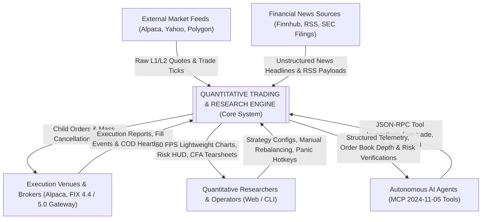
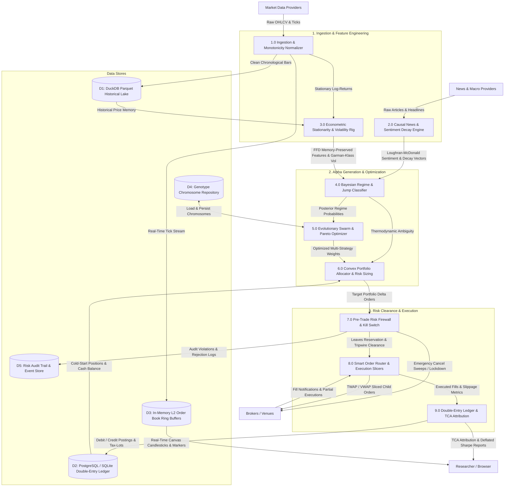

# Data Flow Diagram (DFD) Specification

This document provides the formal **Data Flow Diagram (DFD)** decomposition for the Quantitative Research & Autonomous Live Trading Engine, tracing data movement from external ingestion feeds to alpha models, pre-trade risk validation, order execution, and double-entry accounting.

---

## 1. Level 0: Context Diagram (System Environment)

The Level 0 Context Diagram establishes the operational boundary of the Quantitative Engine and defines interactions with external entities, brokers, news providers, and research operators.

---

## 2. Level 1: System Decomposition DFD (Subsystems & Data Stores)

Level 1 breaks down the engine into **8 primary transformational processes** and **5 core data stores**, mapping how data flows from ingestion through mathematical models to order execution and accounting.

---

## 3. Level 2: Real-Time Execution & Risk Hot-Path (Sub-100μs Microstructure Loop)

Level 2 details the mission-critical hot-path within the autonomous trading loop, pre-trade risk firewall, and smart order router.

```mermaid
flowchart LR
    %% Live Loop Inputs
    INPUT_BAR["PriceBar Stream (t)"] --> STEP1["7.1 Mark-to-Market Price Update"]

    %% Step 1: MTM & Drawdown Check
    subgraph RISK_LOOP ["Pre-Trade Risk Clearance Phase (< 10us)"]
        STEP1 --> STEP2{"Drawdown > Limit?"}
        STEP2 -- Yes --> KILL["7.2 Panic Trigger (EmergencyKillSwitch)"]
        STEP2 -- No --> STEP3{"Watchdog Timeout?"}
        STEP3 -- Yes --> KILL
        STEP3 -- No --> STEP4["7.3 Epistemic Uncertainty Haircut Scaling"]
        
        STEP4 --> STEP5["7.4 Sizing Check: Max Notional & Leverage Limits"]
        STEP5 -- Reject --> ERR["ERR-RSK-002: Limit Breach -> Log Rejection"]
        STEP5 -- Pass --> STEP6["7.5 Atomic Leaves Reservation"]
    end

    %% Step 2: Order Slicing Phase
    subgraph ROUTING_LOOP ["Microstructural Routing Phase (< 50us)"]
        STEP6 --> STEP7{"Algorithm Sizer"}
        STEP7 -- TWAP --> SLICE1["8.1 Poisson Random Interval Slicer"]
        STEP7 -- VWAP --> SLICE2["8.2 Volume Profile Curve Slicer"]
        STEP7 -- Arrival --> SLICE3["8.3 Almgren-Chriss Impact Minimizer"]

        SLICE1 --> DISPATCH["8.4 Gateway Socket Dispatch"]
        SLICE2 --> DISPATCH
        SLICE3 --> DISPATCH
    end

    %% Step 3: Gateway & Fill Reconciliation
    subgraph FILL_LOOP ["Reconciliation & Ledger Phase"]
        DISPATCH --> VENUE["Exchange / Broker (Alpaca, FIX)"]
        VENUE --> ACK["Fill Report / Reject"]
        ACK -- Rejection --> ROLLBACK["7.6 Atomic Leaves Rollback"]
        ACK -- Fill Event --> RECORD["9.1 FIFO Tax-Lot Allocation & Double-Entry Journal"]
        RECORD --> TELEM["Broadcast WebSocket Telemetry (HUD & Chart)"]
    end
```

---

## 4. Data Store Architecture

| Store | Technology | Key Models / Entities | Purpose |
|:---|:---|:---|:---|
| **D1: Historical Lake** | DuckDB + Parquet | `CandlestickBarDTO`, `PriceBar` | Nanosecond-resolution multi-asset historical bar lake partitioned by symbol. |
| **D2: Relational Ledger** | PostgreSQL / SQLite (WAL) | `DBLedgerAccount`, `DBTaxLot`, `DBJournalEntry` | Balanced double-entry financial ledger conserving capital ($\sum \text{Debit} = \sum \text{Credit}$). |
| **D3: Order Book Cache** | In-Memory Ring Buffer | `OrderBookSnapshot`, `ConsolidatedQuote` | Sub-microsecond L2 bid/ask depth and rolling bar cache for indicators. |
| **D4: Genotype Pool** | SQLAlchemy ORM / JSON | `DBGenotype`, `ChromosomeRepr`, `ChromosomeGame` | Multi-generation evolutionary strategy chromosomes and Pareto frontiers. |
| **D5: Audit & Event Store** | Append-Only Table | `KillSwitchEvent`, `PreTradeDecision` | Immutable regulatory audit log tracking pre-trade decisions and cancellations. |

---

## 5. Architectural Defensive Invariants

1. **`INV-DATA-004` (Strict Monotonicity)**: Every timestamp flowing from Ingestion ($1.0$) into Historical Lake ($D1$) must satisfy $t_i > t_{i-1}$; duplicate timestamps trigger deterministic rejection.
2. **`INV-RSK-001` (Zero Leakage Clearance)**: No order can be dispatched across network sockets without successfully acquiring atomic leaves reservation from Process $7.5$.
3. **`INV-RSK-008` (Sub-50ms Kill Switch Mass Cancellation)**: Activation of the Emergency Kill Switch triggers concurrent async cancellation across all broker gateways with socket timeout shields.
4. **`INV-LEDGER-001` (Conservation of Value)**: All executions create balanced compound journal entries with explicit tax-lot depletion (FIFO/LIFO) and zero unbacked cash creation.
