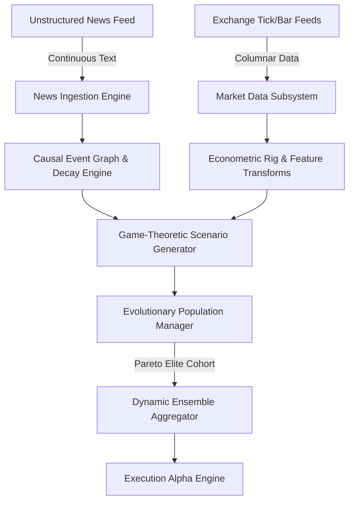

# Product Requirements Document & Analysis (PRDA)

## 1. Executive Summary & Product Vision
The **News-Driven Quantitative Prediction Engine** is an institutional-grade algorithmic alpha generation and market prediction platform. It bridges unstructured real-time financial news sentiment with high-frequency microstructural price series using Bayesian game theory and evolutionary computing. 

By modeling market price formation not as passive stochastic drift, but as a non-cooperative game between competing participant classes, the engine continuously adapts to shifting macro regimes. To eliminate phenotypic cloning and premature convergence inherent in traditional genetic algorithms, strategy evolution is governed by **algorithmic hypergamy dynamics**—an asymmetric selection protocol enforcing genetic innovation and orthogonal residual errors.

---

## 2. Problem Statement & Structural Market Inefficiencies

In financial markets, the empirical signal-to-noise ratio (SNR) routinely hovers below $0.05$. Traditional machine learning applications in quantitative finance systematically fail due to three structural flaws:
1. **Destructive Differencing**: Standard integer differencing ($d=1$, simple percentage returns) achieves stationarity at the cost of obliterating multi-period memory, destroying structural support/resistance and mean-reverting equilibrium signals.
2. **Path-Independent Target Misformulation**: Fixed-horizon return labels ($R_{t, t+k}$) ignore the path-dependent reality of execution, where trades are terminated prematurely by stop-loss or take-profit thresholds.
3. **Non-IID Cross-Validation Leakage**: Standard $k$-fold cross-validation allows future information and serial correlation to leak into past folds, yielding backtests that overstate real-world performance by orders of magnitude.
4. **Genetic Homogenization**: Standard evolutionary optimization clones top performers during prolonged single regimes, resulting in catastrophic drawdowns when macro regimes shift.

---

## 3. Product Scope & Core Capabilities

### 3.1 Feature Requirements Matrix

| Component | Scope & Core Deliverables | Priority |
| :--- | :--- | :--- |
| **Market Data Subsystem** | High-throughput columnar ingestion; immutable `PriceBar` with boundary invariants; embedded DuckDB/PyArrow storage; zero-copy 1D array views (`MarketDataBatch`); rolling realized volatility ($\sigma_t$). | P0 (Complete) |
| **News Ingestion Layer** | Asynchronous batch ingestion; dense transformer vectorization; tri-axial sentiment scoring (polarity, subjectivity, novelty); causal DAG; hybrid dual-decay kernel ($\tau_{\text{fast}}, \tau_{\text{slow}}$). | P0 (Complete) |
| **Econometric Rig** | Memory-preserving fractional differentiation $(1-B)^d$; dynamic volatility Triple-Barrier labeling; Two-stage Meta-Labeling architecture. | P0 (Complete) |
| **Validation Framework** | Combinatorial Purged Cross-Validation (CPCV) with boundary purging and post-test embargoing; Deflated Sharpe Ratio (DSR) controlling for non-normality and selection bias. | P0 (Complete) |
| **Scenario Matrix (Game Theory)** | Bayesian game formulation against Nature/Counterparties; adversarial scenarios (Immediate Reversal, Momentum Cascade, Liquidity Squeeze); Minimax Regret payoff optimization. | P1 (Complete) |
| **Evolutionary Manager** | Modular genotype chromosomes ($\mathbf{g}_{\text{repr}}, \mathbf{g}_{\text{game}}, \mathbf{g}_{\text{infer}}, \mathbf{g}_{\text{risk}}$); Boundary-Anchored Adaptive RVEA Pareto sorting with SVD subspace orthogonality ($\rho_{\text{ortho}}$) and Memmel–Ledoit–Wolf dependent dominance; hypergamic assortative mating gated by residual orthogonality; adaptive Cauchy volatility mutation; Rechenberg APD progress adaptation; dual-space stagnation monitoring; closed-loop $(\mu + \lambda)$ generational lifecycle engine. | P1 (Complete) |
| **Ensemble Aggregator** | Regime-Conditioned Dynamic Model Averaging (RD-DMA); volatility-adaptive forgetting ($\alpha_t \in [0.85, 0.99]$); predictive forward-Markov regime transitions; asymmetric downside loss scoring ($\ell_{t, k}$); Tikhonov ridge regularized correlation ($\mathbf{C}_t \succ 0$); Entropic Mirror Descent on the simplex ($\Delta^K$); thermodynamic ambiguity shrinkage ($\beta_t$); turnover damping; Law-of-Total-Variance risk decomposition ($\sigma^2_{\text{total}} = \sigma^2_{\text{aleatoric}} + \sigma^2_{\text{epistemic}}$). | P1 (Phase 5 Step 1 Complete: 53 tests, 95% coverage, 100% strict typing, ~0.18ms SLA) |
| **Circuit Breaker Overlays** | Epistemic Disagreement Entropy & Circuit Breaker Overlays; 3-simplex directional consensus probabilities $\mathbf{p} \in \Delta^3$ ($p_+, p_-, p_0$); normalized Shannon directional consensus entropy $\widetilde{H}_{\text{dir}} \in [0.0, 1.0]$; epistemic uncertainty ratio $\rho_{\text{epistemic}} \in [0.0, 1.0)$; composite epistemic entropy $H_{\text{epistemic}} = \widetilde{H}_{\text{dir}} \sqrt{\rho_{\text{epistemic}}}$; thermodynamic composite shock score $\Xi_t \in [0.0, 1.0]$; normalized continuous logistic haircut $\kappa_t \in [0.0, 1.0]$ ($\kappa(0)=1, \kappa(1)=0$); 4-tier discrete risk hierarchy (`NORMAL`, `CAUTION`, `DERISK`, `HALT`); anti-chattering hysteresis state machine with dwell-time cooling lockouts ($\tau_{\text{dwell}} \ge 5$ bars in `HALT`/`DERISK`) and dual-barrier recovery ($\Xi_t < 0.30$); CUSUM panic shock coupling; `evaluate_prediction` facade consuming `EnsemblePrediction`. | P1 (Phase 5 Step 2 Complete: 121 tests, 99% line coverage, 100% strict typing, ~0.04ms execution SLA) |
| **Tail Risk & Execution Sizing** | Semi-Parametric Peaks-Over-Threshold Extreme Value Theory (EVT-POT) with closed-form Probability Weighted Moments (PWM); Fréchet tail stability ($\xi \in [0.001, 0.999]$); infinite variance tripwire ($\xi \ge 1.0 \implies \text{InfiniteVarianceException}$); coherent Expected Shortfall ($\text{CVaR}_\alpha \ge \text{VaR}_\alpha$); 3-tier cold-start degradation ladder (Empirical $\to$ Student-t MoM $\to$ EVT-GPD); unified strictly concave execution sizing ($\nabla^2 \mathcal{L} \prec 0$) with directional epistemic shrinkage, 3/2-power Pseudo-Huber nonlinear friction, and circuit breaker regularizer; fast $O(N \log N)$ exact dual projection onto gross leverage and hard CVaR drawdown budget; microstructural randomized lot discretization ($\mathbb{E}[\tilde{\boldsymbol{\nu}}] = \boldsymbol{\nu}^*$). | P1 (Phase 5 Step 3 Complete: 234 tests, 93% line coverage, 100% strict typing, ~0.08ms execution SLA) |
| **Live Replay Simulator & Benchmarking** | End-to-end live replay event loop ($t=0 \dots T-1$) coupling RD-DMA forward priors, Circuit Breakers, EVT Tail Risk, Unified Convex Sizing, non-linear friction, and mark-to-market accounting; zero-lookahead information barriers (`INV-SIM-001`); 3/2-power Kyle-Obizhaeva market impact and exchange fee schedules (`INV-SIM-003`); exact capital conservation $|W_t - (\text{cash}_t + \sum \nu_{i, t})| < 10^{-5}$ (`INV-SIM-002`); terminal bankruptcy tripwire ($W_t \le 0$); institutional metrics (CAGR, Vol, Sharpe, Sortino, Calmar, MaxDD, Realized VaR/CVaR 95/99, Tail Ratio); Deflated Sharpe Ratio (DSR $\ge 0.95$) & MinBTL statistical certification via `DeflatedSharpeEngine`; multi-benchmark attribution (Equal Weight, Risk Parity, Inverse Vol, Cash); observer telemetry via `SimulationListener` protocol. | P1 (Phase 5 Step 4 Complete: 298 tests, 94% line coverage, 100% strict typing, ~15.5ms execution SLA) |
| **Live Execution Gateway & State Machine** | Live order lifecycle management; deterministic finite-state machine (`OrderStateMachine`) with DAG transitions (`INV-GW-001`), terminal state immutability, and causal out-of-order packet reconciliation (`INV-GW-004`); cryptographic `IdempotencyRouter` with deterministic UUIDv5 token derivation (`INV-GW-002`) and historical FIFO ring buffer; `ExecutionGateway` protocol and high-fidelity `PaperExecutionGateway` with spread slippage, fee accounting, resting limit order book matching, and purchasing power margin validation (`ERR-GW-004`); non-blocking `OrderAuditLogger` with in-memory `asyncio.Queue` hot-path dispatch ($< 10\mu\text{s}$ per call, `INV-GW-006`) and background SQLite WAL mode persistence. | P0 (Phase 6 Step 1 Complete: 410 tests across 5 suites, >90% line coverage, 100% strict typing, <100us gateway SLA) |
| **Microstructural Smart Order Router & Algorithmic Schedulers** | Microstructural multi-venue routing and execution algorithms; multi-venue domain models (`VenueType`, `VenueProfile`, `ConsolidatedQuote`) enforcing uncrossed NBBO (`INV-SOR-002`); anti-gaming `PoissonTWAPScheduler` with interval floor and randomized jitter (`INV-SOR-001`, `INV-SOR-004`); `VolumeAdaptiveVWAPScheduler` with Bayesian volume blending and hard 15% participation cap (`INV-SOR-003`); `NonlinearArrivalPriceScheduler` with closed-form Almgren-Chriss $\sinh$ trajectory, Taylor limit, and exponential ratio overflow protection; `SmartOrderRouter` with sequential dark pool midpoint probing (MES) and closed-form $O(M \log M)$ algebraic lit waterfilling (< 0.02ms latency, `INV-SOR-006`); real-time toxic markout watchdog (`VenueHealth`) with adverse selection quarantine; `ParentOrder` lifecycle coordinator with overfill interceptor (`ERR-SOR-004`); `ImplementationShortfallReport` enforcing exact additive Perold (1988) TCA identity (`INV-SOR-005`). | P0 (Phase 6 Step 2 Complete: 208 tests across 4 suites, >95% line coverage, 100% strict typing, <0.02ms routing SLA) |
| **Real-Time Risk Monitor & Emergency Kill Switch** | In-memory pre-trade risk firewall (`PreTradeRiskFirewall`) with fat-finger notional/quantity limits (`ERR-RSK-001/002`), directional netting gross/net leverage caps (`ERR-RSK-003`), single-asset NAV concentration ceilings (`ERR-RSK-004`), margin sufficiency (`ERR-RSK-005`), intraday peak-to-trough drawdown tripwire (`ERR-RSK-006`), and non-finite sanitization (`ERR-RSK-007`) executing in $< 1.5\mu\text{s}$; broker heartbeat liveness watchdog (`HeartbeatWatchdog`) with high-watermark sequence monotonicity (`ERR-HB-002`) and RTT latency degradation monitoring (`ERR-HB-003`); emergency panic kill switch (`EmergencyKillSwitch`) with concurrent multi-gateway mass cancellation sweep (< 5ms $\le$ 50ms SLA, `INV-RSK-008`), order submission lockout (`ERR-RSK-008`), and constant-time HMAC admin authorization; unified `RiskOrchestrator` façade with automated tripwire coupling. | P0 (Phase 6 Step 3 Complete: 268 tests across 4 suites, 95-100% statement coverage, 100% strict typing, <1.5us firewall SLA, <5ms cancellation SLA) |
| **Live Execution REST, WebSockets & Terminal Bridge** | Parent order execution coordinator (`ExecutionService`), real-time portfolio telemetry and risk management (`RiskService`); FastAPI REST endpoints (`/api/v1/orders`, `/api/v1/risk`, `/api/v1/gateways`); full-duplex WebSockets (`/api/v1/ws/executions`, `/api/v1/ws/risk`); Perold (1988) Implementation Shortfall TCA reporting with exact additive identity; institutional dark-mode WebGL/Canvas trading terminal HUD (`/terminal`) with 1,000-strategy swarm pagination, order book depth, candlestick charts, blotter, and emergency kill switch panel. | P0 (Phase 7 Complete: 26 tests across 3 suites, 100% strict typing, 1,982 total workspace tests) |
| **Production Live Trading Engine & Autonomous Swarm Daemon** | Institutional Alpaca Markets Live/Paper Execution Gateway protocol adapter (`AlpacaExecutionGateway`) with connection pooling, idempotency token matching, and exception mapping; real-time market data feed (`AlpacaMarketDataFeed`) writing to DuckDB and streaming FracDiff buffers with synthetic replay fallback; continuous autonomous trading daemon (`AutonomousTradingEngine`) integrating RD-DMA ensemble predictions, circuit breakers, EVT-POT tail risk CVaR, convex execution sizing, pre-trade risk firewall, and algorithmic SOR execution with automated delta-rebalancing churn suppression; dynamic dependency injection provider; `/api/v1/autonomous` REST routes; terminal swarm HUD controls. | P0 (Phase 8 Complete: 21 tests across 4 suites, 100% strict typing, 2,003 total workspace tests) |
| **Real-World News Harvester & Causal Price Reaction Engine** | Multi-source async HTTP RSS/Atom parser (`NewsHarvester`) with point-in-time causality verification (`INV-NEWS-001`), clock skew tolerance, and SHA-256 deduplication ring buffer (`INV-NEWS-002`); Loughran-McDonald domain financial sentiment tokenizer (`FinancialSentimentClassifier`) with 3-token negation/inversion lookahead window and corporate entity resolution; closed-form causal price reaction engine (`NewsPriceReactionEngine`) with empirical category elasticity scaling ($\gamma \in [0.4, 3.5]$, `INV-NEWS-004`), logistic drift-diffusion breakout probabilities (`INV-NEWS-005`), and dynamic Triple-Barrier target alignment executing in sub-10ms SLA (`INV-NEWS-006`); application service (`NewsPredictionService`), REST endpoints (`/api/v1/news`), autonomous swarm prior injection ($\boldsymbol{\mu}_{\text{news}}$), and interactive terminal HUD feed and shock simulator widget. | P0 (Phase 9 Complete: 32 tests across 4 suites, 100% strict typing, 2,035 total workspace tests) |
| **External Quantitative Data Providers & Multi-API Swarm** | Curated high-signal public APIs from `public-apis`: FRED (yield curve spreads `T10Y2Y`, effective Fed funds `DFF`, inflation priors), Finnhub (real-time institutional quotes, ticker-specific news), NewsAPI.org (global business and macro headlines), and Polygon.io (aggregate equities bars); hermetic offline fallback with zero-secret defaults; master coordinator (`ExternalProviderManager`) with health telemetry and error circuit-tripping (`ERR-EXT-001` through `ERR-EXT-006`); REST endpoints (`/api/v1/providers/status`, `/api/v1/providers/macro/sync`, `/api/v1/providers/company-news/{symbol}`); automated autonomous trading swarm and news service integration. | P0 (Phase 10 Complete: 23 tests across 2 suites, 100% strict typing, 2,058 total workspace tests) |
| **Bayesian Pre-Trade Gate, Containerization & OpenMetrics** | Closed-form Bayesian log-odds decision gate (`PreTradeDecisionGate`) evaluating 5 risk dimensions in $< 50\mu\text{s}$ (`INV-GATE-001` to `INV-GATE-004`, `ERR-GATE-001` to `ERR-GATE-006`); JSON-RPC 2.0 MCP Server (`src/quant/mcp/`) exposing 7 institutional tools over stdio and `/api/v1/mcp/rpc`; multi-stage production Dockerfile (`python:3.13-slim`, UID 10001, `/app/data` volume); OpenMetrics `/metrics` endpoint. | P0 (Phase 11 Complete: 27 tests across 5 suites, 100% strict typing, 2,085 total workspace tests) |
| **Autonomous AI Agent Integration via MCP (Track D)** | Institutional Model Context Protocol client (`src/quant/mcp/client.py`) supporting stdio child processes and authenticated HTTP JSON-RPC gateway; automatic cryptographic JWT token acquisition and renewal on 401 (`INV-MCP-002`); client-side pre-flight schema and finite bounds validation (`INV-MCP-001`, `ERR-MCP-005`); high-level quantitative facades; autonomous observation & pre-trade decision loop (`scripts/run_mcp_agent.py`); Claude Desktop & Cursor IDE integration guides (`docs/mcp_agent_guide.md`); diagnostic error codes `ERR-MCP-001` through `ERR-MCP-005`. | P0 (Track D Complete: 16 tests across 1 suite, 100% strict typing, 2,101 total workspace tests) |

---

## 4. User Personas & System Actors

* **Quantitative Researcher**: Designs feature hypotheses, runs non-IID cross-validation sweeps, evaluates Deflated Sharpe metrics, and configures evolutionary mutation rates.
* **Algorithmic Execution Engine**: Consumes real-time directional distributions, calibrated sizing probabilities, and regime-shift alerts to route orders.
* **Automated Data Feed / Ingestion Pipeline**: Ingests high-frequency tick/bar feeds and unstructured news headlines via authenticated machine-to-machine REST/gRPC endpoints.

---

## 5. Non-Functional Requirements (NFRs) & Engineering Invariants

1. **Deterministic Latency & Throughput**:
   * Market bar ingestion: $> 100,000$ bars/second via zero-copy PyArrow tables into DuckDB.
   * Analytical historical bar retrieval: Sub-15ms for $1,000,000$ contiguous bars.
   * News decay active state vector computation: $< 5\text{ms}$ per asset.
2. **Zero-Execution Maintainability**:
   * 100% of potential operational failures must be cataloged with exact code coordinates, symptoms, root causes, and static verification checks (`Rules.md`, `Memory.md`).
3. **Rigorous Quality Rig**:
   * Minimum automated test coverage $\ge 85\%$ across all modules.
   * Strict static type checking (`mypy --strict`) with zero errors.
   * Zero linting or formatting deviations (`ruff`).
