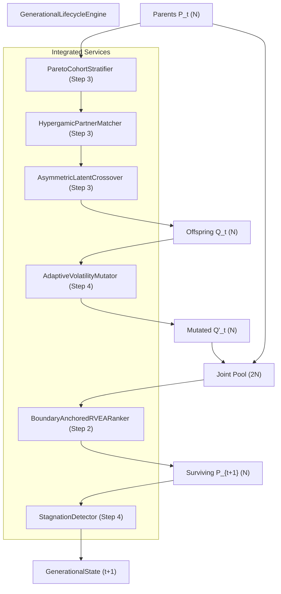

# Design Specification: Phase 4, Step 4 — $(\mu + \lambda)$ APD-Adaptive Evolutionary Lifecycle Engine

## 1. Executive Summary & Problem Formulation

Traditional genetic algorithms in quantitative finance suffer from:
1. **Generational Amnesia**: Fixed $(\mu, \lambda)$ replacement permanently discards proven alpha parents when an offspring generation is mediocre.
2. **Multi-Objective Adaptation Collapse**: Standard Rechenberg 1/5th rule based on Pareto dominance collapses ($\sigma \to \sigma_{\min}$) because strict dominance is rare on non-dominated fronts.
3. **Cauchy Variance Blowout / Gaussian Trapping**: Gaussian mutation traps strategies in local basins, while unconstrained Cauchy blows up with unbounded variance.
4. **Gene-Family Risk Destabilization**: Mutating core capital preservation parameters with the same amplitude as exploratory signal features causes strategies to breach drawdown limits.
5. **Behavioral Stagnation Blindness**: Parameter distance checks miss strategies that have different parameter values but identical prediction residuals ($\rho \approx 1.0$).

Phase 4, Step 4 resolves all five pathologies via the **$(\mu + \lambda)$ APD-Adaptive Evolutionary Lifecycle Engine**, completing **Phase 4 (Evolutionary Population & Hypergamy Dynamics)**.

---

## 2. Mathematical Architecture

### 2.1 $(\mu + \lambda)$ Environmental Pareto Selection
At generation $t$:
1. Current parent population: $\mathcal{P}_t$ ($|\mathcal{P}_t| = N$).
2. Generated offspring: $\mathcal{Q}_t$ ($|\mathcal{Q}_t| = N$) from Hypergamic Selection (Step 3) and Adaptive Mutation (Step 4).
3. Form the joint candidate pool: $\mathcal{U}_t = \mathcal{P}_t \cup \mathcal{Q}_t$ ($|\mathcal{U}_t| = 2N$).
4. Evaluate multi-objective Pareto ranking on $\mathcal{U}_t$ using `BoundaryAnchoredRVEARanker` (Step 2).
5. Select the surviving population $\mathcal{P}_{t+1}$ by filling from Front 1, Front 2, etc., ordered by Angle-Penalized Distance (APD) along active reference rays until $|\mathcal{P}_{t+1}| = N$.

**Guarantees**:
- **Monotonic Frontier Preservation**: The Pareto frontier of $\mathcal{P}_{t+1}$ weakly dominates or matches $\mathcal{P}_t$ in every objective.
- **Zero Generational Amnesia**: An offspring replaces a parent if and only if it achieves higher non-dominated rank or superior APD along its reference ray.

### 2.2 Truncated Cauchy Perturbation with Gene-Family Differential Scaling
For gene coordinate $d \in \{0, \dots, 19\}$ with normalized position $u_d \in [0, 1]$:
$$\Delta u_d = \sigma_{\text{mut}}^{(t)} \cdot \kappa_{\text{family}}(d) \cdot \xi_d$$
where:
- $\xi_d \sim \text{Cauchy}(0, 1)$ strictly clipped to $[-\theta_{\text{clip}}, \theta_{\text{clip}}]$ with $\theta_{\text{clip}} = 2.0$, preventing unbounded variance while retaining fat-tailed exploration.
- Gene-family scaling factor $\kappa_{\text{family}}(d)$:
  - $\kappa_{\text{risk}} = 0.50$ for `risk` block (`vol_target`, `max_weight`, `max_drawdown_limit`, `turnover_budget`)
  - $\kappa_{\text{game}} = 0.75$ for `game` block (`ambiguity_temp`, `risk_aversion`, `predatory_intensity`, `logits`)
  - $\kappa_{\text{search}} = 1.25$ for `repr` and `infer` blocks (`tau_slow`, `tau_ratio`, `decay`, `execution_horizon`, `hyperbolic_decay`, `profit_take`, `stop_loss`, `holding_period`, `meta_label_thresh`)

### 2.3 Mirror Boundary Reflection
To prevent sticky edge boundary artifacts at $0.0$ and $1.0$:
$$u_d^{\text{raw}} = u_d + \Delta u_d$$
$$u_d^{\text{refl}} = \begin{cases}
  -u_d^{\text{raw}} & \text{if } u_d^{\text{raw}} < 0.0 \\
  2.0 - u_d^{\text{raw}} & \text{if } u_d^{\text{raw}} > 1.0 \\
  u_d^{\text{raw}} & \text{otherwise}
\end{cases}$$
followed by defensive double-reflection clamp $u_d^* = \min(\max(u_d^{\text{refl}}, 0.0), 1.0)$.

### 2.4 APD-Progress Rechenberg Volatility Adaptation
Instead of single-objective Pareto dominance, mutation success is measured by **Angle-Penalized Distance (APD) progress along reference rays**:
An offspring $q_j \in \mathcal{Q}_t$ is classified as successful ($s_j = 1$) if:
$$\text{APD}(q_j) < \text{APD}(p_{\text{parent}}(q_j)) \quad \text{OR} \quad \text{FrontRank}(q_j) < \text{FrontRank}(p_{\text{parent}}(q_j))$$
Instantaneous APD success ratio:
$$r_{\text{succ}}^{(t)} = \frac{1}{N} \sum_{j=1}^N s_j \in [0.0, 1.0]$$
Smoothed success ratio:
$$\bar{r}_{\text{succ}}^{(t)} = \alpha_{\text{smooth}} \cdot r_{\text{succ}}^{(t)} + (1 - \alpha_{\text{smooth}}) \cdot \bar{r}_{\text{succ}}^{(t-1)}$$
Step-size update:
$$\sigma_{\text{mut}}^{(t+1)} = \begin{cases}
  \sigma_{\text{mut}}^{(t)} \cdot \gamma_{\text{expand}} & \text{if } \bar{r}_{\text{succ}}^{(t)} > 0.20 \\
  \sigma_{\text{mut}}^{(t)} \cdot \gamma_{\text{contract}} & \text{if } \bar{r}_{\text{succ}}^{(t)} < 0.20 \\
  \sigma_{\text{mut}}^{(t)} & \text{otherwise}
\end{cases}$$
clamped strictly to $[\sigma_{\min}, \sigma_{\max}] = [0.005, 0.250]$, with defaults $\gamma_{\text{expand}} = 1.10$, $\gamma_{\text{contract}} = 0.90$.

### 2.5 Dual-Space Stagnation Monitoring & Cataclysmic Re-Diversification
Stagnation is monitored simultaneously in two complementary spaces:
1. **Genotypic Hypercube Dispersion**:
   $$\bar{D}_{\text{param}} = \frac{2}{N(N-1)} \sum_{i < j} \|\mathbf{u}_i - \mathbf{u}_j\|_2$$
2. **Phenotypic Residual Collinearity**:
   $$\bar{\rho}_{\text{pop}} = \frac{2}{N(N-1)} \sum_{i < j} |\text{Corr}(e_i, e_j)|$$
A generation is marked stagnant if **both** conditions bind:
$$\bar{D}_{\text{param}} < \epsilon_{\text{stag}} \quad \text{AND} \quad \bar{\rho}_{\text{pop}} > \rho_{\text{stag}}$$
(defaults $\epsilon_{\text{stag}} = 0.05$, $\rho_{\text{stag}} = 0.80$).

When stagnation persists for $G_{\text{stag}} \ge 3$ consecutive generations:
- **Cataclysmic Re-Diversification**:
  - Front-1 non-dominated champions are preserved bitwise identical.
  - All other individuals undergo hyper-mutation with expanded step size $\sigma_{\text{cataclysm}} = 0.35$ across search genes.
  - Reset stagnation counter $G_{\text{stag}} = 0$.

---

## 3. Class Architecture & Invariant Contracts



### 3.1 Dataclasses
```python
@dataclass(frozen=True)
class MutationConfig:
    initial_step_size: float = 0.05
    min_step_size: float = 0.005
    max_step_size: float = 0.25
    mutation_probability: float = 0.20
    cauchy_clipping_bound: float = 2.0
    expansion_factor: float = 1.10
    contraction_factor: float = 0.90
    smoothing_factor: float = 0.20
    risk_gene_scale: float = 0.50
    game_gene_scale: float = 0.75
    search_gene_scale: float = 1.25
    stagnation_diversity_threshold: float = 0.05
    stagnation_correlation_threshold: float = 0.80
    stagnation_generations_limit: int = 3
    cataclysmic_step_size: float = 0.35


@dataclass(frozen=True)
class GenerationalState:
    generation_index: int
    population_size: int
    active_step_size: float
    smoothed_success_ratio: float
    phenotypic_diversity: float
    mean_residual_correlation: float
    stagnation_count: int
    is_cataclysm_triggered: bool
    surviving_candidate_ids: tuple[str, ...]
    front_1_count: int


@dataclass(frozen=True)
class LifecycleStepResult:
    next_chromosomes: dict[str, StrategyChromosome]
    surviving_fitness: tuple[CandidateFitness, ...]
    ranking: RankingResult
    state: GenerationalState
```

### 3.2 Invariant Contracts
- `INV-LIFE-001`: Population size strictly conserved ($N_{t+1} == N_t == N_{\text{target}}$).
- `INV-LIFE-002`: Mutated offspring are guaranteed 100% valid `StrategyChromosome` instances satisfying all domain invariants by construction.
- `INV-LIFE-003`: Monotonic frontier guarantee: no Front-1 parent is replaced unless an offspring achieves superior non-dominated status or superior APD along its reference ray.
- `INV-LIFE-004`: Mutation step size strictly bounded in $[\sigma_{\min}, \sigma_{\max}]$.
- `INV-LIFE-005`: Cataclysmic hyper-mutation preserves Front-1 champions bitwise identical.
- `INV-LIFE-006`: Lifecycle step executes in $< 35\text{ms}$ for $N=100$.
