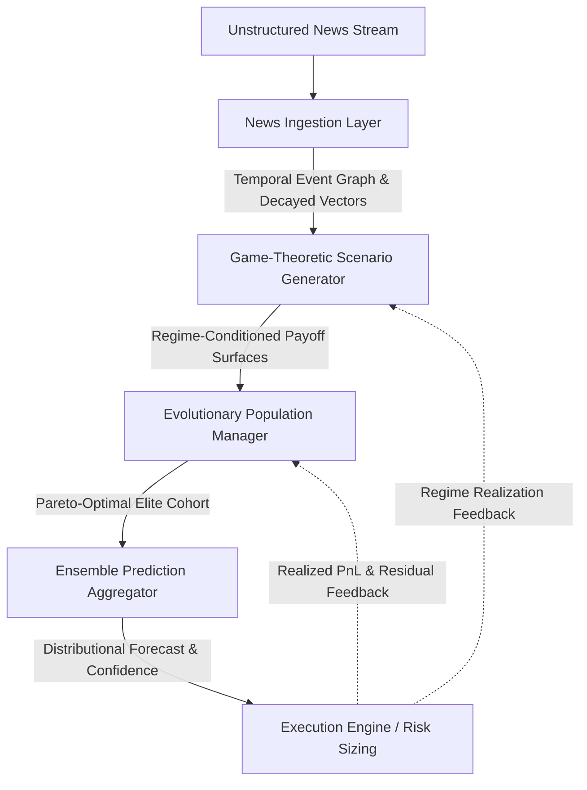

# News-Driven Market Prediction Engine: System Architecture Plan

## Executive Summary
This document outlines the architectural blueprint for a multi-algorithmic, news-driven market prediction engine. The system continuously ingests unstructured financial news streams, constructs time-decayed causal event graphs, stress-tests candidate prediction strategies against adversarial market scenarios using Bayesian game-theoretic payoff matrices, and dynamically evolves the strategy population using a natural-selection framework enhanced with **algorithmic hypergamy dynamics** to preserve genetic diversity and prevent regime-specific overfitting.

---

## 1. System Architecture Overview



The system is organized into four core modular layers:
1. **News Ingestion Layer**: Semantic parsing, continuous vectorization, and temporal decay chaining.
2. **Game-Theoretic Scenario Generator**: Multi-scenario adversarial simulation and payoff matrix computation.
3. **Evolutionary Population Manager**: Genotype encoding, adaptive mutation, and hypergamous mate selection.
4. **Ensemble Prediction Aggregator**: Regime-weighted Bayesian aggregation and disagreement entropy monitoring.

---

## 2. Component Specifications

### 2.1 Component 1: News Ingestion Layer & Temporal Chaining

#### Event Representation
Incoming unstructured news items are converted into composite feature vectors:

$$\mathbf{e}_i = \Big[ \mathbf{v}_{\text{dense}} \;\|\; \mathbf{s}_{\text{sentiment}} \;\|\; \mathbf{u}_{\text{urgency}} \;\|\; \mathbf{c}_{\text{centrality}} \Big] \in \mathbb{R}^D$$

- $\mathbf{v}_{\text{dense}} \in \mathbb{R}^{d_e}$: Transformer embedding (domain-adapted FinBERT / LLM encoder).
- $\mathbf{s}_{\text{sentiment}} \in [-1, 1]^3$: Tri-axial sentiment scores (polarity, subjectivity, novelty).
- $\mathbf{u}_{\text{urgency}} \in [0, 1]$: Transmission velocity / event urgency prior.
- $\mathbf{c}_{\text{centrality}} \in [0, 1]^K$: Relevance mapping across target asset universes and sectors.

#### Temporal Chaining & Memory Kernel
Events are stored in a Directed Acyclic Graph (DAG) representing causal event linkages. The active news state for asset $k$ at time $t$ is governed by a hybrid decay kernel:

$$\mathbf{S}_{\text{news}}^{(k)}(t) = \sum_{i \in \mathcal{V}_t} c_{i,k} \cdot \mathbf{e}_i \cdot \kappa(t - t_i, \mathbf{u}_i)$$

$$\kappa(\Delta t, u) = \alpha \exp\left(-\frac{\Delta t}{\tau_{\text{fast}} \cdot (1 - u)}\right) + (1 - \alpha)\left(1 + \frac{\Delta t}{\tau_{\text{slow}}}\right)^{-\beta}$$

- **Fast decay ($\tau_{\text{fast}}$)**: Models rapid sentiment absorption and high-frequency noise dissipation.
- **Slow decay ($\tau_{\text{slow}}$)**: Models long-term thematic trends and structural shifts.

#### Interface Contract
```
Interface: INewsIngestionEngine
    Methods:
        - IngestDocument(doc: RawDocument) -> EventNode
        - UpdateGraph(node: EventNode) -> Void
        - GetStateVector(asset: AssetID, timestamp: Timestamp) -> Vector[Real]
```

---

### 2.2 Component 2: Game-Theoretic Scenario Generator

#### Justification
Financial markets are non-cooperative, imperfect-information games. Simple historical regression overfits because market prices represent the equilibrium outcome of competing participant classes (institutional flows, fast arbitrageurs, and retail momentum).

#### Scenario Payoff Formulation
Candidate algorithms act as **Player 1** (Predictor), choosing an action $\mathbf{a}_1 \in [-1, 1]^K$ against **Player 2** (Market / Nature Scenarios $\mathbf{s}_j \in \mathcal{S}$):
1. $\mathbf{s}_1$ (**Immediate Reversal**): Immediate sentiment pricing followed by market-maker mean reversion.
2. $\mathbf{s}_2$ (**Momentum Cascade**): Trend continuation driven by stop runs and herd positioning.
3. $\mathbf{s}_3$ (**Liquidity Trap / Squeeze**): Adversarial distribution where institutional liquidity absorbs the sentiment herd.

The scenario payoff utility $U(i, \mathbf{s}_j)$ incorporates non-linear execution costs and crowding penalties:

$$U(i, \mathbf{s}_j) = \mathbf{a}_1^T \mathbb{E}[\mathbf{r} \mid \mathbf{s}_j] - \lambda \cdot \mathbf{a}_1^T \mathbf{\Sigma}(\mathbf{s}_j) \mathbf{a}_1 - \mathcal{C}(\mathbf{a}_1, \mathbf{a}_1^{\text{prior}}) - \Omega_{\text{crowding}}(\mathbf{a}_1, \mathbf{s}_j)$$

Evaluation across scenarios uses **Minimax Regret**:

$$V_i = -\max_{\mathbf{s}_j \in \mathcal{S}} \left( \max_{\mathbf{a}^*} U(\mathbf{a}^*, \mathbf{s}_j) - U(\mathbf{a}_i, \mathbf{s}_j) \right)$$

#### Interface Contract
```
Interface: IScenarioGenerator
    Methods:
        - GenerateScenarios(news_state: Vector[Real], depth: OrderBookSnapshot) -> List[ScenarioProfile]
        - EvaluatePayoffs(action: ActionVector, scenarios: List[ScenarioProfile]) -> Map[ScenarioID, Float]
```

---

### 2.3 Component 3: Evolutionary Population Manager & Hypergamy Dynamics

#### Genotype Data Structure
Each algorithmic individual is encoded as a chromosome $\mathbf{g}_k = \langle \mathbf{g}_{\text{repr}}, \mathbf{g}_{\text{game}}, \mathbf{g}_{\text{infer}}, \mathbf{g}_{\text{risk}} \rangle$:
- $\mathbf{g}_{\text{repr}}$: Parameters for temporal decay rates ($\tau_{\text{fast}}, \tau_{\text{slow}}, \alpha$) and feature projection weights.
- $\mathbf{g}_{\text{game}}$: Scenario belief priors $\mathbf{p}_{\text{belief}}$ and risk/regret aversion parameters $\lambda, \gamma$.
- $\mathbf{g}_{\text{infer}}$: Inference hyperparameters (model depths, thresholds, sensitivity constants).
- $\mathbf{g}_{\text{risk}}$: Volatility-targeting scalar, maximum drawdown thresholds, and leverage limits.

#### Hypergamic Mate Selection Logic
- **Problem**: Standard fitness-proportionate selection causes premature convergence and phenotypic cloning during dominant market regimes.
- **Mechanism**: The population is divided into the **Alpha Cohort** (top $\rho = 20\%$ by multi-objective fitness) and the **Aspirant Cohort** (remaining $80\%$).
- **Rule**: Lower-tier algorithms actively seek to mate with Alpha models. However, an Alpha individual **rejects** crossover unless the candidate's historical prediction errors demonstrate residual orthogonality:

$$\text{Corr}(\mathbf{e}_{\text{Alpha}}, \mathbf{e}_{\text{Aspirant}}) < \delta_{\text{ortho}}$$

This preserves elite alpha characteristics while mathematically guaranteeing genetic and behavioral diversity.

#### Multi-Objective Fitness Metric
$$\mathcal{F}(\mathcal{I}_i) = \text{DeflatedSharpe}(\mathcal{I}_i) \cdot \exp\left( -\psi \cdot \text{MaxDD}(\mathcal{I}_i) \right) + \omega_1 \cdot V_i(\text{Regret}) + \omega_2 \cdot \mathcal{H}_{\text{novelty}}(\mathcal{I}_i)$$

- Penalizes non-normal returns and backtest overfitting bias (Deflated Sharpe).
- Exponentially penalizes maximum peak-to-trough drawdowns ($\text{MaxDD}$).
- Directly credits game-theoretic scenario robustness ($V_i$) and population diversity distance ($\mathcal{H}_{\text{novelty}}$).

#### Adaptive Mutation
Mutation probability $\mu(t)$ scales dynamically with market regime volatility and news entropy:

$$\mu(t) = \mu_0 \cdot \left(1 + \tanh\left(\beta \cdot \frac{\sigma_{\text{realized}}(t)}{\bar{\sigma}_{\text{baseline}}} - 1\right)\right)$$

---

### 2.4 Component 4: Ensemble Prediction Aggregator

#### Bayesian Model Weighting
Final directional predictions are generated by an elite ensemble weighted by regime compatibility:

$$w_i(t) = \frac{\mathbb{P}(R_t \mid \mathcal{I}_i) \cdot \mathcal{F}(\mathcal{I}_i)^\gamma}{\sum_{j \in \mathcal{T}_{\text{Alpha}}} \mathbb{P}(R_t \mid \mathcal{I}_j) \cdot \mathcal{F}(\mathcal{I}_j)^\gamma}$$

#### Disagreement Entropy Circuit Breaker
If the predictive divergence among elite models exceeds an entropy limit $\theta_{\text{entropy}}$:
- Exposure and leverage are automatically dialed down.
- A **System Regime Shift Alert** triggers accelerated exploration (elevated mutation) in the evolutionary population.

---

## 3. Evolutionary Cycle (Pseudocode)

```python
Procedure RunEvolutionEpoch(Population P, MarketState M, NewsGraph G, Scenarios S):
    # 1. Evaluate Fitness across adversarial scenarios
    For individual I in P:
        predictions = I.Predict(G)
        payoffs = EvaluatePayoffs(predictions, S)
        metrics = BacktestWindow(predictions, M)
        I.fitness = ComputeMultiObjectiveFitness(metrics, payoffs, P)

    # 2. Stratify Population
    Sort(P, descending_by=fitness)
    AlphaCohort = P[0 : int(N * rho)]
    AspirantCohort = P[int(N * rho) : N]

    P_next = []
    # Elitism: retain top absolute performers
    P_next.AppendAll(Clone(AlphaCohort[0 : EliteCount]))

    # 3. Hypergamous Mating Loop
    While Length(P_next) < N:
        aspirant = RouletteSelect(AspirantCohort, by=fitness)
        elite_target = RouletteSelect(AlphaCohort, by=fitness)

        # Gated Acceptance based on residual orthogonality
        If ResidualCorrelation(aspirant, elite_target) < DeltaOrtho:
            child_1, child_2 = Crossover(aspirant.genotype, elite_target.genotype)
        Else:
            # Fallback: exploratory breeding within aspirant tier
            peer = RandomSelect(AspirantCohort)
            child_1, child_2 = ExploratoryCrossover(aspirant.genotype, peer.genotype)

        # 4. Entropy-governed mutation
        rate = ComputeAdaptiveMutationRate(M.entropy)
        child_1 = Mutate(child_1, rate)
        child_2 = Mutate(child_2, rate)

        If ValidateConstraints(child_1): P_next.Append(child_1)
        If ValidateConstraints(child_2) and Length(P_next) < N: P_next.Append(child_2)

    Return P_next
```

---

## 4. Implementation Roadmap for Quantitative Engineering Team

| Phase | Milestone | Deliverables |
| :--- | :--- | :--- |
| **Phase 1** | **Data Ingestion & Event Chaining** | Transformer entity-extraction pipeline, decay kernel modules, graph storage. |
| **Phase 2** | **Scenario Matrix & Game Theory** | Market response simulator, adversarial scenario definitions, Minimax regret evaluator. |
| **Phase 3** | **Evolutionary Engine Core** | Genotype schema, hypergamic selection gate, Deflated Sharpe & novelty fitness metrics. |
| **Phase 4** | **Ensemble Aggregator & Safeguards** | Regime-conditioned Bayesian weighting, entropy circuit breaker, paper trading pipeline. |
